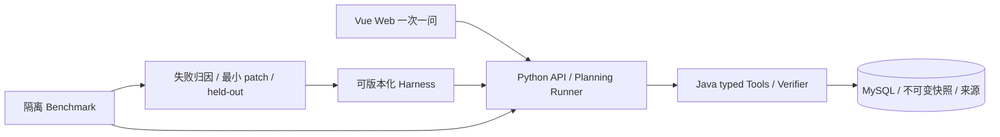

# CoursePilot-Evo

一个帮助学生核对学业进度、了解课程与教师、表达选课偏好并比较方案的学业规划项目。页面一次问一个问题，支持高绩点、工作量、签到、兴趣、指定教师、职业与时间等组合目标。课程事实和时间由 Java 核验，Agent 负责理解、规划与解释。

**当前状态：开发设计、可校验接口契约、仓库检查工具和独立 HTML 示例。Java/Python/Vue 服务、真实班次接入和 RSI 指标尚未实现。**五人协作，一个计算机培养路径先行；当前第四周末，第八周提交。

## 先看懂项目，再开始开发

先读[团队总览：业务流程、核心对象、模块分工](docs/15-team-baseline-and-batches.md)，再到[个人模块业务说明与 TRD](docs/05-team-and-sub-trds.md)理解完整职责，最后领取[本期业务任务](docs/19-delivery-plan.md)。看板标题是业务交付，接口和实现步骤在卡片里。

## 团队进度入口

[开发与验收看板](https://github.com/users/HelicasECoode42/projects/1) · [队员操作说明](docs/18-team-progress-guide.md) · [第五至第八周排期草案（待核对）](docs/19-delivery-plan.md)。仅维护周次；任务和 Bug 使用同一看板，审批证据保留在关联 PR。

## 从这里开始

| 你要做什么 | 入口 |
| --- | --- |
| 看学生体验 | [HTML 示例](demo/coursepilot-guided-demo.html)及[交接说明](demo/README.md)，下载后用浏览器打开 |
| 看项目怎么运转、每人最终交什么 | [团队业务总览](docs/15-team-baseline-and-batches.md)、[模块阅读入口](docs/05-team-and-sub-trds.md) |
| 了解用户需要 | [PRD](docs/02-prd.md)、[选课需求与资料研究](docs/14-student-choice-research-and-ux.md) |
| 实现接口 | [总体 TRD](docs/03-trd.md)、[行为契约](docs/04-infrastructure-workflow.md)、[OpenAPI/Schema](contracts/README.md) |
| 看自己的完整模块职责 | [A 数据](docs/trd/a-data.md)、[B Java](docs/trd/b-verifier.md)、[C Agent](docs/trd/c-agent.md)、[D RSI](docs/trd/d-benchmark-rsi.md)、[E Web](docs/trd/e-web-integration.md) |
| 提交与 debug | [工程规范](docs/16-engineering-and-debugging.md)、[GitHub 协作](docs/12-github-collaboration.md)、[PR 模板](.github/pull_request_template.md) |
| 填志愿与账号 | [人员表模板](docs/team/team-signup-template.csv)，导入金山表格；填写后的表不要提交公开仓库 |
| 看图与实验 | [Mermaid 图](docs/diagrams/README.md)、[Benchmark 协议](docs/07-benchmark-protocol.md) |

## 架构与目录



- `contracts/`：字段真源、OpenAPI、JSON Schema、正反例。
- `java-environment/`：A 导入 + B 数据和唯一规则核验，当前骨架。
- `agent-runtime/`：C 唯一生产/评测 Runner 与运行 Harness，当前骨架。
- `benchmark/`、`evo-harness/`：D 任务、隔离评分、失败归因与晋级，当前骨架。
- `web/`：E 的 Vue 产品实现；`demo/` 是独立交互示例。
- `docs/`：PRD/TRD、开发规范、学习资料与设计图。
- `scripts/`、`.github/`：契约、自查、模块检查和 PR/CI 规范。

## 仓库检查

```bash
python -m venv .venv
. .venv/bin/activate
python -m pip install -r requirements-dev.txt
python scripts/check_contracts.py
python scripts/self_check.py
python scripts/check_modules.py
```

可执行服务还没建立，当前没有“一键启动完整系统”的承诺。各模块首次加代码时须同时加 manifest、固定依赖、测试入口与启动说明；模块检查明确输出尚未实现模块的 SKIP。CI 通过不代表功能全部实现或安全已经保证。

## 数据与信任边界

培养计划由本地 `.xls` 输入导入，原文件不公开提交。班次当前只有插件静态研究和模拟 fixture，没有已验证的真实教务快照。真实时间缺失、解析未知或来源未核验时，必须显示 UNKNOWN；模拟核验不能称真实课表已有效。评价注明教师/修读学期/来源，不能保证给分、签到或当期开课。

学生在官方系统自行选课；项目不持有教务凭据、不执行选课提交。公开仓库排除原始资料、个人成绩、密钥、私有 Trace 和独立验收答案。具体代码与日志要求见工程规范。

自进化参考 System 1/2 与 task-group 思路，限定运行 Harness 文本/策略 patch；固定模型、工具和预算，经隔离 held-out 决定晋级/回滚。两轮流程和少 token 且不降质是验收/实验目标，结果须实测。

接口与跨模块一致性检查见 [复核记录](docs/17-contract-review.md)。
