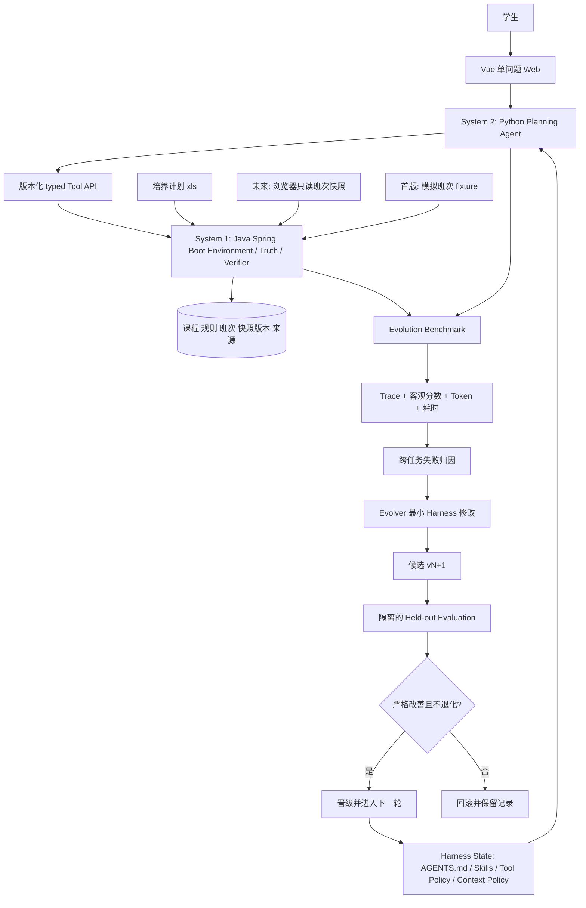

# CoursePilot-Evo：可核验、可复用经验的学业规划 Agent

> 五人课程项目安排｜五周版｜2026-09-30 更新。本文是**开发与评测计划**，未宣称 CoursePilot 已接入教务、已完成 RSI 或已经节省 Token。

## 一、场景与数据依据

学生选课时需要综合考虑学业进度、兴趣、给分反馈、签到、作业与考核负担、教师体验和时间安排。本项目拟在一处呈现培养要求、已修记录、课程与教师资料，并通过一次一问的短页面帮助学生说清目标；职业发展是可选分支。正常使用从已关联学业记录开始，缺记录时才导入；系统自动核对未完成必修与类别学分缺口，不让学生每次重复填写。教学计划建议学期与本学期硬要求分别处理，开课情况需另有班次证据。

Java 提供课程事实、规则与确定性核验，Python Agent 理解多目标、提出候选并解释取舍。学生可以指定教师课程、确认必须保留或可协商，查看有来源的评价并调整方案。真实时间无法核验时明确告知未知；系统只辅助规划，实际选课由学生在官方教务完成。[开发大纲与交付批次](15-team-baseline-and-batches.md)、[交互原型规范](../demo/README.md)。

用户给的 `以此为准，计算机2024级教学计划表20250306.xls` 有 24 张表，覆盖多条培养路径；首版选一条计算机科学与技术路径建立受控解析模板；首个模板基线一次独立核对，后续同模板由自动校验发布。该表有课程、学分、建议学期和文字规则，**没有班次时间**。[数据核查](06-workbook-audit.md)有逐表依据。本机有上大选课页 UserScript `选课插件v0.6.js`，可从源码推断部分班次字段，但**当前无法访问选课页进行实测**，因此真实班次入口尚未验证，也未接入 CoursePilot。五周首版用模拟班次验证时间解析与冲突算法；真实开课、周五空课仍回答未知。[数据入口说明](09-browser-adapter.md)列出了代码证据与风险；[Java 实施方案](10-java-import-and-rules.md)给出导入、SQL 与规则分工。

用户提供 [选课小本本](https://course-rate.icu/) 作为潜在评价入口，本次未成功读取核验其页面与字段，当前按待核查外部链接处理。首版可导入少量经授权或虚构的评价摘要并保存课程、教师、修读学期、来源和匹配状态。历史评价不能证明当期授课、不签到或保证高分。

## 二、技术分层与亮点

**System 1** 用 Java 21/Spring Boot 做低成本确定性工作：培养计划导入、课程查询、要求核对、学分计算、时间冲突、计划合法性、偏好指标、数据版本与来源管理、Benchmark 客观评分。时间相关判断在模拟数据上仅用于算法评测；面向学生的判断需有经核验的真实班次快照。Java 不做复杂自然语言推理。

**System 2** 用 Python/LLM 理解自然语言、规划、解释和分析失败。目标不止于“Prompt 改 Prompt”：对于多例任务反复验证有效的策略，将高成本分析沉淀为可复用 Skill、Tool Policy、Context Policy；必要时将稳定规则**作为后续工程变更**下沉到 Java 确定性工具，但五周首版 Evolver **不得自动修改 Java API 或规则**。这借鉴 PhysicalRSI 的思路，项目不声称复现该系统。

展示层是**Vue 3 + Vite 响应式 Web 页面**，首版不做小程序。学生页面一次处理一个问题，评价与学业资料在详情入口查看，只显示决策需要的事实/建议/未知。独立老师页展示 Trace、版本和演化报告；模拟数据明确标识。

## 三、五周交付范围

| 等级 | 要做的事 | 验收证据 |
| --- | --- | --- |
| P0 | 选定培养路径；Apache POI 导入 `.xls`；已知规则自动校验、异常阻断 | 课程/学分与原表逐项对照，来源可追溯 |
| P0 | 班次 JSON 合同与模拟 fixture；插件源码静态核查 | 冲突算法可测，真实班次标未验证；不声称实时开课 |
| P0 | Java Tool API：要求核对、课程查询、计划验证；有快照时校验冲突 | JUnit 对照样例，未知不判通过 |
| P0 | Python Agent + Web 单问题路由闭环 | 输入目标→调用 Java→返回事实/建议/未知及 Trace |
| P0 | 已关联学业记录、自动核对、多动机与指定教师的可编辑目标 | 学生可选提示或自由输入；未回答的偏好不被补全，学分缺口按已修清单完整性标注 |
| P1 | 少量评价摘要导入与来源展示 | 标主观/历史来源，不冒充当期教学班或官方成绩信息 |
| P1 | 四组任务 Benchmark、固定基模与预算、Trace 和硬指标 | 同配置可重复运行，留出答案对 Evolver 不可见 |
| P1 | 至少支持 v0→v1→v2 的**多轮机制**与晋级/回滚；实际晋级以结果为准 | 两轮候选决策与版本 lineage；失败也如实记录 |
| 范围外 | 自动选课/抢课、学校登录代管、小程序、通用排课求解器 | 不做提交教务的写操作 |

任务组拟为：①培养要求核对；② hard/soft preference 理解；③规划、冲突修复与 replan；④信息缺失时澄清与拒绝编造。参照 task-group 思路，每组设计 5 个 evolution + 5 个 held-out，合计 40 个**目标任务**；如五周人工标注不足，缩到每组至少 3+3（24 个），不得以缩水样本宣称普遍泛化。涉及班次的 case 要分别标注“模拟快照”和“无真实快照”条件，模拟数据不计入真实开课能力。

## 四、五人分层分工与工作量

以 1 人日约 6–8 小时估算，计划 **55 人日**，平均每人每周约 2.2 人日。多人共享接口先在第一周冻结，个人子 TRD 不能另造数据对象。

| 成员 | 模块、技术栈与交付 | 人日 | 主要难点 |
| --- | --- | ---: | --- |
| A 数据入口 | Java/POI 一个路径导入与发布门槛；已修/评价输入、原始时间黄金 fixture | 11 | 三类 Excel 表、模板编译/自动校验、来源与版本、周次解析 |
| B System 1 | Java/Spring Boot、MySQL/Flyway、规则与 Tool API、JUnit | 12 | 未知语义、课程/班次双快照、冲突与客观核验 |
| C System 2 | Python/FastAPI/Pydantic/httpx、多目标/指定教师 Planning Agent、统一 Runner/Harness | 11 | 硬/软偏好、受控调用、建议必须二次核验 |
| D 评测/RSI | Python/pytest/JSONL、W1 开始任务标注、Trace、Miner、两轮 gate | 10 | 留出隔离、跨 Case 假设、双轮版本与成本指标 |
| E Web/集成 | Vue 3/Vite/Router、单问题交互、教师详情、独立老师报告、端到端集成 | 11 | 数据状态清晰、异常与快照过期、模块联调 |

成员姓名由组内填写。[分工与子 TRD](05-team-and-sub-trds.md)给出各自输入输出和验收。A/B 共同维护 Java 数据结构边界，C/D 共用**同一个** Agent Runner，E 通过固定 DTO 接口集成。

## 五、里程碑、风险与验收

| 周 | 可检查成果 | 决策门槛 |
| --- | --- | --- |
| 1 | 选定培养路径；静态核查插件；冻结 SQL/规则类型、模拟班次 JSON、Tool API、Trace 与首批标注与单问题原型 | 真实班次入口记 UNVERIFIED_NO_ACCESS；教学计划导入 preview、黄金样例与异常清单可检查 |
| 2 | Java 导入/规则/Verifier 与模拟班次导入；网页、Agent 用固定 DTO 先打通 | 自动发布门槛、首个基线独立对照；模拟冲突用例通过，真实时间仍 UNKNOWN |
| 3 | 学生 Web 引导→Agent→Java 的完整路径；澄清、建议二次核验、重规划 | 模型不能绕过 Java 宣称硬事实；页面区分真实培养数据与模拟班次 |
| 4 | 完成 W1 开始的四组任务标注与基线 v0；Trace/Token/Latency/Tool Calls；跨 Case 失败假设 | evolution 与 held-out 隔离，评分器不从模型答案生成真值 |
| 5 | 运行 v0→v1→v2 的候选评测与晋级/回滚；演示和含失败样例的报告 | 候选必须客观分数严格提升且 held-out 不退化；否则回滚 |

首要限制是当前没有可访问的真实选课页；五周主线以 `.xls` 培养规则为准，模拟班次只验算法，浏览器适配留待有授权样例后验证。其次是五周规模和小样本：任务组可按上述下限缩放，主观“推荐好不好”只作为人工抽查，核心以规则事实、硬约束、未知/幻觉、澄清正确性和 held-out 分数评价。必须记录平均输入/输出 Token、工具调用数和总耗时，检验“经验固化后少推理且不降质”的假设；**省 Token 并非已实现结论**。最终交付是可运行演示、可回放 Trace、逐例评分、版本 lineage 与如实填写的失败记录。若模型额度或班次数据不足，报告实际完成边界，不填造指标。

参考： [GDPevo 官方仓库](https://github.com/Prism-Shadow/GDPevo) 的 task-group 划分；[PhysicalRSI 项目页](https://mmlab.hk/research/PhysicalRSI) 的 System 1/2 与技能固化思路。二者仅为设计参考。
