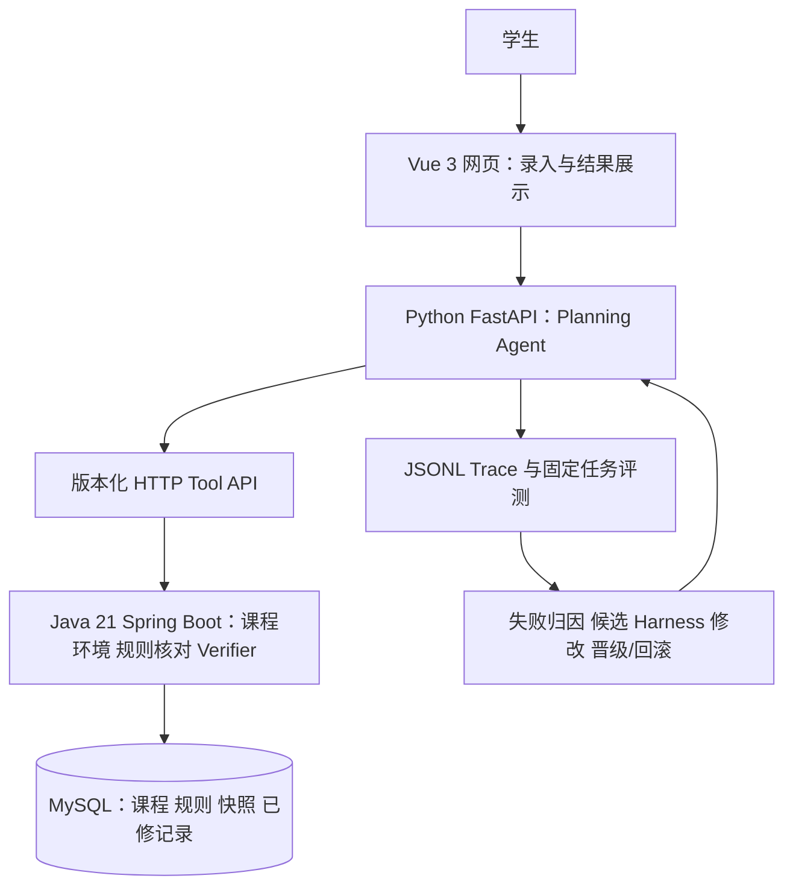
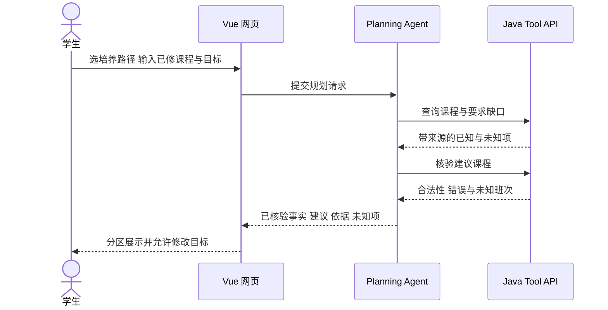
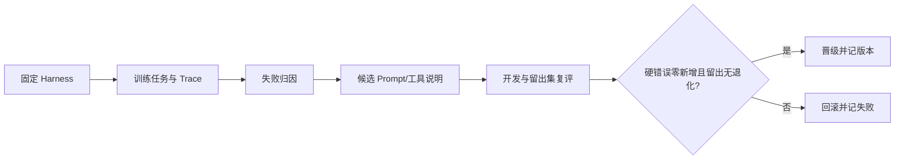

# CoursePilot-Evo：面向真实培养计划的学业分析 Agent

> 五人课程项目安排｜五周版｜2026-09-29。本文是开发计划，功能、评测分数与学校接口均未宣称已完成。原 v0.1 八周计划归档，不再作为当前排期。

## 一、问题和演示场景

学生常常能看到培养计划，却难以快速回答“还缺哪类学分”“哪些课属于本专业路径”“这门课为什么被推荐”。学生选择 2024 级培养路径、录入已修课程后，可以问：“我下学期想补专业选修，也想满足全英语授课要求，课业不要太满。”系统先核对课程与规则，再给出**建议修读课程及依据**，把无法确认的开课/班次信息明确显示为未知。

项目不代替学校选课系统。使用者给出的教学计划 `.xls` 有 24 张表、8 种专业/招录路径组合；首版先选定并人工核验一个计算机科学与技术路径。该文件包含课程、学分、建议学期和部分文字规则，**不含具体班次的周几与节次**。因此没有独立班次快照时，不生成“无时间冲突课表”，也不承诺周五空课。[数据核查](06-workbook-audit.md)记录了字段与单元格例子。

## 二、目标与技术分层

- **Java 是确定性依据**：Apache POI 导入 `.xls`；领域模型保存课程、要求及来源；API 查课程/核对学分/验证推荐课程是否存在且属于正确路径。文字规则未人工核实、班次缺失时返回 `UNKNOWN`，不让模型补猜。
- **Python/LLM 做理解和建议**：解释用户目标，必要时澄清，调用 Java Tool，再生成附来源的建议。一次请求限制工具调用和修正次数。
- **Harness 自进化是受控实验**：固定任务 → Trace/Java 评分 → 自动归纳失败 → 只改提示词或工具说明 → 训练回归与留出集对比 → 晋级或回滚。评测器、规则、答案、模型与预算不得由 Evolver 修改。
- **展示层选网页**：Vue 3 + Vite 做响应式单页，显示路径、已修课、要求缺口、建议、依据和“未知”标记。五周内不做微信小程序，避免新增发布与登录链路。

## 三、数据与功能边界

| 来源 | 首版用途 | 明确不能推断 |
| --- | --- | --- |
| 用户提供的 2024 级教学计划 `.xls` | 培养路径、课程、学分、建议学期和人工审核后的文字规则 | 实际开课、班次时间、余量、先修关系（若未明示） |
| 用户手填/模板导入的已修记录 | 计算已修学分和要求缺口 | 未提供的成绩或学分认定 |
| 可选的班次快照 | 若第 1 周取得且核实，可新增冲突检查 | 未取得时不展示课表可行性 |
| 选课小本本等评价 | 可作为带出处的主观参考 | 绩点、抢课概率或客观难度分 |

主要功能优先级：P0 数据导入与来源、Java 要求核对、Agent 调工具、网页解释；P1 固定 Benchmark 与一次 Harness 候选晋级/回滚；P2 真实班次冲突、自动排课、复杂优化，仅在另有数据和时间时考虑。

## 四、五人模块与工作量

以 1 人日约 6–8 小时估算，共 **54 人日**，五周平均每人每周约 2.2 人日；是计划工时，不是已投入工时。

| 成员 | 技术与独立交付 | 人日 | 主要难点 |
| --- | --- | ---: | --- |
| A 数据 | Java + Apache POI；选择培养路径、解析三类表、保留来源与异常清单 | 10 | 合并单元格、左右并列课程、组合编号和文字规则 |
| B 真值层 | Java 21 + Spring Boot；要求核对、课程校验、`UNKNOWN`、JUnit 对照案例 | 12 | 不把未知当通过，规则结果可解释 |
| C 平台/展示 | Spring Web + MySQL/Flyway；Tool API；Vue 3 + Vite 单页 | 12 | 接口与页面集成，课程/来源/未知项同时清晰呈现 |
| D Agent | Python + FastAPI/Pydantic/httpx；目标提取、工具调用、建议修正 | 10 | 控制调用次数，不能自行宣布硬事实 |
| E 评测/自进化 | Python + pytest/JSONL；任务标注、Trace、失败归因、受限候选修改 | 10 | 留出集隔离、真实回滚、不伪造提升 |

A/B/C 共同负责 Java 主体；D/E 负责 Agent 与评测。成员姓名由组内填写。每人的可实施子 TRD 已在内部文档细化。

## 五、五周里程碑

| 周 | 全组可演示成果 | 决策门槛 |
| --- | --- | --- |
| 1 | 核对 `.xls` 路径与字段；冻结课程/要求/Trace/API v1；手工标注首批任务 | 选定一个培养路径；若无班次快照，明确取消排课展示 |
| 2 | Java 导入、查询和要求核对；网页与 Python 假数据接通 | 课程号、学分、来源与人工核对一致 |
| 3 | Agent 调 Java 工具，网页完成“输入→缺口→建议→依据/未知”闭环 | 模型无法绕过 Java 直接声明规则结论 |
| 4 | 约 24 个固定任务的标注、基线运行与失败分析 | 训练/开发/留出集分开，Trace 能回放 |
| 5 | 至少一次候选 Harness 修改、复评、晋级或回滚；演示与报告 | Java 核验无新增硬错误，留出集退化则回滚；报告保留失败例 |

若第 3 周仍未完成 Java 核对闭环，暂停自进化开发，先完成真实数据与规则演示；若没有模型调用额度，可保留确定性模块和评测设计，但不能声称完成自动进化。

## 六、评测、风险与验收

计划人工标注约 **24 个任务**：正常核对、歧义条件、文字规则、资料缺失、跨路径错误与过度自信建议；目标为训练 12、开发 6、留出 6，实际数量以完成的人工核对为准。指标包括培养要求核对正确率、未知项召回、建议课程有效性、来源引用覆盖、完整任务成功率、耗时与调用成本。小留出集仅用于课程项目内部比较，不宣称统计意义上的普遍提升。[Benchmark 协议](07-benchmark-protocol.md)写明计算和晋级门槛。

最大风险是把建议学期当成实时开课、把文字备注当成自动可算规则，以及五周集成过重。措施是第一周冻结路径和契约、网页只做单页、每周交付一条集成链路。最终验收以可重复演示、代码与数据说明、人工对照表、Trace、候选版本决策和包含失败案例的报告为准；所有结果数字待实测后填写。
