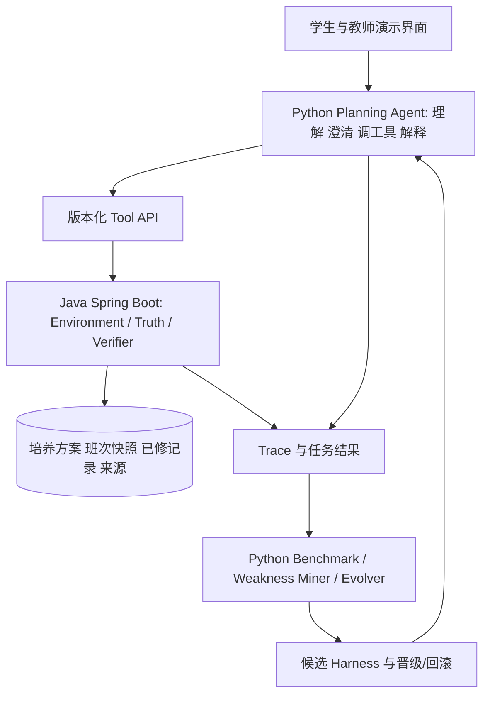
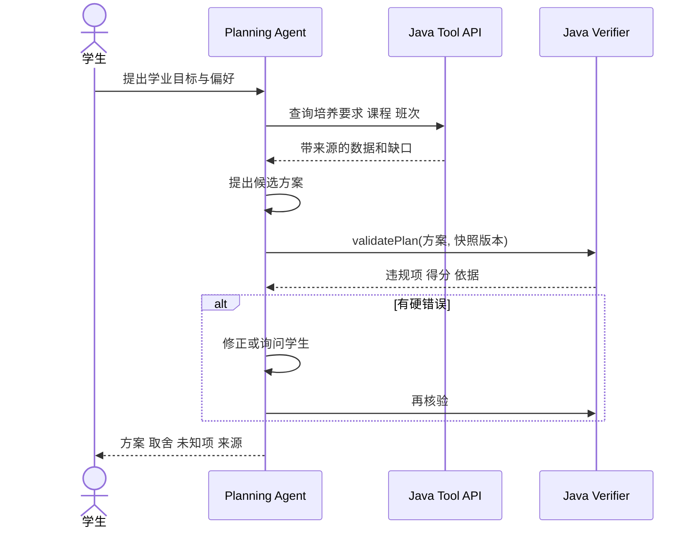

# CoursePilot-Evo：可自进化的学业规划 Agent

> 五人课程项目安排稿｜2026-09-29｜供教师评审。本文是实施计划，**不代表系统、学校接口、实验结果已经完成**。由 CoursePilot v0.1 改写；与原稿的差别是将求解器降为可选能力，将可靠规则核验与 Agent 工作流优化作为技术主线。

## 1. 课题背景与目标

学生选课时需要同时核对培养方案、已修记录、班次冲突与个人偏好。比如：“这学期补两门专业选修，数学课必须上，周五尽量空出来。”普通课表工具能显示课程，却难以解释要求缺口、数据依据和不同选择的取舍。本项目拟提供一个对话式规划助手：学生输入目标，Agent 查找课程与规则，提出有依据的方案；Java 服务核验硬事实，失败时反馈给 Agent 修正。

项目的第二条技术主线是**受控的 Harness 自进化**：收集规划执行轨迹与固定任务评分，自动找出重复失败模式，生成对提示词/Skill/工具说明的有限修改，再在未见任务上验证；只有无回归且指标改善的候选版本才晋级。单纯记录评测分数不算自进化。首版只修改模型外部 Harness，不允许修改规则、评分器、测试答案或模型预算。

## 2. 技术分层

| 层 | 职责 | 主要交付 |
| --- | --- | --- |
| 数据层 | Excel、人工录入、班次快照的规范化和来源记录 | `Course`、`Offering`、`Requirement`、`CompletedCourse` |
| Java 真值层 | 查课、培养要求核对、班次冲突、方案核验、确定性偏好分；提供 API | Spring Boot 服务、规则依据、Verifier 结果 |
| Python Agent 层 | 理解自然语言、必要澄清、工具调用、提出/修正方案、引用事实解释 | Planning Agent 与会话流程 |
| 评测与自进化层 | 固定任务、Trace、评分、弱点归因、候选修改、未见任务验收 | Benchmark、版本晋级或回滚记录 |
| 展示层 | 表单、计划比较、缺口与来源、版本效果 | 简洁网页与演示脚本 |

硬事实只能来自 Java 工具。Agent 可判断课程适配性、偏好权衡和解释措辞，但不得自行宣称“无冲突”“已满足学分”等未核验结论。首版不要求 Java 穷举最优课表；若有足够班次数据，可逐步加入候选过滤或求解辅助。

## 3. 数据、来源和可行性门槛

| 数据 | 当前情况 | 首版策略 |
| --- | --- | --- |
| 培养方案 Excel | 团队称已有，字段和规则尚未检查 | 第 1 周核字段；无法确认的规则标“待人工确认” |
| 已修记录 | 由使用者提供 | 模板导入或手填；演示用授权或虚构档案 |
| 选课小本本 PDF | 有多期，以主观评价为主 | 人工核对少量标签，保留刊期页码；不充当客观评分 |
| 学期班次与时间 | 能否持续获得仍未知 | 首选经核对的学期快照；历史快照只展示其对应学期 |

第 1 周必须取得可解析培养方案和至少一份可核对的班次时间样本，才能保留完整选课演示。若班次数据缺失，则收缩为“培养要求核对 + 候选课程解释”，并调整题目与验收，不伪造开课、余量或冲突事实。实际选课始终在学校系统完成。

## 4. 关键流程与模块

模块划分：数据导入与溯源；Java 领域模型和查课工具；培养规则/冲突/方案 Verifier；Python Planning Agent；Benchmark/Trace/自进化；简洁展示与集成。数据与 API 契约先于并行开发冻结，避免五人模块互相猜字段。

## 5. 五人工作量与交付

工作量为**计划人日**（1 人日约 6–8 小时），不是已投入工时；总计约 84 人日，八周平均每人每周约 2.1 人日。

| 成员 | 主责 | 计划人日 | 可验收交付 |
| --- | --- | ---: | --- |
| A 数据与来源 | Excel/班次导入、字段映射、来源与快照管理 | 15 | 样本数据、导入报告、来源标记、异常字段清单 |
| B Java 规则 | 领域模型、要求核对、冲突检查、方案 Verifier | 19 | 确定性工具接口、规则测试、错误与未知项 |
| C Java 平台与展示 | Spring Boot API、版本/任务/Trace 存储、最简网页和集成 | 18 | 可调用 API、可回放记录、页面演示 |
| D Planning Agent | 约束理解、澄清、工具调用、修正与依据解释 | 16 | 可运行 Agent 流程、失败示例与调用轨迹 |
| E 评测与自进化 | Benchmark、评分、弱点归因、有限修改、晋级/回滚 | 16 | 固定任务、候选版本对比、晋级决策记录 |

共担：第 1 周共同核数据与接口；第 7–8 周共同跑案例、修缺陷和写报告。姓名待组内确认。各模块详细任务在内部文档拆分。

## 6. 八周里程碑

| 周次 | 里程碑 | 评审证据 |
| --- | --- | --- |
| 1 | 核实数据与课程要求，冻结对象/Tool API/Trace v1 | 真实字段样例、数据可行性决定、契约文档 |
| 2 | Spring Boot 骨架与导入查询 | 导入报告、课程/来源查询 |
| 3 | 培养要求、冲突和方案核验 | 手工标注案例对照，已知/未知区分 |
| 4 | Java Verifier 与 Python 工具调用闭环 | 固定输入下可复现核验和错误修正 |
| 5 | Agent 对话与简洁页面 | 完成一次查询—建议—核验—重规划演示 |
| 6 | 固定 Benchmark 与 Trace | 任务集、可回放轨迹、基线指标 |
| 7 | 有边界的 Harness 候选修改及留出集验收 | 至少一次候选晋级或回滚的完整记录 |
| 8 | 整体测试、风险复盘与提交 | 演示、代码、数据说明、评估报告含失败案例 |

## 7. 风险、评估与验收

| 风险 | 处理 |
| --- | --- |
| 班次数据无法获得 | 第 1 周作范围决定；不把历史班次写成当前开课 |
| 培养规则含人工判断 | 规则表标依据与适用范围；不能核验的返回未知 |
| Agent 生成似是而非结论 | 所有硬事实带 `verifierResultId` 与来源，未验证不展示为事实 |
| 自进化过拟合/作弊 | 训练与留出任务分离；冻结模型、预算、Java Verifier 和任务答案；保留回滚 |
| 五人集成延误 | 第 1 周冻结契约；每周共享一条集成演示；接口变更需版本和迁移说明 |

拟准备约 30–40 个任务，具体数量以实际人工核对为准。评估规则核对正确率、硬约束违规数、未知项识别、解释来源完整度、任务成功率、耗时与模型调用成本，并比较进化前后及留出集退化。验收线：一条固定数据快照上的“目标输入→查证→方案/澄清→Java 核验→解释→修改后再规划”可重复演示；评测闭环能够记录至少一次候选修改与晋级/回滚决策。所有结果数字待运行后填写。
