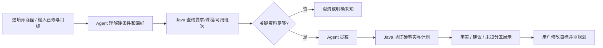

# 内部 PRD v0.3｜CoursePilot-Evo（五周）

状态：**方案/仓库骨架，尚未实现**。需求依据是用户提供的教学计划 `.xls` 和本机选课页 UserScript 的只读代码检查；后者尚未在 CoursePilot 接入或验证。展示层定为 **Vue 3 + Vite 响应式 Web**，不做小程序。

## 用户与核心任务

用户选择经人工审核的培养路径，录入已修课程与自然语言目标。工作台返回三类内容：① Java 可核验的事实及来源；② Agent 根据偏好提出的建议和取舍；③ 资料缺失、未审核规则和无法验证的班次条件。典型问法：“还缺多少专业选修学分？数学必须上，周五最好空出来。”若班次快照经验证，系统可以比较班次冲突/周五占用；若没有或过期，明确说无法判断并邀请用户导入当前学期快照。学生始终在官方系统自行选课。

## 页面与用户流程

单页工作台分为：培养路径和快照选择；已修记录编辑；目标输入；结果区；可展开的核验/Trace 区。结果卡片显示 `已核验 / 建议 / 未知 / 系统错误`。班次卡片额外显示学期、采集时间、`VERIFIED/PARTIAL/UNAVAILABLE` 与来源。浏览器侧导入流程是学生自行登录官方页面、主动导出最小化 JSON、在本页预览后上传；页面不接收教务账号、Cookie 或 Token。

## 范围和验收

| 优先级 | 功能 | 可见验收 |
| --- | --- | --- |
| P0 | 一条真实 2024 级路径的培养要求核对 | 学分/规则可追溯到工作表行；未审核规则 UNKNOWN |
| P0 | CourseOffering 快照导入合同和第一周可行性验证 | 显示学期/时间/异常；仅 VERIFIED 启用时间判断 |
| P0 | 自然语言硬/软偏好解析、工具调用、修正与澄清 | 候选经 Java 二次核验，Trace 可回放 |
| P0 | Web 单页和本地匿名会话 | 输入→结果→追问/重规划；错误可恢复 |
| P1 | 四 Task Group Benchmark、成本指标、版本比较 | 逐例分数、Token、工具调用、耗时和 held-out 对照 |
| P1 | 白名单 Harness 演化、v0→v1→v2 机制 | 每轮有跨 Case 假设、最小 patch、晋级/回滚依据 |
| 非目标 | 自动选课、抢课、模拟学校登录、持有教务凭据、微信小程序 | 无提交教务写接口 |

## 产品约束

- Java System 1 是事实边界：课程、学分、冲突、要求、来源/版本；Agent 不能把自己推断写成已核验事实。
- 不把 `UNKNOWN` 当 `false` 或“已通过”。查询失败是系统错误；数据缺失是业务未知。
- 用户的“必须”一般是 hard condition，“最好”一般是 soft preference；歧义影响计划合法性时先澄清。偏好指标由 Java 基于经验证的计划计算，最终取舍由 Agent 解释。
- 只保存演示必需的虚构或经授权已修数据。Trace 不存教务 Cookie、真实学号、完整个人成绩或模型私有思维链。
- “第一次昂贵分析→可复用 Skill/Policy→后续相关任务少 Token 且 held-out 不降质”是**实验假设**，不是验收时预填的结论。主观推荐质量仅做人工抽查。

详细数据入口见[浏览器适配设计](09-browser-adapter.md)，接口见[总体 TRD](03-trd.md)，门槛见[Benchmark 协议](07-benchmark-protocol.md)。
