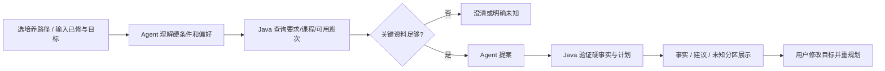

# 产品需求 PRD｜CoursePilot-Evo

状态：**方案/仓库骨架，尚未实现**。数据依据是本地教学计划 `.xls` 和选课页 UserScript 的只读代码研究；后者尚未在 CoursePilot 接入或验证。展示层定为 **Vue 3 + Vite 响应式 Web**，不做小程序。

本文维护用户需求与产品范围。团队如何理解整体流程、对象和责任，先读[业务总览](15-team-baseline-and-batches.md)；个人完整功能见[模块入口](05-team-and-sub-trds.md)，课程第五至第八周只在[排期](19-delivery-plan.md)维护。

## 用户与核心任务

学生正常使用从已关联的培养路径和已修记录开始；无记录时提供导入/补缺入口。Java 核对未完成必修、类别缺口、建议修读与未知项。学生通过一次一问表达高绩点、少签到、工作量、好评、指定教师、兴趣、职业、升学和时间等组合目标；职业只在相关分支询问。候选课程教师提供可追溯评价与取舍，Agent 按需查询并由 Java 二次验证。没有真实班次时只能做课程层计划、保存教师意愿、显示时间待确认；模拟班次在明确演示模式下验证算法。学生在官方系统自行选课。交付周次见[本期安排](19-delivery-plan.md)。

## 页面与用户流程

Vue 单页应用内采用一次一问的分步路由：本学期动机→相关条件追问→指定课程/教师→时间底线→必要的取舍→候选方案。一次只展示当前问题，返回保留答案。学业记录与详情通过独立入口查看；已经导入的已修课和培养路径不重复询问，只补缺失项。必修待完成项由 Java 核对，建议本学期修读与硬要求分开显示，不让学生凭记忆手填。

选课动机包括高绩点、低挂科风险、少签到、低工作量、好评课程、指定教师、兴趣探索、职业、升学和时间适配，可组合。只有选择职业准备才问专业对应的发展方向，并提供典型任务介绍；其他用户跳过。课程候选落实到课程×教师，详情显示给分、签到、作业、考核、授课体验、来源、学期、样本与分歧。历史教师偏好可以先保存；无当期班次时不能称已选中本学期教师或确认无冲突。用户界面不展示 Java/Harness/Benchmark/Trace 等工程说明，演化报告放独立的老师/开发者演示页。

所有评价仍是有限、主观、有时效的证据；缺失标未知，不能保证高分、不签到或容易通过。当前 HTML 仅演示交互与占位内容；真实导入与服务尚未实现。完整维度、路由、数据边界与研究链接见[学生需求研究](14-student-choice-research-and-ux.md)。

## 范围和验收

| 优先级 | 功能 | 可见验收 |
| --- | --- | --- |
| P0 | 一条真实 2024 级路径的培养要求核对 | 学分/规则可追溯到工作表行；未通过导入门槛的规则 UNKNOWN |
| P0 | 模拟 CourseOffering 快照合同与时间解析测试 | 明示 SYNTHETIC；真实班次能力为 UNKNOWN |
| P0 | 自然语言硬/软偏好解析、工具调用、修正与澄清 | 候选经 Java 二次核验，Trace 可回放 |
| P0 | 已修课程、清单完整性、必修/学分缺口与可编辑的兴趣/岗位/时间/签到画像 | 用户不用先写完整 Prompt；未填写偏好不被暗中设默认值，清单不完整时缺口标估算/未知 |
| P0 | Web 单问题路由、学业记录入口和本地匿名会话 | 一次一问；按动机跳过无关题；返回保留答案；错误可恢复 |
| P1 | 少量经授权或虚构的评价摘要导入与来源展示 | 历史评价只作主观参考，不冒充当期教学班或“容易高分”的事实 |
| P1 | 四 Task Group Benchmark、成本指标、版本比较 | 逐例分数、Token、工具调用、耗时和 held-out 对照 |
| P1 | 白名单 Harness 演化、v0→v1→v2 机制 | 每轮有跨 Case 假设、最小 patch、晋级/回滚依据 |
| 非目标 | 自动选课、抢课、模拟学校登录、持有教务凭据、微信小程序 | 无提交教务写接口 |

## 产品约束

- Java System 1 是事实边界：课程、学分、冲突、要求、来源/版本；Agent 不能把自己推断写成已核验事实。
- 不把 `UNKNOWN` 当 `false` 或“已通过”。查询失败是系统错误；数据缺失是业务未知。
- 用户的“必须”一般是 hard condition，“最好”一般是 soft preference；歧义影响计划合法性时先澄清。偏好指标由 Java 基于经验证的计划计算，最终取舍由 Agent 解释。
- 只保存演示必需的虚构或经授权已修数据。Trace 不存教务 Cookie、真实学号、完整个人成绩或模型私有思维链。
- “第一次昂贵分析→可复用 Skill/Policy→后续相关任务少 Token 且 held-out 不降质”是**实验假设**，不是验收时预填的结论。主观推荐质量仅做人工抽查。
- 结构化课程/学分由 Java 查询 MySQL 并返回短 JSON，不把全库同步给模型；评价摘要可按课程/教师检索少量片段，首版不引入向量 RAG。

Java/SQL 与规则落地见[实施方案](10-java-import-and-rules.md)，数据入口见[浏览器适配设计](09-browser-adapter.md)，接口见[总体 TRD](03-trd.md)，门槛见[Benchmark 协议](07-benchmark-protocol.md)。
