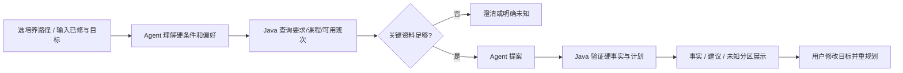

# 内部 PRD v0.4｜CoursePilot-Evo（五周）

状态：**方案/仓库骨架，尚未实现**。需求依据是用户提供的教学计划 `.xls` 和本机选课页 UserScript 的只读代码检查；后者尚未在 CoursePilot 接入或验证。展示层定为 **Vue 3 + Vite 响应式 Web**，不做小程序。

## 用户与核心任务

用户选择通过自动校验并发布的培养路径，录入已修课程并确认清单是否完整。页面先显示必修待完成项与分类学分缺口，再通过“先补必修 / 多修学分 / 探索专选 / 目标岗位 / 少早课 / 签到偏好 / 周五尽量空”等提示帮助学生说清目标；用户也可自由输入。工作台返回三类内容：① Java 可核验的事实及来源；② Agent 根据偏好提出的建议和取舍；③ 资料缺失、未通过导入门槛的规则和无法验证的班次条件。典型问法：“还缺多少专业选修学分？数学必须上，周五最好空出来。”当前无法取得经验证的真实班次快照，因此系统对真实冲突/周五占用明确说无法判断；模拟班次仅在演示模式验证算法。以后学生能提供合法快照时，再开放导入入口。学生始终在官方系统自行选课。[完整使用场景、评价来源与 Harness 做法](13-guided-planning-and-harness.md)。

## 页面与用户流程

单页工作台分为：培养路径和快照选择；已修记录编辑；Java 自动核对结果；引导式目标卡片与自由输入；候选课程/评价；方案与取舍；可展开的来源/Trace 区。用户可以回答“必须空还是尽量空”“高分指高学分还是评价印象”“希望从事什么岗位”“是否在意签到”等关键问题。岗位目标和兴趣由用户声明并可修改，未经确认的模型推断不写入稳定画像。签到若仅有历史评价，只作为主观参考。结果卡片显示 `已核验 / 建议 / 未知 / 系统错误`。没有真实班次时只展示课程层面的计划，不展示伪造的当期教师/时间；`SYNTHETIC` 班次仅在演示模式使用。未来真实浏览器导入流程才由学生自行登录官方页面、主动导出最小化 JSON、预览后上传；页面始终不接收教务账号、Cookie 或 Token。

## 范围和验收

| 优先级 | 功能 | 可见验收 |
| --- | --- | --- |
| P0 | 一条真实 2024 级路径的培养要求核对 | 学分/规则可追溯到工作表行；未通过导入门槛的规则 UNKNOWN |
| P0 | 模拟 CourseOffering 快照合同与时间解析测试 | 明示 SYNTHETIC；真实班次能力为 UNKNOWN |
| P0 | 自然语言硬/软偏好解析、工具调用、修正与澄清 | 候选经 Java 二次核验，Trace 可回放 |
| P0 | 已修课程、清单完整性、必修/学分缺口与可编辑的兴趣/岗位/时间/签到画像 | 用户不用先写完整 Prompt；未填写偏好不被暗中设默认值，清单不完整时缺口标估算/未知 |
| P0 | Web 单页和本地匿名会话 | 输入→结果→追问/重规划；错误可恢复 |
| P1 | 少量经授权或虚构的评价摘要导入与来源展示 | 历史评价只作主观参考，不冒充当期教学班或“容易高分”的事实 |
| P1 | 四 Task Group Benchmark、成本指标、版本比较 | 逐例分数、Token、工具调用、耗时和 held-out 对照 |
| P1 | 白名单 Harness 演化、v0→v1→v2 机制 | 每轮有跨 Case 假设、最小 patch、晋级/回滚依据 |
| 非目标 | 自动选课、抢课、模拟学校登录、持有教务凭据、微信小程序 | 无提交教务写接口 |

## 产品约束

- Java System 1 是事实边界：课程、学分、冲突、要求、来源/版本；Agent 不能把自己推断写成已核验事实。
- 不把 `UNKNOWN` 当 `false` 或“已通过”。查询失败是系统错误；数据缺失是业务未知。
- 用户的“必须”一般是 hard condition，“最好”一般是 soft preference；歧义影响计划合法性时先澄清。偏好指标由 Java 基于经验证的计划计算，最终取舍由 Agent 解释。
- 只保存演示必需的虚构或经授权已修数据。Trace 不存教务 Cookie、真实学号、完整个人成绩或模型私有思维链。
- “第一次昂贵分析→可复用 Skill/Policy→后续相关任务少 Token 且 held-out 不降质”是**实验假设**，不是验收时预填的结论。主观推荐质量仅做人工抽查。
- 结构化课程/学分由 Java 查询 MySQL 并返回短 JSON，不把全库同步给模型；评价摘要可按课程/教师检索少量片段，五周首版不引入向量 RAG。

Java/SQL 与规则落地见[实施方案](10-java-import-and-rules.md)，数据入口见[浏览器适配设计](09-browser-adapter.md)，接口见[总体 TRD](03-trd.md)，门槛见[Benchmark 协议](07-benchmark-protocol.md)。
