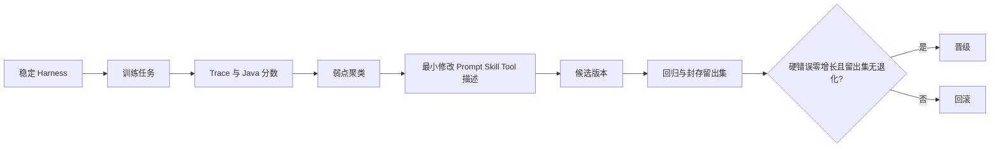

# 总体 TRD v0.1｜CoursePilot-Evo

状态：设计待评审。本文定义可并行开发的边界，具体字段在第 1 周用真实数据样本冻结。详细对象、状态、版本和 Trace 见[统一规范](04-infrastructure-workflow.md)。

## 1. 部署与依赖方向

- `web`：输入、方案/来源对比、评测结果展示。
- `java-environment`（Java 21 + Spring Boot）：数据导入、领域模型、Tool API、Verifier、记录存储；MySQL 为建议存储，课程要求可调整。
- `agent-runtime`（Python）：Planning Agent、模型适配器、工具客户端；只消费公开 Tool API。
- `evo-harness`（Python）：Benchmark、Trace 采集、弱点归因、Evolver、晋级/回滚；只能读取 Java Verifier 结果，不能修改它。

依赖方向：Web → API；Planning Agent → Java Tool API；Harness → Agent Runner / Verifier API。Java 不依赖 Python Agent 或模型输出。评测留出集由测试负责人封存，Evolver 只读训练失败轨迹。

## 2. Java 领域与工具

核心对象：`Course`（课程代码、名称、类别、学分）、`Offering`（课程、班次、学期、周次/节次）、`Requirement`（规则类型、门槛、适用培养方案、来源）、`CompletedCourse`（学生、课程、成绩/学分、状态）、`Preference`（类型、权重、硬/软）、`Plan`（班次集合、快照 ID）。缺失值必须显式 `UNKNOWN`，不能用空字符串冒充通过。

拟定工具：

| 工具 | 输入 | 输出及验证责任 |
| --- | --- | --- |
| `GET /v1/courses` | 快照、筛选条件 | 课程及来源，不捏造未导入班次 |
| `POST /v1/requirements/audit` | 培养方案 ID、已修记录引用 | 满足项、缺口、未知项、规则依据 |
| `POST /v1/offerings/conflicts` | 快照、班次 ID 列表 | 冲突对与周次/节次证据 |
| `POST /v1/plans/validate` | 快照、Plan、硬条件 | 硬错误、未知项、软偏好分项、`verifierResultId` |
| `GET /v1/snapshots/{id}` | 快照 ID | 数据来源、学期、版本、校验和 |

所有请求带 `requestId`、`schemaVersion`；所有响应带 `snapshotId` 和 `provenance[]`。错误以机器可读 `code` 返回，不让 Agent 从 HTTP 文本猜测。若需登录，学生记录只按授权用户可读。接口入参要有长度、ID、类别校验。

## 3. Planning Agent

输入为用户目标、受限的已修记录引用和数据快照。Agent 从语言中抽取“必须上数学”之类硬条件与“尽量空周五”之类软偏好；无法确认课程或规则时调用工具。生成候选方案后必须 `validatePlan`，有硬错误则修正或请用户决定放宽；达到固定修正次数上限时返回已知问题，不能假装完成。最终说明引用 `verifierResultId`、规则/班次来源和未知项。

模型提示词、Skill、工具描述按 `harnessVersion` 固定，推理模型、温度、预算、工具集合在同一评测批次固定。不要把已修记录原文、密钥或完整 Trace 输入给 Evolver。

## 4. Benchmark 与自进化

任务分为训练、开发、留出三组，覆盖正常规划、含糊偏好、规则冲突、无班次数据、主观评价引用和恶意/矛盾输入。题目含数据快照 ID、用户表达、人工标注的关键事实与验收断言；留出集不提供给 Evolver。固定种子和模型版本，重复运行时记录方差。

评分先以 Java 硬错误和规则核对为门槛，再看任务完成、引用完整度与偏好。弱点归因按错误码、工具缺失、解释遗漏聚类。Evolver 输出**最小 diff**和修改理由，只能改白名单目录里的提示词/Skill/工具说明。候选重新跑回归和留出集；硬错误增加直接回滚，留出集成功率下降也回滚。晋级记录版本 hash、任务集 hash、模型配置、分数和批准原因。人工可一键回滚到上个稳定版本。

## 5. 数据与存储建议

关系数据：`snapshot`、`course`、`offering`、`requirement`、`completed_course`、`task`、`trace_event`、`verifier_result`、`harness_version`、`benchmark_run`。大文本/原始文件放对象或本地文件存储，用内容 hash 引用；数据库保存元数据。开发时可先用文件快照，不能因技术栈简化而丢版本与来源。个人成绩记录和模型密钥不得放公开示例。

## 6. 关键验证

Java 规则使用小而人工可核对的样例验证：重叠周次、同节次不同周、课程别名、重复修读、未知学分等。Agent 集成至少覆盖一次核验失败后修正、一次正确澄清、一次数据缺失说明。Harness 验证包含“候选进步可晋级”和“硬错误或留出集退化必回滚”。指标在运行后填写，不预设提升百分比。
