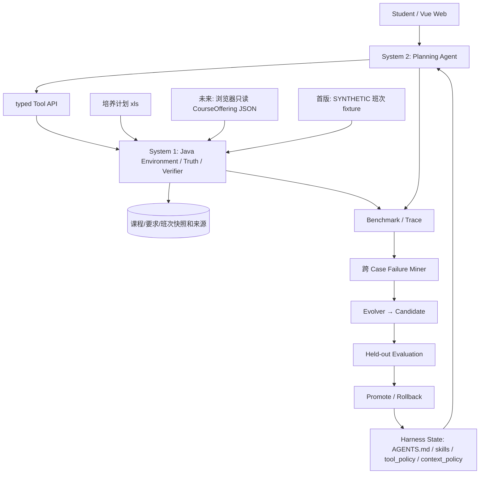

# 总体 TRD v0.4｜System 1 / System 2 与五周实现

状态：设计稿；CoursePilot 目前只有文档/骨架，无可运行 Agent/Java 服务。先冻结[共享契约](04-infrastructure-workflow.md)，再按[五人子 TRD](05-team-and-sub-trds.md)并行。原始 `.xls` 的字段边界见[数据核查](06-workbook-audit.md)，浏览器侧班次入口见[适配说明](09-browser-adapter.md)。

## 1. 进程、技术栈和责任

| 层 | 技术 | 本项目要实现的最小职责 |
| --- | --- | --- |
| Browser Adapter（后续） | 独立只读 UserScript/浏览器 JS、JSON Schema | 当前仅静态核查原插件；无法实测选课页，真实采集延后 |
| System 1 / Data | Java 21、Apache POI、Spring Boot、Spring Web、Bean Validation | `.xls` 导入、CourseOffering 快照校验、Course/Offering/Requirement 模型和 typed Tool API |
| System 1 / Truth | Java 规则类、JUnit 5、Spring Data JPA、MySQL 8、Flyway | 学分/要求/时间冲突/合法性/偏好指标和客观评分；全部绑定快照与来源 |
| System 2 | Python 3.11+、FastAPI、Pydantic、httpx、OpenAI-compatible 客户端 | 一个有界 Planning Agent；理解目标、调用工具、修正、澄清、解释 |
| Harness / RSI | Python、pytest、JSONL、hashlib、不可变快照 | AGENTS.md/skills/tool_policy/context_policy，Trace、失败归因、候选最小 patch、多轮晋级/回滚 |
| Web | Vue 3、Vite、Fetch | 路径/已修/目标录入，模拟班次导入演示，事实/建议/未知/版本展示 |

本地建议端口：Web 5173、Python 8000、Java 8080、MySQL 3306，可配置。浏览器不直接调用模型；Python 不读 MySQL，Java 不调用 LLM。除导入接口外，Web 调 Python，由 Python 调 Java Tool。课程时间可用性由 Java 返回状态决定。老师反馈后的引导式交互、评价导入与数据供给见[场景与 Harness 实施说明](13-guided-planning-and-harness.md)。

**参考与自研边界：**从 PhysicalRSI 借鉴 System 1/2 与“经验固化成可继承软件资产”的思想，从 GDPevo 借鉴同业务环境的 task-group 与 evolution/held-out 分离。CoursePilot 自己要实现的是教学计划/班次双快照、Java 课程真值工具、学业规划 Agent、四组自建任务、隔离晋级规则和 Web 演示；不复现两项研究的任务、代码、论文结果或性能数字。

## 2. 统一领域对象和存储

A 的 Excel 模板编译/自动校验、SQL 表与 B 的 typed rule evaluators 详见[Java 实施方案](10-java-import-and-rules.md)。选课小本本仅作为外部课程/教师评价链接；不当作开课时间或培养规则真值。

**先定义 DTO，不让成员独立创造同名对象。** `CurriculumSnapshot` = 文件 SHA + 培养路径 + 导入规则版本；`OfferingSnapshot` = 规范化 JSON 内容 SHA + `xnm/xqm` + adapterVersion + capturedAt；`SourceRef` = `kind, snapshotId?, sheet?, row?, endpoint?, sourceUrl?, capturedAt?`，其中培养/班次硬事实与评价/人工岗位标签的 `kind` 分开。`Course` 按课程代码和路径归属；`CareerCourseTag` 是少量人工策划的岗位-能力-课程映射，必须有来源，不当作学校官方要求；`CourseOffering` 按 `term + courseCode + classId` 标识，包含 credits/capacity/teacher、原始上课时间、解析后 `Meeting[]` 与 `parseStatus`。`Requirement` 带原文、规则表达式和 `compileStatus`。`CompletedCourse` 用虚构/经授权输入。`Plan` 指向课程/班次并记录 hard/soft constraints。

数据库拟建 `curriculum_snapshot, course, curriculum_course, requirement_rule, offering_snapshot, course_offering, meeting, completed_course, external_review_link, review_note, career_course_tag, verification_result`。先做一条已通过自动门槛的路径；班次仅用 `SYNTHETIC` fixture 验证算法，真实快照当前不可得。未发布路径不可混算，班次快照不覆盖培养快照。原始脚本/真实响应、学号与 Cookie 不入数据库。MySQL 用于可重复导入和工具查询；评测 Trace/版本/报告以本地 JSONL/manifest 保存，避免五周里扩展不必要的表。

## 3. Tool API v1 草案

所有业务请求带 `schemaVersion, requestId, curriculumSnapshotId, offeringSnapshotId?`；响应带 `status: OK|UNKNOWN|INVALID_INPUT|SNAPSHOT_MISMATCH|ERROR, data, provenance[], warnings[]`。时间问题必须带且校验 `offeringSnapshotId`；无快照或时间解析未知，响应 `UNKNOWN`/`unknownChecks[]`。查询班次的 `capturedAt/term/parseStatus` 始终透出。

| API | 输入重点 | 输出重点 |
| --- | --- | --- |
| `GET /api/v1/curriculum-snapshots` | 路径 | 已发布路径、文件 hash、版本 |
| `GET /api/v1/courses` | curriculumSnapshotId、代码/类别 | Course、可选岗位能力标签与 SourceRef |
| `GET /api/v1/reviews/search`（P1） | courseCode、teacherKey?、limit | 带来源的少量评价摘要/外链与匹配状态；不证明当期授课 |
| `POST /api/v1/offering-snapshots/import` | CourseOfferingSnapshot JSON | offeringSnapshotId、校验结果、拒绝行与警告 |
| `GET /api/v1/offerings` | 双快照、学期、课程代码 | 规范化班次和采集时间 |
| `POST /api/v1/requirements/audit` | 培养快照、已修记录 | satisfied/gaps/unknowns 与来源 |
| `POST /api/v1/plans/validate` | 双快照、已修、候选班次、硬条件 | violations/unknownChecks/verifiedFacts/verifierResultId |
| `POST /api/v1/preferences/score` | 经过验证的计划、软偏好 | 周五占用、碎片时段等可计算指标；无时间则 UNKNOWN |
| Python `POST /api/v1/planning` | 学生输入、双快照/本地会话 | verifiedFacts/recommendations/unknowns/clarification/traceId |

Java Tool API **冻结期间**不得由 Evolver 修改。Java 可以实现 `scoreBenchmarkCase`/独立评分适配器，评分器答案与 held-out 标签由 D 保管；Evolver 无读权限。示例 JSON 与版本/错误封套见[共享契约](04-infrastructure-workflow.md)。

## 4. 一次规划和一次演化

Planning Runner：Pydantic 校验→LLM 从页面提示和自由输入抽取 hard/soft/兴趣/歧义→按 tool_policy 查询 Java 的要求、课程及可用评价/班次→提出 2–3 个课程候选→Java `plans/validate`→必要时最多一次修正或澄清→最终答复。建议最大 4 次工具调用和一次修正，实际预算第一周固定并写入 manifest。模型文本不可覆盖 Java 学分或冲突结论；`parseStatus != PARSED` 时冲突/周五条件未知。

RSI Runner：稳定 Agent vN→Evolution Benchmark→Trace→跨至少两例的失败假设→Evolver 对白名单 Harness State 产生一次有限 patch→Candidate vN+1→Evolution 回归+隔离 Held-out→客观门槛判定→Promote/Rollback→下一轮基于稳定 vN+1。必须能记录 v0→v1→v2 的版本 lineage；如果候选失败，分支保留为 rejected，稳定指针不前进。允许 patch 的首版范围只有 `AGENTS.md`、`skills/`、`tool_policy`、`context_policy`；Java/API/评分器/答案/模型配置均冻结。将验证稳定的做法进一步实现为 Java 工具是未来人工工程迭代，不属于首版自动 patch。

课程、学分和规则由 Java 按需查询 MySQL，以短 JSON + SourceRef 给 Agent，不把全库塞进 Prompt。评价摘要是带来源的主观文本，首版按 courseCode/teacherKey 检索少量片段；没有足量授权文本和检索评测时不建向量 RAG。每次运行的 `run-manifest.json` 记录数据/Benchmark/Java API/Verifier/模型/Harness 版本、温度、token budget；Trace 保存 token、工具次数、总耗时和来源，详见[Benchmark 协议](07-benchmark-protocol.md)。检验的是“重用策略后减少推理成本且 held-out 不退化”，不能因为多思考使分数略升就称为效率提高。

## 5. 五周集成与退化路径

W1 冻结共享结构并静态核查插件；W2 Java 规则和真实 `.xls` 数据导入；W3 Web→Python→Java 闭环；W4 任务组基线；W5 多轮候选与演示。真实班次数据尚未验证，产品模式下 `offerings` 和时间类规则返回 UNKNOWN，其他培养要求核对继续可演示。若模型额度不足，保留真实 Java 核验与评测设计，如实报告未完成的自进化。每周以固定 fixture 运行一条端到端场景；新字段先改共享契约，再改 DTO/测试/页面。
