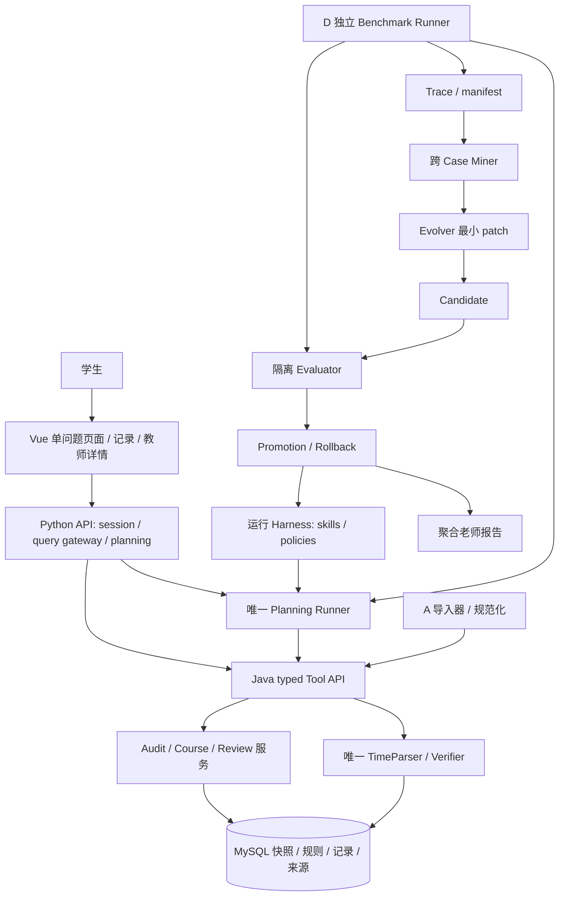
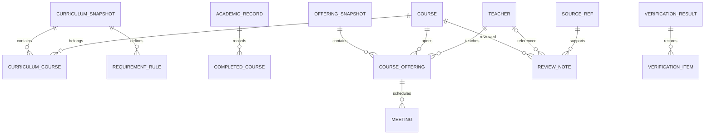
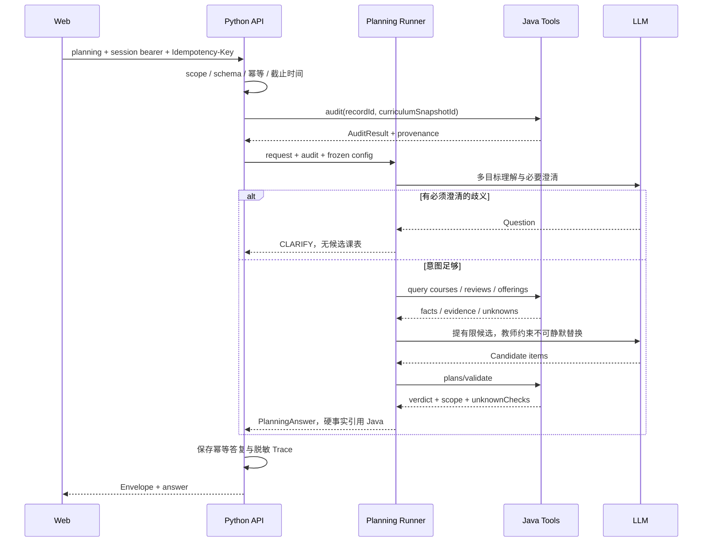
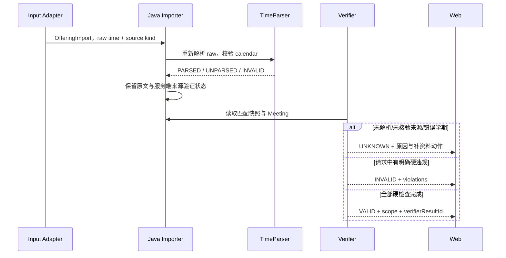
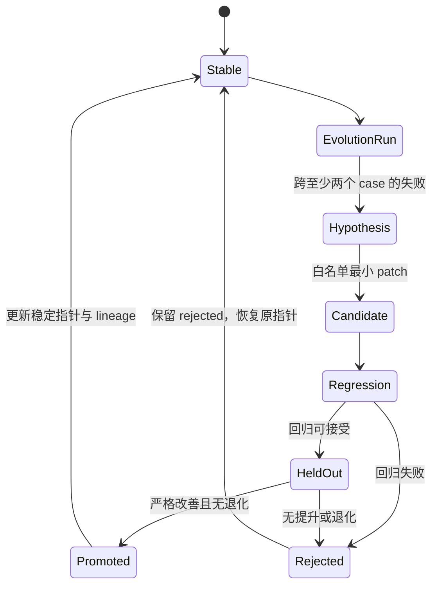

# 总体 TRD v1.0｜CoursePilot-Evo

| 项 | 基线 |
| --- | --- |
| 状态 | 可执行设计与接口契约；服务尚未实现 |
| 产品 | [PRD](02-prd.md)、[需求维度](14-student-choice-research-and-ux.md) |
| 技术 | Vue 3/Vite/Router；Python 3.11+/FastAPI/Pydantic；Java 21/Spring Boot/MySQL/Flyway |
| 字段真源 | [OpenAPI/JSON Schema](../contracts/README.md) |
| 行为真源 | [公共接口契约](04-infrastructure-workflow.md) |
| 实现安排 | [开发大纲](15-team-baseline-and-batches.md)、[A–E 子 TRD](05-team-and-sub-trds.md) |
| 代码与协作 | [工程规范](16-engineering-and-debugging.md)、[协作规范](12-github-collaboration.md) |

## 1. 范围与所有权

System 1 Java 拥有课程、培养要求、学业记录、班次快照、评价查询和确定性核验；System 2 Python 拥有意图、调用策略、规划、澄清、输出与 Harness 装载。Agent 不拥有规则真值。D 拥有独立题集、标签、隔离评分与版本晋级；E 展示服务结果，不再计算学分或冲突。

首版一个计算机培养路径、有限评价记录、少量计算机岗位介绍。真实班次暂不可验证：课程层规划仍可开发，时间算法用明确的 simulation fixture。首版不做学校登录代管、自动选课、实时评论/岗位爬取、全职业推荐或公网学生成绩平台。

数据参考是本地原始教学计划与插件静态研究。库中硬事实必须有 SourceRef；原始学校文件、脚本、个人成绩、Cookie 不进入公开仓库。PhysicalRSI/GDPevo 仅为分层/任务组设计参考，不冒称复现。

## 2. 结构与部署

默认本地 Web 5173、Python 8000、Java 8080、MySQL 3306，均配置化。Java/MySQL 不暴露浏览器；Python 通过 Service Key 调 Java。没有 MQ、微服务平台和独立向量库要求，避免五周引入额外运维。

Web 学生页面与老师报告分路由；报告要管理权限，不能只隐藏按钮。匿名本地 session 仅供虚构/授权演示；部署真实学生服务另完成 HTTPS、正式身份、对象级权限、隐私与数据保留方案。

## 3. 数据结构与关系

| 表/对象 | 唯一性/事务边界 | 关键规则 |
| --- | --- | --- |
| curriculum_snapshot | track+contentHash+importerVersion 唯一 | PUBLISHED 后不可原地修改 |
| course / curriculum_course | courseCode 字符串；归属由 snapshot+code 定义 | 同名不合并，学分 DECIMAL，不跨快照混算 |
| requirement_rule | snapshot+requirementId | 原文/SourceRef/受控表达式/compileStatus |
| academic_record / completed_course | subject+recordId+revision | 当前会话拥有；版本不可覆盖；完整性显式 |
| offering_snapshot | term+contentHash+adapterVersion | sourceKind 和服务端 sourceValidation 分开 |
| course_offering / meeting | snapshot+classId；班次有多条 meeting | B 唯一解析器；缺时间 UNPARSED |
| teacher / review_note | teacherKey；reviewNoteId | course+teacher+term 匹配，不能默认证明当期开课 |
| verification_result | verifierResultId；绑定请求摘要与 recordRevision | 不是可复用于任意新方案的通行证 |

Trace、run manifest、lineage 和 Harness snapshot 先使用本地 JSONL/JSON 文件。数据库仅存业务与核验记录，不把整个评测平台塞入 SQL。报告目录与原始 Trace 不公开暴露。

## 4. 应用接口

具体字段与状态见 [Java OpenAPI](../contracts/java.openapi.json)、[Python OpenAPI](../contracts/planning.openapi.json)。

| 用户行为 | Web→Python | Python→Java | 必需约束 |
| --- | --- | --- | --- |
| 建演示会话 | POST sessions | 无 | 限流、随机 token、只保存 hash、30 分钟过期 |
| 保存/读已修 | POST/GET academic-records | 同名接口 | 对象级 scope、记录版本、写入幂等 |
| 查培养与课程 | GET curriculum-snapshots / courses | 同名接口 | 只已发布路径、有限分页 |
| 看教师/评价/方向 | GET teacher-course-options / reviews/search / career-directions | 同名接口 | 历史/当期/未知分开，返回证据 ID |
| 查缺口 | POST requirements/audit | 同名接口 | 有所属记录，缺失完整性不能算确定缺口 |
| 提目标/replan | POST planning | 若干 typed tools 与 plans/validate | 校验 scope、快照、预算、教师锁定 |
| 看演化报告 | GET reports/runs/{runId} | 无 | session+adminKey，只有聚合报告 |
| 导入培养/班次/评价 | 受限本地管理流程 | import 端点 | service+admin key，事务和自然幂等 |

Python API 网关只能转发白名单路径/参数，不能接受 userUrl/toolName 来任意代理。trusted X-Subject-Id 来自认证结果，不来自 body。Java 请求和错误封套经过 Pydantic 校验再给模型；不能把堆栈直接塞 Prompt。

## 5. 学生规划时序

同一个 Runner 对生产与 Benchmark 可调用；避免评测专用 Agent 偷享额外工具/预算。累计 6 tools、3 model calls、8000 input/2000 output tokens、45 秒默认上限，详见共同契约，真实效率需实测。

## 6. 时间与未知时序

单条已经可证明的 violation 优先于未知；若没有 violation 但有 unknown，判 UNKNOWN。任何 simulation 的 VALID 仅表示模拟检查通过。通勤缺数据另标未知，不等同时间节次无冲突。

## 7. 演化流程与稳定状态

D 的 Evaluator 独立读取 gold/held-out；Evolver 不可读取这些文件或 Java/评分器代码。固定 model/API/data/budget。首版 patch 仅 agent-runtime/harness 的 AGENTS.md、skills、tool_policy、context_policy；根 AGENTS.md 为开发规范，不属于运行 patch。

## 8. 非功能、安全与故障恢复

查询目标是本地稳定响应，不写未实测 P95。每阶段记录耗时，用目标数据集压测后才报告实际性能。数据库导入失败事务回滚；planning 超时返回 ERROR，不制造推荐。客户端重试相同幂等键不得双执行模型。

日志只写 request/trace/task ID、阶段、工具名称、耗时、状态、错误码；不写完整 Prompt、评价原文、成绩、密钥。默认不渲染用户 HTML，不执行模型生成的脚本/SQL，使用参数化查询。评价 URL 不由服务端任意抓取，源文件不能携带可执行指令影响 Harness。

演化与导入数据使用临时目录、原子发布；路径由服务端生成，拒绝路径穿越、超限文件、未经支持的格式。未经来源核验的真实时间不能通过，未知规则不能手工批准上线。

## 9. 验收与待关闭项

| 验收项 | 负责 / 证据 |
| --- | --- |
| 一条真实培养路径、幂等与未知阻断 | A/B：golden 对照与导入差异 |
| 模拟单双周、离散周、未知/冲突 | B/D：参数化测试与 Java 结果 |
| 多动机、老师锁定、课程教师证据匹配 | C/E/D：case 与集成测试 |
| session 隔离、输入验证、无密钥/敏感日志 | B/C/E：反例和工程自查 |
| 同一 Runner 与两轮候选 | C/D：manifest、逐例分数、lineage |
| 单问题、小屏、返回保留、独立报告 | E：交互测试与截图 |

待关闭项：首次培养路径 ID、实际基模 ID、各模块负责人姓名、授权评价样例。默认预算与新鲜度阈值已经给出可实现起点，W1 可经共同契约 PR 调整一次，随后固定比较条件。真实班次仍 UNVERIFIED_NO_ACCESS，不以计划代替已完成。
