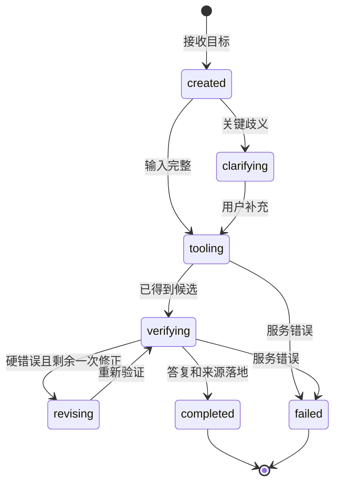

# 五人共同遵守的基础设施与工作流契约 v0.2

这是**开发前的统一规范**，不是已存在的系统实现。第 1 周用真实 `.xls` 样本和一条假数据链路冻结 v1；子 TRD 不得自行改同名字段。

## 1. 三种版本，不能混用

- `snapshotId`：原始 `.xls` SHA-256 + 培养路径 + 导入规则版本。所有课程、要求、核验结果绑定同一个快照；换文件不覆盖旧记录。
- `schemaVersion`：Tool API、Trace、Benchmark JSON 的字段版本。破坏性变更升版本，并给 Web/Python/Java 同时改适配。
- `harnessVersion`：Python Prompt、工具说明和工作流配置的内容 hash。一次运行开始后固定；`verifierVersion` 与 `benchmarkSetVersion` 另外记录，Evolver 无权修改它们。

## 2. Java Tool 边界

输入使用课程代码字符串，不转数字；来源记录至少 `sheet, row, column, sourceFileHash, track`。响应封套固定 `schemaVersion, requestId, snapshotId, status, data, provenance[], warnings[]`。`status=UNKNOWN` 表示资料不足，`ERROR` 表示服务失败；都不能在 Agent 侧转成“通过”。

`AuditResult`：`satisfied[]`、`gaps[]`、`unknowns[]`。`RecommendationValidation`：`validCourses[]`、`violations[]`、`unknownChecks[]`、`verifierResultId`。`valid=true` 只表示所有**已启用且有数据**的硬检查通过，页面仍显示未检查的班次/余量未知，不使用“课表可行”文案。

## 3. 一次规划的状态

Python orchestrator 依据 Java 响应推进状态；LLM 只提出文本或候选动作，不能自己宣布 `completed`。五周版先用一次同步 `POST /api/v1/planning` 返回最终结果和 `taskId`，网页显示加载状态。若后续请求确实超过可接受延迟，再引入队列/SSE；不为假想并发提前加 MQ。

## 4. Trace v1

每个事件含 `taskId, traceId, seq, timestamp, stage, eventType, snapshotId, harnessVersion, verifierVersion, toolName?, inputDigest?, outputRef?, durationMs?, errorCode?`。建议事件：`USER_INPUT`、`CONSTRAINT_EXTRACTED`、`TOOL_CALLED`、`TOOL_RETURNED`、`CANDIDATE_PROPOSED`、`VERIFIER_RETURNED`、`CLARIFICATION_REQUESTED`、`FINAL_DELIVERED`、`ERROR`。Python 写 JSONL，序号单调；Java 返回 `verifierResultId` 供关联。隐藏密钥、私人已修记录全文、模型完整思维链；可重放所需输入用脱敏 fixture 和 hash。

## 5. 共同错误码

`PATH_NOT_REVIEWED`（路径未审核）、`COURSE_NOT_FOUND`、`COMPOSITE_CODE_UNRESOLVED`、`RULE_UNKNOWN`、`OFFERING_UNAVAILABLE`、`SNAPSHOT_MISMATCH`、`MODEL_TIMEOUT`、`TOOL_UNAVAILABLE`。每项定义用户文案和是否可重试。`OFFERING_UNAVAILABLE` 出现时，任何时间冲突或“周五空课”的判断都必须是未知。

## 6. 交接和变更流程

1. A 交 `snapshotId`、字段字典、异常清单和人工审核规则；B 不直接解析 Excel。
2. B 交 Java DTO/OpenAPI 样例及核验测试；C 只包装其服务为 API，不复制规则逻辑。
3. C 提供固定的本地 URL 与错误封套；D 用 `httpx` 调用，不读 Java 数据库。
4. D 交 Trace 样例与最终答复 schema；E 用同一 Agent Runner 跑固定任务，不另写一份“评测专用 Agent”。
5. 第 1 周全组一起确认 API v1；此后更改字段先改此文件/示例，再改 Java/Python/Web 的测试与实现。每周至少一条从网页到 Java 的集成演示。

完成线：在本地新环境按 README 启动，导入同一文件两次不重复课程；固定请求得到相同规则结果；Tool/Trace schema 可被相邻模块消费。模型随机性另由 Benchmark 记录，不要求自然语言逐字一致。
