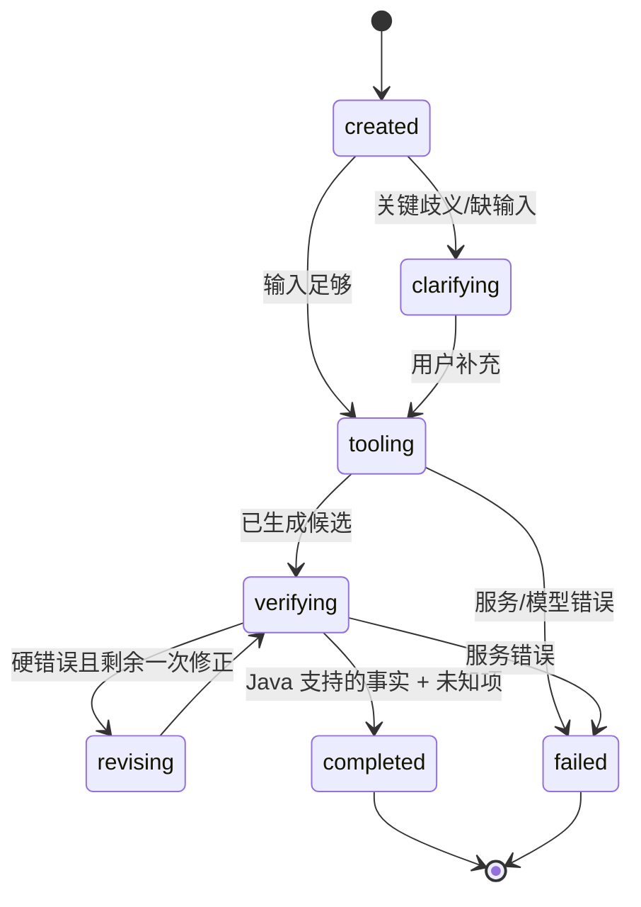

# 共同基础设施、对象与工作流契约 v0.4

状态：**开发前契约草案**，第 1 周以真实 `.xls` 与明确标记 `SYNTHETIC` 的班次 fixture 冻结 v1；目前没有经授权的真实班次样例。此文件是五人共用的接口真源；个人子 TRD 不得自行改变字段。问题先在这里记录决议，再改 Java/Python/Web DTO 和示例。

## 1. 快照、版本与拥有者

| 标识 | 含义 / 生成与拥有者 | 变更规则 |
| --- | --- | --- |
| `curriculumSnapshotId` | A 导入 `.xls`，按文件 SHA-256 + 培养路径 + importerVersion 建立，B 持久化 | 同源重导幂等；新文件/规则版本新 ID |
| `offeringSnapshotId` | A 导出 CourseOffering JSON，B 导入并计算内容 hash + 学期 + adapterVersion | 可空；旧快照不覆盖新快照，不能伪装实时 |
| `schemaVersion` | 全组共管 Tool/Trace/Benchmark DTO；初稿 `1.0` | 破坏性变更升版本并同步所有客户端 |
| `javaToolApiVersion` / `verifierVersion` | B 的接口和确定性规则 commit/hash | 在同一 Benchmark 比较中冻结 |
| `harnessVersion` / `parentVersion` | C 的 AGENTS/skills/policies 内容 hash；D 记录 lineage | 单次运行冻结；候选始终有父版本与 patch hash |
| `benchmarkSetVersion` / `evaluatorVersion` | D 的题目/标签/评分器 hash | Evolver 不可读答案，也不可改评分器 |
| `modelConfigId` | C/D 固定 base model、temperature、token budget、工具上限 | 同一次 vN/vN+1 对比不得变化 |

`SourceRef` 最少包含 `kind: CURRICULUM|OFFERING, snapshotId, sheet?, row?, column?, endpoint?, capturedAt?`。`Course`、`CourseOffering`、`Meeting`、`Requirement`、`CompletedCourse`、`Plan` 的字段见[总体 TRD](03-trd.md)与[JSON Schema](course-offering-snapshot.schema.json)。培养快照与班次快照不可用一个 `snapshotId` 混称。课程代码、班次 ID、学年学期均为字符串，保留前导零；同学期 `courseCode+classId` 唯一。

## 2. API 封套与状态

Java 请求至少含 `schemaVersion, requestId, curriculumSnapshotId`，涉及时间时另含 `offeringSnapshotId`。响应固定 `schemaVersion, requestId, curriculumSnapshotId, offeringSnapshotId?, status, data, provenance[], warnings[]`。`status=UNKNOWN` 是业务资料不足，`INVALID_INPUT` 是调用方输入错误，`SNAPSHOT_MISMATCH` 是版本/学期错，`ERROR` 是系统失败；不得统一转换为“无冲突/通过”。

```json
{
  "schemaVersion": "1.0", "requestId": "demo-001",
  "curriculumSnapshotId": "curr:example-hash", "offeringSnapshotId": null,
  "status": "UNKNOWN",
  "data": {"unknownChecks": [{"code": "OFFERING_UNAVAILABLE", "message": "没有经验证的本学期班次快照"}]},
  "provenance": [{"kind": "CURRICULUM", "snapshotId": "curr:example-hash", "sheet": "计科学1", "row": 45}],
  "warnings": []
}
```

`AuditResult = satisfied[] + gaps[] + unknowns[]`；`PlanValidation = verifiedFacts[] + violations[] + unknownChecks[] + verifierResultId`；`PreferenceScore = metrics[] + unknownMetrics[]`。`valid=true` 只可在**所有请求的硬检查都已执行且无 violation**时返回；未执行的时间检查必须显示 unknown，不能算合格课表。偏好分数绝不替代硬约束。

## 3. 引导式规划输入与评价证据

`PlanningRequest` 由 E 的页面提交，至少含 `schemaVersion, sessionId, curriculumSnapshotId, completedCourses[], transcriptComplete, promptText, selectedGoalChips[], previousPlanId?`；`offeringSnapshotId?` 只有经验证的真实快照或显式演示模式可填。C 从页面提示与自由输入整理 `GoalIntent`：`hardConstraints[], softPreferences[], interestTags[], creditGoal?, teacherPreference?, questionToClarify?`。每条约束带 `sourceText` 和 `confidence`；不能把页面没有收集到的偏好伪装为学生已确认。涉及“高分”等歧义时先确认含义。

`ReviewNote` 最少包含 `reviewNoteId, courseCode, teacherKey?, sourceType, sourceUrl?, importBatchId, textExcerpt, tags[], matchStatus`，其中 `sourceType=USER_IMPORT|EXTERNAL_LINK|SYNTHETIC`，`matchStatus=VERIFIED_COURSE|UNVERIFIED`。评价只作为主观证据；`UNVERIFIED` 不得关联到某个当前教学班。B 的 `GET /api/v1/reviews/search`（P1）按课程/教师返回有限条摘录和来源，不提供大段全文或声称“高分保证”。A 管少量 CSV/JSON 导入和来源格式，B 管存储/查询，E 管展示，C 管上下文选择。

模型上下文只含本次任务相关的 Java Tool 响应、快照 ID、SourceRef、少量评价摘录和结构化偏好。`context_policy` 限制片段数/字段/Token，数据库更新通过下一次工具查询体现；不维护一个自动同步的“AI 全库”。RAG 只在未来有长篇授权文档和可评估的检索任务时加入，首版课程/学分/规则仍以 SQL + Java 为真值。

## 4. 规划状态与 Agent State



`AgentState` 记录 `taskId, traceId, sessionId, harnessVersion, modelConfigId, curriculumSnapshotId, offeringSnapshotId?, status, goalIntent, toolCallCount, tokenIn, tokenOut, elapsedMs, finalAnswerRef?`。LLM 只提出目标或候选，Python Runner 根据 Java 响应改变状态；用户澄清产生新 turn，并保留原 `taskId` 与新的 `traceId`。五周首版用同步规划 API；超时时返回可重试错误，不引入 MQ。

## 5. Trace、评分与隔离

每个 JSONL 事件字段：`taskId, traceId, seq, timestamp, stage, eventType, curriculumSnapshotId, offeringSnapshotId?, harnessVersion, javaToolApiVersion, verifierVersion, caseId?, toolName?, inputDigest?, outputRef?, durationMs?, inputTokens?, outputTokens?, errorCode?`。建议事件：`USER_INPUT`, `GOAL_EXTRACTED`, `TOOL_CALLED`, `TOOL_RETURNED`, `CANDIDATE_PROPOSED`, `VERIFIER_RETURNED`, `CLARIFICATION_REQUESTED`, `FINAL_DELIVERED`, `ERROR`。序号单调；模型使用量以 provider 返回为准，缺失时标 `UNAVAILABLE`，不要估为 0。每个 run 另保存 `run-manifest.json`, `case-results.jsonl`, `agent-state.json`, `scores.json`, `lineage.json` 和 Harness 快照。Trace 脱敏，不保存 Cookie、学生身份、原始教务响应或完整私有思维链。

D 保管 `benchmark/evolution/` 与隔离的 `benchmark/held-out/`。Evolver 的运行工作目录仅挂载 evolution case 的用户输入、脱敏 Trace、可修改 Harness 文件；答案、held-out 输入/标签、评分器、Java 服务代码均**不挂载/不可读取**。评测 Runner 在候选生成后另启隔离进程读取答案评分，只返聚合分数和门槛结果给 promotion。不能只在 Prompt 中写“不要看”来代替目录/进程隔离。

## 6. 共同错误码与数据新鲜度

`PATH_NOT_REVIEWED`, `COURSE_NOT_FOUND`, `COMPOSITE_CODE_UNRESOLVED`, `RULE_UNKNOWN`, `OFFERING_UNAVAILABLE`, `UNKNOWN_TIME_FORMAT`, `UNMATCHED_COURSE`, `TERM_MISMATCH`, `SNAPSHOT_STALE`, `SNAPSHOT_MISMATCH`, `MODEL_TIMEOUT`, `TOOL_UNAVAILABLE`。每个码要有用户文案、是否可重试和 Trace 映射。未来真实班次采集时间超过声明的新鲜度阈值时标 `SNAPSHOT_STALE`；当前没有可实测快照，不能无依据说“实时”。

## 7. 模块交接与变更次序

1. **全组先冻结** JSON Schema、两个快照 ID、Tool API、Trace、评分 manifest、错误码和本地端口。用一个明确标记 `SYNTHETIC` 的 CourseOffering fixture 做端到端合同测试；真实班次入口状态为 `UNVERIFIED_NO_ACCESS`。
2. A 交导入器、字段映射、异常/隐私清单、通过自动门槛的培养快照，以及少量有来源的评价摘要导入格式；B 消费标准对象，不再解析浏览器页面。
3. B 交 Java DTO/OpenAPI、规则单测和 `UNKNOWN` 示例；C 只通过 HTTP 工具取得真值，不读数据库或自行计算学分。
4. C 交唯一 `planner.run(case)`、Agent State/Trace；D 复用同一 Runner，不做评测专用 Agent。D 交逐例结果、hypothesis、patch、lineage；E 只展示结果，不重算评分。
5. E 用假 DTO 先做页面，在 W3 接真服务。新字段先更新本文件与示例，再由相邻模块同步代码、测试和页面；每周至少跑一条 Web→Python→Java 全链路。

完成线：相同文件重复导入幂等，固定 Java 请求给同一规则结果；模拟班次/无真实班次两条测试路径都不误报冲突；Agent 硬事实附 `verifierResultId/SourceRef`；D 能重放同一输入并追溯模型/Harness/快照；E 显示状态和版本。这里列的是验收标准，不代表已经通过。
