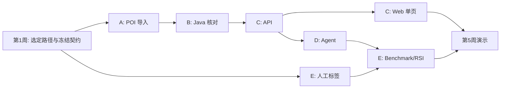

# 五人分工与子 TRD：从哪里开始写代码

成员 A–E 是占位名，实际姓名由组内填写。五周总计划约 **54 人日**。先读[数据核查](06-workbook-audit.md)、[总体 TRD](03-trd.md)和[共同契约](04-infrastructure-workflow.md)，再领取下面一份子 TRD；它们已经写到技术栈、文件、步骤和验收，不是只给模块名称。

| 成员 | 读哪份子 TRD | 技术栈 | 第一次交给下一人的东西 | 人日 |
| --- | --- | --- | --- | ---: |
| A 数据 | [A：`.xls` 导入与来源](trd/a-data.md) | Java 21、Apache POI、MySQL/Flyway、JUnit | 一份已核对的 `snapshotId`、课程表、异常清单 | 10 |
| B 规则 | [B：培养要求与 Verifier](trd/b-verifier.md) | 纯 Java 规则类、Spring Service、JUnit 5 | `auditRequirements`、`validateRecommendation` DTO 与用例 | 12 |
| C 平台/网页 | [C：Tool API 与 Vue 页面](trd/c-platform-web.md) | Spring Web、Validation、MySQL、Vue 3/Vite | 可从浏览器调用的一条 API 链路 | 12 |
| D Agent | [D：Python Planning Agent](trd/d-agent.md) | Python、FastAPI、Pydantic、httpx、LLM client | 可解释答复和逐步 Trace | 10 |
| E 评测 | [E：Benchmark 与 RSI](trd/e-benchmark-rsi.md) | Python、pytest、JSONL、Git hash | 基线、候选 diff、晋级/回滚记录 | 10 |

**依赖顺序：**A 的真实字段 → B 的规则 → C 的 Tool API → D 的 Agent → E 的评测。C 的网页可在 B/D 未完成时用固定 fixture 并行开发；E 的任务标注与数据审核可从第 1 周并行开始。每周五用同一 `snapshotId` 跑一条全链路，发现契约冲突当周修改。

不需要把任务书“发送给 AI 代理”才能算委派；成员领用文件后再按其接口写代码。接口要改，先更改共同契约，再通知相邻模块。五周内不开始独立小程序或通用 Agent 平台。
