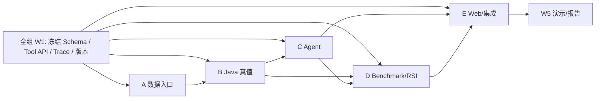

# 五人分工与后续子 TRD 任务委派（五周）

先读[老师版](01-teacher-project-plan.md)、[完整学生场景](13-guided-planning-and-harness.md)、[总体 TRD](03-trd.md)、[共享契约](04-infrastructure-workflow.md)、[数据入口](09-browser-adapter.md)和[Benchmark](07-benchmark-protocol.md)。**第一周全组冻结两个快照 ID、CourseOffering JSON、Tool API、Trace、run manifest 后**，再按下表领个人任务。成员 A–E 是占位名，实际姓名组内填写。预计 55 人日是计划工时。

| 人 | 子 TRD / 技术栈 | 所有权与首次交付 | 人日 |
| --- | --- | --- | ---: |
| A | [数据适配](trd/a-data.md)：Java POI + JSON Schema + 插件静态核查 | `.xls` 模板编译/自动校验/原子发布、模拟班次 fixture；P1 少量评价摘要导入格式 | 12 |
| B | [Java Environment/Verifier](trd/b-verifier.md)：Spring Boot/JPA/Flyway/JUnit | 课程/班次/要求模型、typed Tool API、确定性核验；P1 评价摘要查询 | 12 |
| C | [Planning Agent](trd/c-agent.md)：Python/FastAPI/Pydantic/httpx | 同一 Agent Runner、引导式 GoalIntent、澄清策略、Harness State、脱敏 Trace | 10 |
| D | [Benchmark/RSI](trd/d-benchmark-rsi.md)：Python/pytest/JSONL | 四组任务、隔离评分、跨 Case Miner、候选/晋级/回滚 | 11 |
| E | [Web/会话/集成](trd/e-web-integration.md)：Vue 3/Vite/Fetch | 引导式问题、必修/学分缺口、事实/未知/版本与评价来源可视化、端到端演示 | 10 |

工作量依据：A 承担 Excel 三类表的解析器、黄金样例、自动校验/异常阻断及班次字段的静态契约，给 12 人日；B 有核心 Java 规则和两个快照，给 12；D 需人工标注与双轮版本流程，给 11；C/E 分别聚焦 Agent 与页面/联调。A/B 的 Java DTO、C/D 的 Runner 和 D/E 的 Trace 展示必须共用契约，不能复制规则或另造对象。

每份子 TRD 写明要回答的问题、文件所有权、输入输出、验收和依赖。W1 用虚构 fixture 并行开发；W2 A/B 先交通过自动门槛的真实培养快照、模拟班次 fixture 与 Tool；W3 C/E 联通；W4 D 跑基线；W5 全组运行双轮候选。接口变更先改共享契约和样例，再同步各模块，实际班次入口不可用时保留明确的 UNKNOWN 降级。GitHub 仓库已创建，当前公开；四位成员待邀请取得写入权限，见协作文档。
