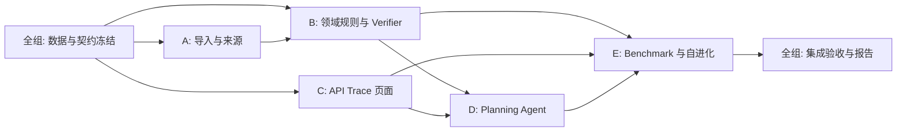

# 五人分工与后续子 TRD 委派

成员以 A–E 占位，姓名和实际负责范围待组内确认。本文件是**任务书**，未向真人发送、未创建分支或远程仓库。先由全组审核 [统一规范](04-infrastructure-workflow.md) 和一份真实样本，再并行写/实现各自子 TRD。

| 成员 | 文件/模块所有权 | 子 TRD 必须回答 | 交付与依赖 | 计划人日 |
| --- | --- | --- | --- | ---: |
| A 数据与来源 | `java-environment/data-import/`、数据字典与来源表 | Excel/班次实际字段如何映射？缺失/重复/历史快照怎样标注？如何回溯到行/页？ | 样本、字段映射、导入校验报告；B/C 依赖其 `snapshotId` | 15 |
| B Java 规则与 Verifier | `java-environment/domain/`、`rules/`、`verifier/` | 培养规则的确定性算法？跨周冲突判定？未知数据如何传播？硬/软项怎样分开？ | 查课/核验服务、人工对照案例；D/E 依赖核验结果 | 19 |
| C Java 平台与界面 | `java-environment/api/`、`persistence/`、`web/` | Tool API 封套和错误码如何落实？Task/Trace/版本如何存取？界面怎样呈现来源与未知？ | Spring Boot API、Trace 查询、最简界面；集成 A/B/D | 18 |
| D Planning Agent | `agent-runtime/`、`harness/prompts/` 初始版 | 如何提取硬/软条件、何时澄清、何时必须调用工具、核验失败如何修正？ | Python Agent、工具客户端、三类代表性 Trace；依赖 B/C API | 16 |
| E Benchmark 与 RSI | `evo-harness/`、`benchmark/`、版本晋级 | 任务如何分组、打分和封存？如何聚类失败？改动白名单和晋级/回滚如何执行？ | 基线评测、一次候选修改及决策记录；依赖 B/C/D | 16 |

## 先统一的全组任务（第 1 周）

1. A 带来培养方案和班次的**脱敏**真实字段样本，B 判定哪些规则可程序核验。
2. C 主持冻结 `Course/Offering/Requirement/Plan`、Tool API、错误码和 Trace v1；D/E 用样例请求验证能否消费。
3. E 与 B 共同定人工标注格式和留出集隔离；D 不接触留出答案。
4. 全组确定首版演示数据与范围；若班次不可用，按老师版收缩。

## 交付时序与依赖

每份子 TRD 模板：目标与非目标、依赖的契约版本、输入输出样例、状态/错误路径、来源与隐私、关键算法、可验证案例、估时与风险、交接对象。不得在子 TRD 中声称已有未交付功能。各人完成设计评审后再实施，接口变更先回到统一规范审批。
