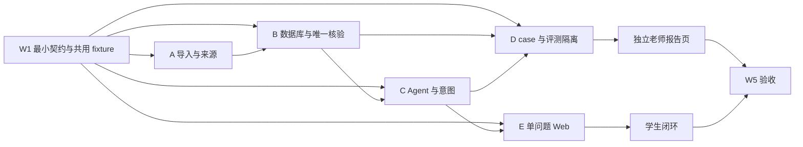

# 五人分工与子 TRD

日期：2026-09-30。先读 [团队基线与开发批次](15-team-baseline-and-batches.md)和 [HTML 交接规范](../demo/README.md)，再读 [统一契约](04-infrastructure-workflow.md)和个人子 TRD。成员 A–E 为占位名，组内填姓名。当前文档与原型已准备，服务尚未实现。

| 人 | 技术栈与子 TRD | 所有权与主要交付 | 人日 |
| --- | --- | --- | ---: |
| A | [数据](trd/a-data.md)：Java 21/Apache POI、JSON Schema、CSV/JSON | 一个培养路径导入、自动门槛、来源定位、已修与评价输入、原始时间黄金 fixture；不另写冲突规则 | 11 |
| B | [真值与核验](trd/b-verifier.md)：Spring Boot/JPA/MySQL/Flyway/JUnit | 数据存储、Audit、教师课程/评价查询、唯一 TimeParser/ConflictChecker、Tool API | 12 |
| C | [Agent](trd/c-agent.md)：Python/FastAPI/Pydantic/httpx | 多动机/澄清、指定教师、统一 Runner、Harness State/Trace、少量计算机方向内容 | 11 |
| D | [评测与演化](trd/d-benchmark-rsi.md)：Python/pytest/JSONL | W1 开始标注四组 case、隔离评分、跨 Case Miner、两轮候选 gate 与报告 | 10 |
| E | [前端与集成](trd/e-web-integration.md)：Vue 3/Vite/Router、Pinia 或会话状态、Fetch | 一次一问、学业记录、课程教师详情、候选/未知/重规划、独立老师报告页 | 11 |

合计 55 人日，约 330–440 小时，是规划估算。A 少做实时浏览器采集与职业内容；C 承接多目标意图和少量方向；B/D 共同复核真值；E 增加产品交互，但不算业务规则。

交付按批次推进：第 0 批 W1 前半冻结最小合同；第 1 批 W1–W2 学业事实；第 2 批 W2–W3 前半学生闭环；第 3 批 W3 后半教师评价与取舍；第 4 批 W4 固定基线/跨 Case 假设；第 5 批 W5 双轮候选/报告。每批的具体动作和门槛见 [团队安排](15-team-baseline-and-batches.md)。

每人第一份提交包含：负责目录、输入/输出、一个共享 fixture 跑通的最小功能、测试证据和限制。接口变化先改共享契约，再同步相邻模块和 fixture。时间解析由 B 唯一维护，A 只给原文与样例；C/D 用同一 Runner；E 不展示工程术语给学生。

首版仅一个计算机培养路径；评价用少量授权或演示输入；真实班次不可验证时 UNKNOWN。远程仓库当前公开，不能提交个人成绩、原始学校响应或密钥；成员邀请按协作规范执行；填完的成员表保持私密，不提交到公开仓库。
