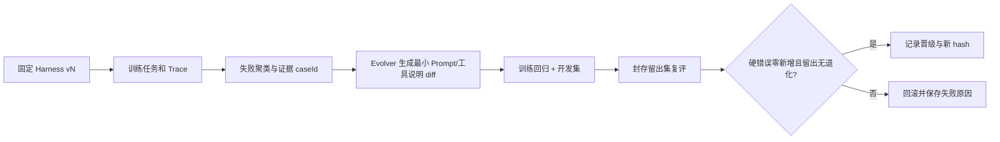

# CoursePilot-Evo Benchmark 与自进化协议（实施方案）

状态：**尚无已跑分数**。本协议给 E/B/D 三方同一套任务、真值和门槛，避免“改完 Prompt 觉得更好”就算自进化。

## 1. 从教学计划制作任务

先选定一个经过人工核验的培养路径和 `snapshotId`。拟做 **24 个脱敏任务**：训练 12、开发 6、封存留出 6。覆盖要求缺口、组合课程号、文字规则、跨路径课程、缺失已修记录、无班次数据、模糊偏好和模型过度承诺。B/E 对照原 `.xls` 的工作表/行独立标注，不以 Java 实现结果或 LLM 回答当标准答案；意见不一致时标 `needs_review` 并排除该 case。

| 示例任务 | 手工标准与来源 | 应判未知的部分 |
| --- | --- | --- |
| 询问专业选修还缺多少 | 在选定 `计科学` 路径下核 `计科学1!F45` 的 24 学分及已修记录 | 用户未提供完整已修记录时的差额 |
| “我满足全英语要求了吗” | `计科学1` 第 53 行确有该要求 | 培养表未给具体课程的全英语标记，缺证明时不能说满足 |
| “下学期周五能空吗” | 没有班次周几/节次 | 时间冲突与周五空课一律未知 |
| 推荐 `08305011~012` | 表 2 存组合编号，需核具体拆分与学期 | 未审核拆分前不能当一门普通课 |
| 第 9 学期专业选修 | `计科学2` 第 19 行有动态调整提示 | 不能保证未来开课 |

任务 JSON 建议字段：`caseId, split, snapshotId, completedCoursesFixture, userQuery, expectedFacts, requiredUnknowns, forbiddenClaims, requiredSourceRefs, reviewerIds`。留出集的 `expected*` 与 `forbiddenClaims` 存隔离目录，只让评分器读取，Evolver 只看训练失败 Trace。任何生成候选的模型提示中不能附留出题目/答案。

## 2. 逐例评分，不靠单个总分遮挡错误

1. **硬事实错误**：错误学分差额、引用错路径、无班次却声称“无冲突”等，每个 case 记 0/1；留出集零新增是晋级硬门槛。
2. **培养核对准确**：与人工标签比较满足项/缺口的精确匹配率；未提供数据的字段不计成 0 或通过，单列未知。
3. **未知识别率**：应回答未知的断言中，系统确实标未知的比例；同时记录错误拒答，以免全答未知刷分。
4. **来源完整率**：需来源的硬事实中，带正确 `sheet + row + snapshotId` 的比例。
5. **任务完成率**：满足该 case 的必需事实、未知提示、禁止结论和结构要求才通过。
6. **成本**：耗时、Tool/LLM 调用次数、token；同一模型和调用预算下比较，失败也记录。

Java 规则单元测试先独立通过，再跑 Agent 任务。每次评测输出 `run-manifest.json`（提交、模型、温度、预算、数据/任务 hash、Harness/Verifier 版本）与逐例 `case-results.jsonl`、`traces/*.jsonl`。报告列失败分布和典型 Trace，不只列平均分。若模型输出随机，每个版本在同一设置下重复 2 次并报告波动；时间不足时至少说明未重复。

## 3. 一轮真正的 Harness 自进化

Evolver 只可修改 `agent-runtime/harness/prompts/` 和 `agent-runtime/harness/tool-descriptions/`。禁止修改 Java Verifier、评分器、任务标签、留出集、模型/温度、token 预算或工具访问权限。候选必须改善至少一个训练失败 case，且开发/留出集没有任何原已通过 case 变失败、没有新增硬错误，才能晋级；否则回滚。小样本下这个严格门槛是课程演示策略，不能据此声称模型能力普遍提升。

## 4. 五周执行节奏

第 1 周共同写 6 个代表性标签；第 2–3 周扩到计划 24 个并封存留出；第 4 周跑基线、归因和修明显数据/规则错误；第 5 周让 Evolver 生成至少一处有限修改，复评并保存晋级或回滚记录。若自进化没跑通，报告如实写“评测可运行，自进化未完成”，不能把人工调 Prompt 算自动进化。
