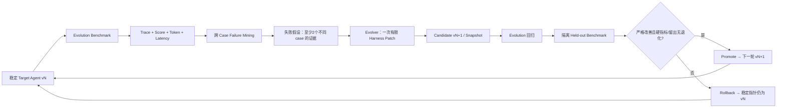

# CoursePilot-Evo：Task Group Benchmark 与多轮 RSI 协议

状态：**实施方案；目前没有已跑分数或省 Token 结论**。借鉴 [GDPevo 官方仓库](https://github.com/Prism-Shadow/GDPevo) 的同环境 task-group/train/test 分离思路，不使用其任务或声称复现其结果。System 1/2 与经验固化仅借鉴 [PhysicalRSI 项目页](https://mmlab.hk/research/PhysicalRSI) 的设计方向。

## 1. 四组任务与人工真值

每组共享同一经审核的培养路径/业务环境，分别设计 **5 evolution + 5 held-out**（总目标 40）；五周标注压力大时，最低每组 **3+3**（共 24），并在报告注明缩放及样本局限。每组都包含“可确认事实”和“应未知”的情况；涉及时间的算法案例明确绑定 `source.kind=SYNTHETIC` 的 `offeringSnapshotId`，真实班次不可用的案例以未知为正确行为；模拟冲突分数不得宣称真实排课能力。已修记录用虚构或获授权并脱敏的 fixture。

| Task Group | evolution / held-out 各自覆盖的变化 | 主要客观判定 |
| --- | --- | --- |
| G1 培养要求核对 | 类别学分、必修、文字规则、组合编号、跨路径 | 缺口/已满足项与人工标签一致，SourceRef 正确 |
| G2 hard/soft 偏好理解 | 页面提示与自由输入混合、“必须/最好”、“高分”歧义、岗位目标、签到偏好、兴趣不明、约束优先级 | hard/soft 结构化抽取，关键歧义时澄清且不补造默认偏好 |
| G3 选课规划、冲突修复与 replan | 有/无班次快照、单双周、时间重叠、改目标重算 | Java 验证的硬约束零违规；未知时间不编造 |
| G4 信息缺失与拒绝编造 | 缺/不完整已修记录、缺岗位映射、只有主观签到评价、未发布规则、快照过期、未匹配课程、仅有历史教师评价、学校政策未知 | 该澄清时澄清，不把评价当当期授课或客观高分，unsupported claim 为零 |

case 草案字段：`caseId, groupId, split, curriculumSnapshotId, offeringSnapshotId?, inputFixtureRef, userQuery, requiredFacts, requiredUnknowns, requiredClarification, forbiddenClaims, requiredSourceRefs, rubricVersion, reviewerIds`。A/B/D 双人对照原 `.xls` 与人工设计、相互复核的模拟班次样例标注，不以 Java 输出或 LLM 回答生成标准答案；分歧标 `needs_review` 并排除。标注文件与可见题面分开，Evolver 仅拿 evolution 的输入和失败 Trace，不见任何标准答案。`held-out` 的题面/答案/评分器均由隔离 Runner 持有。

## 2. 固定比较条件与记录

每次 vN/vN+1 对比固定：**base model 完整版本、temperature、token budget、最大工具调用数、Java Tool API/Verifier、两个数据快照、评测规则和题集**。无法固定模型供应商版本时记录具体 ID 与日期，报告承认不可完全复现。`run-manifest.json` 字段以 `contracts/schemas/domain.schema.json` 的 RunManifest 为准；重复运行编号另写入运行目录索引，不自行添加 Schema 外字段。首版固定预算：输入 8000 Token、输出 2000 Token、6 次工具调用、3 次模型调用、总截止时间 45000ms；配置更改须同步契约并重跑父版本。候选仅可修改 Harness 白名单。

每个 case 保存 `AgentState`、脱敏 `Trace`、结构化答复、Java `verifierResultId`、评分、input/output token、工具调用数、总耗时；每轮保存完整 Harness Snapshot、patch diff、hypothesis、父子 lineage、晋级/回滚理由。Provider 未返回 token 用量时记 `UNAVAILABLE`，不能按 0 或估算值与正式数据比较。模型随机性至少做相同设置下的重复运行；计划 3 次，额度不足则记录次数和波动。

## 3. 指标与评分器

| 指标 | 定义与数据源 | 作用 |
| --- | --- | --- |
| 规则/事实正确率 | 对标注 `requiredFacts` 的精确匹配与 Java 独立核验；分母排除待审核规则 | 主质量指标 |
| 硬约束违规率 | 有效 hard condition 中被 Java 判违规的案例比例；未知不算通过 | 晋级硬门槛，不能上升 |
| Unsupported claim / hallucination 率 | 禁止结论或无 SourceRef/verifierResultId 却宣称硬事实的比例 | 晋级硬门槛，不能上升 |
| Clarification correctness | 需澄清时是否问到关键缺项，不需澄清时是否无故阻塞 | 主质量指标 |
| Held-out task score | 每组逐例 pass，四组等权宏平均；pass 要同时满足必需事实、未知/澄清、禁断言 | 泛化主指标 |
| 平均输入/输出 Token | Provider usage 按 case 分别平均，另报总 Token | 效率指标 |
| 平均工具调用数 / 总耗时 | Trace 计数与 wall clock，失败也计入 | 效率指标 |
| 推荐主观质量 | 盲评抽查解释是否有用 | 次级，不单独晋级 |

`UNKNOWN` 与错误分开评分；过度拒答会损害 task score/clarification correctness，不能靠全答未知刷分。token 效率按同组同题、同配置、同成功条件比较；可报告 `Δtoken = (candidate − baseline)/baseline` 和工具调用变化。检验假设是“昂贵分析固化成 Skill/Tool/Context Policy 后，相关任务更少 token/工具调用且 held-out performance 不下降”，不是推理越长越好。Token、延迟差异需报告重复运行波动，不预设节省幅度。

## 4. vN→vN+1→vN+2 工作流

1. Target Agent vN 在 evolution cases 运行。Failure Miner **只看训练 Trace**，将多例相同失败整理为 `hypothesisId, caseIds>=2, pattern, likelyCause, proposedPatch, expectedMetric`。单例失误不得触发自动 patch。
2. Evolver 只得到假设、必要的脱敏 Trace 片段和白名单文件：`agent-runtime/harness/AGENTS.md`, `skills/`, `tool_policy.yaml`, `context_policy.yaml`。一次仅修改一个可解释策略，保存 diff 和内容 hash；如发现需把策略下沉为 Java 确定性工具，列为人工工程任务，**本轮不自动改 Java**。
   例如 v0 在两个不同案例中把“周五最好空”当成硬条件，Failure Miner 才能提出“hard/soft 误分”假设；候选只改澄清 Skill 或 Tool Policy。下一轮若重复把历史教师评价写成当期授课事实，再修改 Context Policy 并独立评测。单纯预先写一套 Skill、没有 Trace 驱动的假设、候选和回滚，不算已完成演化。
3. Candidate 以同配置跑 evolution 回归；独立 Runner 才能读取 held-out 题面/标签并评分。Evolver 不可修改或读取 Evaluator、Benchmark 标准答案、held-out test、Java API、模型配置/预算。隔离方式见[共享契约](04-infrastructure-workflow.md)。
4. 晋级规则采用**严格的客观改进**：四组等权 held-out task score 高于父版本；或 task score 完全持平且总 Token 平均降低至少 5%（同时平均工具调用不增加）。两种情况均要求每组 held-out score 不下降、任何原通过 case 不变失败、硬违规和 unsupported claim 不增加、clarification correctness 不下降。数据不足/Token 缺失时不得用效率分支晋级。未满足即 rollback，并保留候选、Trace 和拒绝理由。主观推荐评分不能替代上述门槛。
5. 晋级后稳定指针指向 vN+1，下一轮必须基于此版本重新采集 evolution Trace；至少设计/实现能运行 v0→v1→v2 两次独立候选决策。若第一轮失败，可在 v0 上提出新候选，但不能把 rejected 分支叫 v1。报告区分“机制支持两轮”与“实际成功晋级两次”。

重复用同一 held-out 集作多轮门槛可能产生选择偏差；五周版限制候选尝试数并保存全部尝试，最终报告注明该限制。若时间允许另留最终封存 audit cases，仅在报告前测一次。不会把小样本结果写成普遍提升。

## 5. 五周执行与退出标准

W1 完成首批四组标注与 rubric；W2–3 扩展并冻结题集/快照；W4 跑 v0 基线、验证 Java 评分与跨 Case failure hypothesis；W5 做两轮候选评测/回滚和报告。当前真实班次入口不可用；G3 可用模拟 fixture 测冲突修复算法，并用无真实快照 case 测澄清/拒绝编造，但不能声称完成真实冲突修复。若只有人工修改 Prompt、没有隔离评测或回滚，不称为已完成 RSI。
