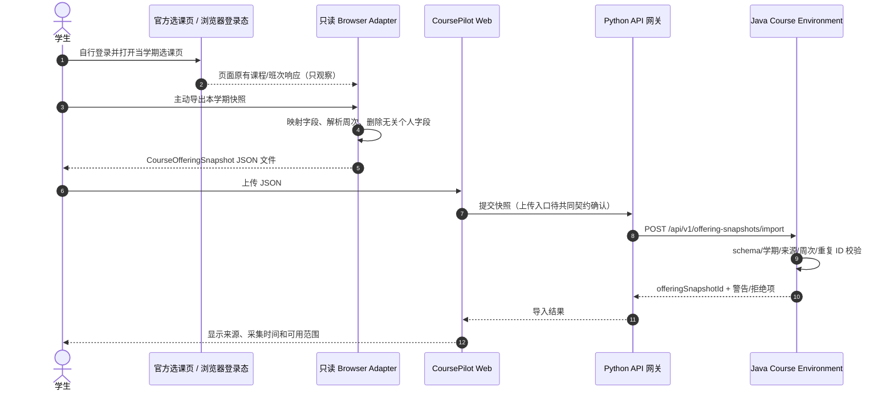

# 班次数据来源、抓取流程与浏览器适配（设计稿）

截至 2026-10-08，已读取 SHUOSC 公开历史班次 JSON，并检查其抓取源码；CoursePilot 尚未实现该来源的导入。先读[公开数据与抓取说明](#5-shuosc-公开历史班次与抓取流程)，再按需看下方本人浏览器快照设计。公开历史数据、当前学期实测数据和虚构测试数据分别记录，不能互相替代。

状态：已只读检查用户本机 `选课插件v0.6.js`（SHA-256 `578c21de0fc91a0024b1bb7e01b3889efcce298322cb61b31346ea8bb832068c`），**当前无法进入选课页；CoursePilot 尚未接入，也没有任何实测教务响应**。文件名为 v0.6，脚本头部 `@version` 实为 `0.5`；以下字段只代表脚本实际引用，不代表学校官方 API 承诺。原脚本保留在本地 `data/raw/`，不作为本项目代码发布或直接执行。

## 1. 实际观察与安全边界

脚本匹配 `https://jwxt.shu.edu.cn/jwglxt/xsxk/*`，`@grant none`，重写页面的 `window.jQuery.post` 回调并观察页面原有返回值。脚本依赖 `jQuery`、`_path`、`initXz()`、`ckjxbrsxx()` 和 DOM。它还在初始化时调用 `initXz()` 并点击 `btn_yd`；按钮实际副作用未经验证，因此**不可原样当作只读采集器安装或运行**。`process()` 里 `rawData.filter(x => rawData[x].kch_id == kch_id)` 也有疑似索引错误。待以后有授权页面访问时再核对按钮行为与样例响应，并写独立、无自动点击和无提交动作的只读 Adapter。首版只做静态字段契约与模拟样例。

| 页面响应/请求（脚本中的子串） | 脚本行为 | 直接可见字段/状态 | 待验证事项 |
| --- | --- | --- | --- |
| `zzxkyzb_cxXsXktsxx` | 响应后调用页面初始化逻辑 | 暂无字段解析 | 返回结构、触发时机、是否必要 |
| `zzxkyzb_cxZzxkYzbChoosedDisplay` | 保存 `rawData`，用于已选/待筛选课表 | `kch_id`, `jxb_id`, `jxbxf`, `jxbrs`, `sksj` | 数组形状、状态字段、空值、课程名、学期归属 |
| `zzxkyzbjk_cxJxbWithKchZzxkYzb` | 保存 `courseCache`，过滤/预览候选班次 | `jxb_id`, `sksj`, `jsxx` | 与课程代码的关联、分页、教师字段格式 |
| `/xkgl/common_cxJxbrsmxIndex.html?...` | 另发 POST 查询排名/容量 HTML | 请求参数 `kch_id`, `jxb_id`, `xnm`, `xqm`；页面表格与 `jxbrs` | 页面结构易变；排名不是选中概率，不纳入首版规划真值 |

脚本用连续周、单双周、离散周正则和 `checkConflict()` 展示冲突。Java 重新实现并测试解析器；不能把脚本的硬编码 `8×13×17` 时间格、静默解析失败或上述疑似 bug 当规则真值。未识别的 `sksj` 必须返回 `UNKNOWN_TIME_FORMAT`。

## 2. 未来有授权页面访问后的采集与导入路径

推荐路径：学生在已登录的官方选课页面**主动点击“导出本学期只读快照”** → Browser Adapter 读取当前页面已取得的响应 → 本地生成规范化 JSON → 学生在 CoursePilot Web 上传文件 → Java 校验并建立不可变 `offeringSnapshotId`。可选路径是用户明确操作后从浏览器 POST 到本机服务；只有验证浏览器对 `localhost` 的 CORS、HTTPS/本地网络限制且校验 Origin 后才启用。两条路径均不向 CoursePilot 提供教务 Cookie/Token，不要求 Spring Boot 模拟登录，不自动选课或提交。



## 3. 规范化结构与字段映射

完整机器可校验草案见 [`course-offering-snapshot.schema.json`](course-offering-snapshot.schema.json)，可供各模块共用的[示例 JSON](course-offering-snapshot.example.json)使用**虚构测试数据**，不是实际开课事实：

```json
{
  "schemaVersion": "1.0",
  "source": {"kind": "SYNTHETIC", "pageOrigin": null, "capturedAt": "2026-09-29T10:00:00+08:00", "adapterVersion": "synthetic-fixture-1"},
  "term": {"xnm": "2026", "xqm": "3"},
  "offerings": [{
    "courseCode": "DEMO001", "classId": "DEMO-JXB-1", "credits": 3,
    "capacity": 60, "teacherText": "示例教师", "meetingTextRaw": "星期三第3-4节{1-16周(单)}",
    "meetings": [{"dayOfWeek": 3, "sectionStart": 3, "sectionEnd": 4, "weeks": [1,3,5,7,9,11,13,15]}],
    "parseStatus": "PARSED", "sourceEndpoint": "SYNTHETIC_FIXTURE"
  }]
}
```

| 标准字段 | 原始来源 | 处理与未知语义 |
| --- | --- | --- |
| `term.xnm/xqm` | 页面学年/学期选择器、排名查询参数 | **必填**，不得从采集日期猜；与当前选择器交叉核验 |
| `courseCode` | `rawData.kch_id`；候选列表关联待核 | 字符串，保留前导零；无法关联则拒绝该条，不造代码 |
| `classId` | `jxb_id` | 字符串，同学期内去重；不能当课程号 |
| `credits` | `jxbxf` | 非负数或 `null`，不从培养计划覆盖班次原值；冲突时警告 |
| `capacity` | `jxbrs` | 整数或 `null`，只表示采集时显示值，不推断名额/录取概率 |
| `teacherText` | `courseCache.jsxx` | 可空；不作为规则真值 |
| `meetingTextRaw` | `sksj` | 保留原字符串以便审计；删 HTML 后分段解析 |
| `meetings[]` / `parseStatus` | 由 `sksj` 解析 | `PARSED/UNKNOWN_TIME_FORMAT/NO_TIME`；解析失败不得被当“无冲突” |
| `sourceEndpoint`, `capturedAt`, `adapterVersion` | Adapter 注入 | 支撑 provenance、失效排查与版本追溯 |

Java 导入生成 `offeringSnapshotId = SHA-256(规范化 JSON + adapterVersion + term)`；一个涉及班次的核验请求必须同时指定 `curriculumSnapshotId` 与 `offeringSnapshotId`。除 JSON Schema 外，Java 还校验 `sectionStart <= sectionEnd`、`PARSED` 时至少一个 `Meeting`、周次去重排序、同学期班次 ID 唯一及 `source.kind` 与每条 `sourceEndpoint` 一致；`source.kind=SYNTHETIC` 只能用于演示/Benchmark，产品模式必须拒绝将其当真实开课。教学计划的建议学期不能覆盖真实班次学期。不同采集时刻的快照互不覆盖，界面显示采集时间；陈旧快照只能做历史演示，不宣称实时余量。教学计划与班次课程号无法对上时标 `UNMATCHED_COURSE`。

## 4. 未来获得访问后才执行的验证清单与风险

1. 在**获授权的本人页面**只读观察三类响应的真实形状、分页/空列表和字段类型；从官方页面独立确认按钮行为，禁止沿用脚本自动点击。
2. 用至少 5 个不同排课写法验证周次/单双周/离散周；解析失败保留原文并标未知。用两门已知重叠、不重叠的班次对照 Java `checkConflict`。
3. 验证 `kch_id + jxb_id + xnm + xqm` 是否足以唯一定位班次，以及当前登录态失效、学期切换时导出是否拒绝混期数据。
4. Adapter 默认仅导出标准字段，禁止输出 Cookie、Token、学号、姓名、完整原始响应及 console 日志；JSON 上传前允许预览和删除。仅保存必要的脱敏测试快照入仓。
5. 页面改版、`jQuery.post` 改成其他调用方式、DOM 字段变化或详情 HTML 变化，都应让采集失败并提示重试/改用手工快照；不能静默使用旧数据。学校使用规则与个人数据授权需由团队在实际采集前确认。

入口状态分四档：`UNVERIFIED_NO_ACCESS`（无实测条件）、`PARTIAL`（部分字段/周次不可靠）、`VERIFIED`（有真实、脱敏、人工对照快照）、`UNAVAILABLE`（实测后确认无法稳定合法采集）。只有 `VERIFIED` 且班次时间解析成功时才在面向学生的请求中启用冲突/周五检查；其余继续用培养计划做学业核对，并显示 `OFFERING_UNAVAILABLE`。当前状态为 **`UNVERIFIED_NO_ACCESS`**。模拟 JSON 只用于解析器/冲突算法，不可升为 `VERIFIED` 或用于真实开课建议。

## 5. SHUOSC 公开历史班次与抓取流程

### 已核对什么、可以用来做什么

[shu-course-data](https://github.com/shuosc/shu-course-data) 发布课程与授课数据，数据文件在 `data` 分支。2026-10-08 实际读取的[current.json](https://github.com/shuosc/shu-course-data/blob/data/current.json)指向 `2024-2025-3`；[对应文件](https://github.com/shuosc/shu-course-data/blob/data/terms/2024-2025-3.json)有 **4,822 条记录**，`termName` 为“2024-2025学年春季学期”，`updateTimeMs=1770789410489`（2026-02-11 13:56:50.489 +08:00）。抓取时间与数据所属学期是两个字段，不能从抓取日期猜本学期开课。

它可以提供真实格式的历史课程、授课及时间文本，用于 A 的输入适配、B 的解析和 D 的独立反例；它不提供个人已修记录、毕业要求或教师评价。文件可公开下载，不需要学校账号。当前学期覆盖、周次完整性和字段身份仍需核对，不据此宣布当前课表无冲突。4,822 是记录数，不是不同课程数。

### 上游是怎么抓的

这是对源码的阅读，未运行爬虫或登录学校系统：

1. [GitHub Actions 工作流](https://github.com/shuosc/shu-course-data/blob/main/.github/workflows/interval-crawler-task.yml)读取仓库 Secrets 中的学校账号，启动 OpenVPN 连学校网络，再运行 TypeScript 抓取程序。当前 `schedule` 已被注释，只保留 `workflow_dispatch`；不能依仓库名称断言持续自动更新。
2. [登录模块](https://github.com/shuosc/shu-course-data/blob/main/src/login.ts)使用学校统一身份认证 `oauth.shu.edu.cn`，提交账号及加密后的密码，经过回调跳转取得选课系统 Token。
3. [抓取模块](https://github.com/shuosc/shu-course-data/blob/main/src/index.ts)从 `studentInfo` 取得该账号可见的选课批次；按学期选一个批次，建立批次上下文后请求 `clazz/list`。先用一条记录的分页查询取得总数，再按总数获取列表。这是上游实现方式，不保证其他账号可见范围、接口上限或当前系统行为相同。
4. 抓取模块把学校原字段转成 `courses` 数组，生成内容 MD5、`termName`、`backendOrigin` 与抓取时间，写 `terms/{termId}.json` 和 `current.json`。MD5 用于内容变化标识，不证明来源真实或数据完整。
5. [后处理](https://github.com/shuosc/shu-course-data/blob/main/post_crawler.py)比较结果并提交到 `data` 分支或创建 PR。当前代码以开放学期列表变化决定是否开 PR，更细字段差异的判定已停用；不能认为所有字段都经过人工审查。

首期只读取已发布历史 JSON，不把上游学校账号登录加入 CoursePilot，也不要求队员将学校密码配置到本项目 CI。重新抓当前学期是后续单独确认的接入工作。上游代码还有关闭 TLS 证书校验的设置，不能照搬到本项目。

### 映射前必须核对的差异

| 上游字段/行为 | 本项目如何处理 |
| --- | --- |
| 实际数组是 `courses`，README 表格写 `course` | 以所选版本实际文件为准，输入形状变化报错，不静默读成空列表 |
| `courseId` / `courseName` | 课程号保留字符串及前导零，与培养计划显式匹配；同名不自动合并 |
| `teacherId` 在源码中取 `KXH` | 暂保留为上游原始标识；不能直接写为教师 `teacherKey`。A/B 核对其是否课序/班次标识、唯一范围及多教师情况后再映射 |
| `teacherName` | 保留授课文字；不能仅凭同名生成可全局关联的教师身份 |
| `classTime` 在源码中取 `YPSJDD` | 原样提供给 B 的唯一解析器，例如“二5-6 限钱院”；备注、未给周次和未知余串不能被静默丢弃或补成全学期 |
| `credit`、`capacity`、`number` 常为字符串 | 学分用精确小数；容量/人数严格校验，只代表快照时的显示值，不承诺实时余量 |
| `limitations` | 保留来源和账号可见上下文，不能当作任意学生的完整选课资格判断 |
| 没有本项目必填的完整 `calendar` | 另外取得对应学期校历/节次依据，缺失则报告未知，不默认周数 |

当前 `OfferingImport.sourceKind` 仅支持 `BROWSER_SNAPSHOT` / `SYNTHETIC`，且单次最多 2,000 条。因此 **该文件还不能直接上传到现有接口**。A 先交输入映射、来源记录、过滤/匹配报告及异常；正式导入前 A/B/C 在 G0 核对社区历史来源、可用范围及容量处理方案，通过公共契约 PR 同步 Schema、正反例、提供方与消费方。不能冒充浏览器采集、把历史真实数据标成虚构模拟，或静默截掉超限记录。这次资料说明不修改来源枚举或 REAL 门槛。

### 由谁落地、怎样验收

- **A / JiangYiLin-Q121（A3）**：固定仓库提交与学期文件、下载时间、上游抓取时间、原始文件 SHA-256 和使用范围；交匹配/重复/异常清单及字段核对记录。上游 MD5 单独保存。
- **B / mira-xu（B1/B3）**：和 A 确认来源/身份映射与合同；用真实格式验证时间解析，缺周次、学期不符、超限和标识冲突有明确拒绝或未知，保留唯一规则实现。
- **D / amorfatiii（D1）**：与 A/B 独立核对历史样例，分别记录历史格式、虚构算法案例和当前资料缺失的预期；历史数据不冒称当期评测能力。
- **E / HelicasECoode42（E2/E3）**：正式接入后展示数据所属学期、来源和可用范围；当前原型仍用虚构候选，不能让来源链接看起来像已经接通。

最低验收：固定样本可重复读取且记录数与上游一致；前导零保留；错数组/坏数值/缺周次/旧学期/无法关联身份/超限输入都能定位；没有当前学期验证仍显示时间待确认；A/B 对所选少量记录人工核对后由 D 复核。完整上游数据先留本地，不将整份历史文件当公共测试答案上传。

### 相关项目与来源标注

[SHU 排课助手](https://github.com/shuosc/shu-scheduling-helper)可参考课程筛选、候选课表与冲突展示；[ShuYo](https://github.com/shuosc/ShuYo)可参考课表与学业修读查询。两者作为学习入口，不宣称本项目已经接入它们的服务。[SHUOSC 仓库列表](https://github.com/orgs/shuosc/repositories)用于发现后续参考资料。

[shu-course-data README](https://github.com/shuosc/shu-course-data#许可证)分别标明代码为 AGPL-3.0-or-later、数据为 CC BY-NC-SA 4.0。获取时保留许可及项目来源；复用代码、分发整理后的数据或提供服务前，按具体使用方式核对相应许可要求。
