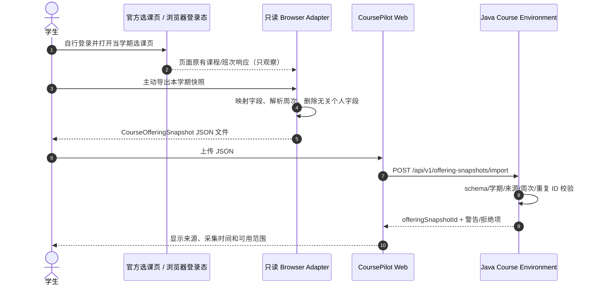

# 浏览器侧班次数据入口与规范化契约（设计稿）

状态：已只读检查用户本机 `选课插件v0.6.js`（SHA-256 `578c21de0fc91a0024b1bb7e01b3889efcce298322cb61b31346ea8bb832068c`），**当前无法进入选课页；CoursePilot 尚未接入，也没有任何实测教务响应**。文件名为 v0.6，脚本头部 `@version` 实为 `0.5`；以下字段只代表脚本实际引用，不代表学校官方 API 承诺。原脚本保留在本地 `data/raw/`，不作为本项目代码发布或直接执行。

## 1. 实际观察与安全边界

脚本匹配 `https://jwxt.shu.edu.cn/jwglxt/xsxk/*`，`@grant none`，重写页面的 `window.jQuery.post` 回调并观察页面原有返回值。脚本依赖 `jQuery`、`_path`、`initXz()`、`ckjxbrsxx()` 和 DOM。它还在初始化时调用 `initXz()` 并点击 `btn_yd`；按钮实际副作用未经验证，因此**不可原样当作只读采集器安装或运行**。`process()` 里 `rawData.filter(x => rawData[x].kch_id == kch_id)` 也有疑似索引错误。待以后有授权页面访问时再核对按钮行为与样例响应，并写独立、无自动点击和无提交动作的只读 Adapter。首版只做静态字段契约与模拟样例。

| 页面响应/请求（脚本中的子串） | 脚本行为 | 直接可见字段/状态 | 待验证事项 |
| --- | --- | --- | --- |
| `zzxkyzb_cxXsXktsxx` | 响应后调用页面初始化逻辑 | 暂无字段解析 | 返回结构、触发时机、是否必要 |
| `zzxkyzb_cxZzxkYzbChoosedDisplay` | 保存 `rawData`，用于已选/待筛选课表 | `kch_id`, `jxb_id`, `jxbxf`, `jxbrs`, `sksj` | 数组形状、状态字段、空值、课程名、学期归属 |
| `zzxkyzbjk_cxJxbWithKchZzxkYzb` | 保存 `courseCache`，过滤/预览候选班次 | `jxb_id`, `sksj`, `jsxx` | 与课程代码的关联、分页、教师字段格式 |
| `/xkgl/common_cxJxbrsmxIndex.html?...` | 另发 POST 查询排名/容量 HTML | 请求参数 `kch_id`, `jxb_id`, `xnm`, `xqm`；页面表格与 `jxbrs` | 页面结构易变；排名不是选中概率，不纳入首版规划真值 |

脚本用连续周、单双周、离散周正则和 `checkConflict()` 展示冲突。Java 重新实现并测试解析器；不能把脚本的硬编码 `8×13×17` 时间格、静默解析失败或上述疑似 bug 当规则真值。未识别的 `sksj` 必须返回 `UNKNOWN_TIME_FORMAT`。

## 2. 未来有授权页面访问后的采集与导入路径

推荐路径：学生在已登录的官方选课页面**主动点击“导出本学期只读快照”** → Browser Adapter 读取当前页面已取得的响应 → 本地生成规范化 JSON → 学生在 CoursePilot Web 上传文件 → Java 校验并建立不可变 `offeringSnapshotId`。可选路径是用户明确操作后从浏览器 POST 到本机服务；只有验证浏览器对 `localhost` 的 CORS、HTTPS/本地网络限制且校验 Origin 后才启用。两条路径均不向 CoursePilot 提供教务 Cookie/Token，不要求 Spring Boot 模拟登录，不自动选课或提交。



## 3. 规范化结构与字段映射

完整机器可校验草案见 [`course-offering-snapshot.schema.json`](course-offering-snapshot.schema.json)，可供各模块共用的[示例 JSON](course-offering-snapshot.example.json)使用**虚构测试数据**，不是实际开课事实：

```json
{
  "schemaVersion": "1.0",
  "source": {"kind": "SYNTHETIC", "pageOrigin": null, "capturedAt": "2026-09-29T10:00:00+08:00", "adapterVersion": "synthetic-fixture-1"},
  "term": {"xnm": "2026", "xqm": "3"},
  "offerings": [{
    "courseCode": "DEMO001", "classId": "DEMO-JXB-1", "credits": 3,
    "capacity": 60, "teacherText": "示例教师", "meetingTextRaw": "星期三第3-4节{1-16周(单)}",
    "meetings": [{"dayOfWeek": 3, "sectionStart": 3, "sectionEnd": 4, "weeks": [1,3,5,7,9,11,13,15]}],
    "parseStatus": "PARSED", "sourceEndpoint": "SYNTHETIC_FIXTURE"
  }]
}
```

| 标准字段 | 原始来源 | 处理与未知语义 |
| --- | --- | --- |
| `term.xnm/xqm` | 页面学年/学期选择器、排名查询参数 | **必填**，不得从采集日期猜；与当前选择器交叉核验 |
| `courseCode` | `rawData.kch_id`；候选列表关联待核 | 字符串，保留前导零；无法关联则拒绝该条，不造代码 |
| `classId` | `jxb_id` | 字符串，同学期内去重；不能当课程号 |
| `credits` | `jxbxf` | 非负数或 `null`，不从培养计划覆盖班次原值；冲突时警告 |
| `capacity` | `jxbrs` | 整数或 `null`，只表示采集时显示值，不推断名额/录取概率 |
| `teacherText` | `courseCache.jsxx` | 可空；不作为规则真值 |
| `meetingTextRaw` | `sksj` | 保留原字符串以便审计；删 HTML 后分段解析 |
| `meetings[]` / `parseStatus` | 由 `sksj` 解析 | `PARSED/UNKNOWN_TIME_FORMAT/NO_TIME`；解析失败不得被当“无冲突” |
| `sourceEndpoint`, `capturedAt`, `adapterVersion` | Adapter 注入 | 支撑 provenance、失效排查与版本追溯 |

Java 导入生成 `offeringSnapshotId = SHA-256(规范化 JSON + adapterVersion + term)`；一个涉及班次的核验请求必须同时指定 `curriculumSnapshotId` 与 `offeringSnapshotId`。除 JSON Schema 外，Java 还校验 `sectionStart <= sectionEnd`、`PARSED` 时至少一个 `Meeting`、周次去重排序、同学期班次 ID 唯一及 `source.kind` 与每条 `sourceEndpoint` 一致；`source.kind=SYNTHETIC` 只能用于演示/Benchmark，产品模式必须拒绝将其当真实开课。教学计划的建议学期不能覆盖真实班次学期。不同采集时刻的快照互不覆盖，界面显示采集时间；陈旧快照只能做历史演示，不宣称实时余量。教学计划与班次课程号无法对上时标 `UNMATCHED_COURSE`。

## 4. 未来获得访问后才执行的验证清单与风险

1. 在**获授权的本人页面**只读观察三类响应的真实形状、分页/空列表和字段类型；从官方页面独立确认按钮行为，禁止沿用脚本自动点击。
2. 用至少 5 个不同排课写法验证周次/单双周/离散周；解析失败保留原文并标未知。用两门已知重叠、不重叠的班次对照 Java `checkConflict`。
3. 验证 `kch_id + jxb_id + xnm + xqm` 是否足以唯一定位班次，以及当前登录态失效、学期切换时导出是否拒绝混期数据。
4. Adapter 默认仅导出标准字段，禁止输出 Cookie、Token、学号、姓名、完整原始响应及 console 日志；JSON 上传前允许预览和删除。仅保存必要的脱敏测试快照入仓。
5. 页面改版、`jQuery.post` 改成其他调用方式、DOM 字段变化或详情 HTML 变化，都应让采集失败并提示重试/改用手工快照；不能静默使用旧数据。学校使用规则与个人数据授权需由团队在实际采集前确认。

入口状态分四档：`UNVERIFIED_NO_ACCESS`（无实测条件）、`PARTIAL`（部分字段/周次不可靠）、`VERIFIED`（有真实、脱敏、人工对照快照）、`UNAVAILABLE`（实测后确认无法稳定合法采集）。只有 `VERIFIED` 且班次时间解析成功时才在面向学生的请求中启用冲突/周五检查；其余继续用培养计划做学业核对，并显示 `OFFERING_UNAVAILABLE`。当前状态为 **`UNVERIFIED_NO_ACCESS`**。模拟 JSON 只用于解析器/冲突算法，不可升为 `VERIFIED` 或用于真实开课建议。
