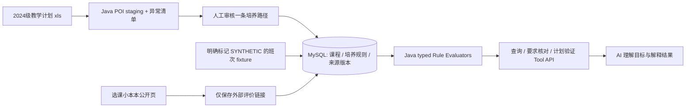

# Java 落地方案：教学计划导入、SQL 与小型规则引擎

> 2026-09-29 决策补充。当前只有 `.xls` 原件与静态插件代码；**无法登录选课页验证班次响应**。下文是 A/B 成员的实施方案，不是已实现功能。

## 1. 三类信息不要混成一张“课程表”

| 信息 | 当前可靠来源 | 入库对象 | 首版能做什么 |
| --- | --- | --- | --- |
| 培养要求、课程及建议学期 | 用户提供的 2024 级 `.xls`；选定路径人工复核 | `CurriculumSnapshot / Course / CurriculumCourse / RequirementRule` | 查缺学分、必修、选修类别、来源说明 |
| 本学期某教师的某教学班及具体上课时间 | 当前**没有可实测的真实快照**；只可从脚本推断字段 | `OfferingSnapshot / CourseOffering / Meeting` | 先用明确标为 `SYNTHETIC` 的测试数据验证时间解析与冲突算法；不能推荐为真实开课 |
| 某门课/教师的主观评价 | [选课小本本](https://course-rate.icu/) 的公开页面 | 首版仅 `ExternalReviewLink`（URL、课程号、教师名、查看日期） | 在推荐卡片给学生可点开的参考链接；不当培养规则或本学期开课事实 |

我只读查看了该网站的首页和一门课程页：页面展示课程号、教师、评价标签/评论，并有同名插件安装入口；查看到的页面**没有可核验的当学期教学班时间**。网站页脚标注 `CC-BY-NC-ND`，因此首版不批量抓取、复制或改写评论入数据库，若以后要利用内容需单独核实授权与可用接口。课程名可能合并多个课程号，同一教师也可能教多个班；`课程名 + 教师名` 不能作为可信主键。

## 2. A 怎么导入 `.xls`：先 staging，后发布快照

**第 1 步：选一个路径。** 先定计算机科学与技术非直招或直招之一，显式配置其三张 sheet 名。原文件 24 张表，不能按“名字相似”混合。`计科学1/计科学2/计科3` 的表型不同；表 2 还有左右两组课程。把 `sourceFileSha256, cohortYear, majorCode, trackCode, importerVersion` 合成 `curriculumSnapshotId`。

**第 2 步：逐格读原值。** Java 21 + Apache POI `WorkbookFactory` 打开 `.xls`，`DataFormatter` 读课程编号，保留 `009...` 前导零。每条 draft 同时保存 `rawText, sheetName, rowIndex, columnIndex`。表头、小计、合并单元格、空行与左右并列列组分别处理，不以某一列非空就断言是一门课。

**第 3 步：只解析确定内容。** 生成 `CourseDraft`、`CurriculumCourseDraft`、`RequirementDraft`。学分数值、课程号、建议学期可自动入草稿；`08305011~012`、`8+4`、三选一、全英语要求、文字备注、缺学分等进入 `ImportIssue`。不要让 AI 自动批准这些规则。

**第 4 步：人工审核并发布。** 用一张审核表显示原单元格、机器提取值、处理决定与审核人。每种表型至少抽查 5 行，关键学分/总计独立核对；`APPROVED` 才可用于 Java 规则。已发布快照不可就地改；修正规则产生新 `importerVersion`/快照，旧评测继续指向旧版。相同 hash + 路径 + 版本重复导入必须幂等。

建议接口：`POST /api/v1/curriculum-imports/preview` 返回 draft 与异常；`POST /api/v1/curriculum-imports/{id}/publish` 只发布人工审核项；`GET /api/v1/curriculum-snapshots/{id}` 可追溯来源。五周内也可先用命令行 preview + 人工维护审核 JSON，待 B 的 API 成熟后再做页面审核器。

## 3. SQL 存事实和版本；Java 计算规则

建议 MySQL 8 + Flyway。最小表关系如下，字段名是**设计草案**，不要求 A/B 第一天写齐所有表：

| 表 | 关键字段 / 主键 | 作用 |
| --- | --- | --- |
| `curriculum_snapshot` | `id, file_sha256, cohort_year, major_code, track_code, importer_version, review_status` | 一个年级/专业/招录路径的审核版本 |
| `course` | `course_code`（字符串）, `name` | 课程目录；名称可变，代码不转数字 |
| `curriculum_course` | `id, snapshot_id, course_code, category, credits, suggested_term, source_sheet, source_row, source_col`；来源坐标建唯一约束 | 课程在某路径的归属、学分和原表证据；重复课程号先列异常，不静默覆盖 |
| `requirement_rule` | `rule_id, snapshot_id, rule_type, params_json, source_ref, review_status` | 经过人工确认的 typed 培养规则；原文一并保存 |
| `completed_course` | `attempt_id, session_id, course_code, recognized_credits, evidence_status` | 保留重修/多次记录，Java 只计入经认定的有效学分；不等于教务成绩真源 |
| `offering_snapshot` | `id, source_type, term_xnm, term_xqm, captured_at, adapter_version` | 班次版本；首版仅 `SYNTHETIC` 测试快照 |
| `course_offering` | `snapshot_id + class_id`, `course_code, teacher_text, credits, capacity, parse_status` | 教学班，不能用教师名或课程名作主键 |
| `meeting` | `offering_snapshot_id + class_id + seq`, `day, section_start, section_end, weeks_json, raw_text` | 上课时间；解析失败保留原文并标未知 |
| `external_review_link` | `course_code + teacher_key + url` | 跳转到外部评价，`teacher_key` 匹配状态可为 `UNVERIFIED` |

`requirement_rule.params_json` 只存受控字段，由 `rule_type` 对应的 Java 类校验；不要把任意 SQL 或 AI 生成的表达式放进去执行。SQL 负责查数据、版本、路径和关联；规则计算在纯 Java Service 中完成，方便 JUnit 对照。对同一课程不同培养路径，`curriculum_course` 可以有不同类别/计入方式；对同一课程不同老师，`course_offering` 和外部评价引用分开保存。

## 4. B 怎么写规则引擎：少量 typed evaluator

首版只实现能人工对照的 3–4 类，不引入 Drools 或“任意自然语言规则引擎”：

| `rule_type` | 参数例子 | Java 算法 | 缺什么就 `UNKNOWN` |
| --- | --- | --- | --- |
| `REQUIRED_COURSE` | `courseCode` | 已修集合包含该代码且认定有效 | 已修记录不完整/代码认定不明 |
| `MIN_CATEGORY_CREDITS` | `category, minimumCredits` | 已修、已认定、属该路径该类别的学分求和，与门槛比较 | 类别或学分待审核；学生未声明已修记录完整 |
| `ONE_OF` | `courseCodes, minCount` | 集合命中数量/学分 | 组合编号未人工拆解 |
| `FULL_ENGLISH_MIN_COUNT`（可选） | `minCount` | 仅用有来源且经审核的课程英语标记计数 | `.xls` 有要求文本但课程标记/已修证据不足 |

统一接口可写为 `RuleEvaluator.evaluate(RequirementRule rule, CompletedTranscript transcript, CurriculumSnapshot snapshot) -> RuleResult`；`RuleResult.status` 为 `SATISFIED | NOT_SATISFIED | UNKNOWN`，并带 `required/actual/gap/sourceRefs/reasons`。只有学生明确声明已修清单完整、对应学分与规则均已审核，才能把不足判为 `NOT_SATISFIED`；资料不足时给 `UNKNOWN`，不能算 0 学分。`PlanVerifier` 在此基础上检查重复修读、跨路径课程和用户 hard condition。偏好如“课表别太碎”独立计算，不改变硬规则状态。

例如人工审核 `计科学1!F45` 后，规则记录可写成 `MIN_CATEGORY_CREDITS`、`{"category":"专业选修","minimumCredits":24}`。若学生声明已修清单完整，Java 查询该路径已认定的专业选修学分为 18，就返回 `NOT_SATISFIED, gap=6, sourceRef=计科学1!F45`；清单不完整则返回 `UNKNOWN`。AI 只把这个结果解释给学生，不重新计算 24−18。

## 5. 上课时间怎么解析和测试

从插件源码只能知道它尝试解析连续周、单双周、离散周，**无法证明真实页面有哪些其他格式**。A/B 先用显式标记的模拟样例，例如 `星期三第3-4节{1-16周(单)}`，转成 `Meeting(day=3, sections={3,4}, weeks={1,3,...,15})`。两班冲突是 `(星期、节次、周次)` 集合有交集；同一天同节但单双周不同不冲突。未知格式保存 `rawText`、`parseStatus=UNKNOWN_TIME_FORMAT`，Java 返回 `UNKNOWN`，不得输出“无冲突”。

这一步验证的是**解析器与冲突算法**，不是学校当前开课数据。真实 CourseOffering 导入、`classId`/教师映射和周五空课承诺均等到可授权访问选课页并取得样例后再做。届时使用 [浏览器快照契约](09-browser-adapter.md)；Spring Boot 不登录教务系统，也不持有 Cookie/Token。

## 6. AI 到底负责什么

AI 可以读学生问题，抽取“数学必须上”为 hard condition、“周五最好空”为 soft preference；可以读 Java 返回的**少量结构化事实**，解释缺口、比较建议和提出澄清。导入阶段 AI 可辅助把复杂备注**起草**为候选规则，必须由人对照原表批准后才入 `requirement_rule`。运行时不把整份 `.xls` 或所有评论塞给模型，也不允许模型自己算学分、宣布规则满足或把模拟课表说成真实开课。学分、课程归属和毕业要求用 SQL + Java typed rules，不用 RAG 检索片段作为这些硬事实的判定器。

## 7. 五周最小验收顺序

1. W1：A 选路径、解析 `.xls` 到 preview/异常清单；B 冻结 SQL 表和 3 类规则 DTO；课程/教师评价只留链接。班次来源状态记 `UNVERIFIED_NO_ACCESS`。
2. W2：A 人工审核并发布一个真实培养快照；B 完成 SQL 导入、要求核对、来源追踪和 JUnit 对照。
3. W3：B 用模拟班次完成时间解析/冲突测试；C/E 接 Java Tool，界面明确显示“模拟数据/真实数据不可用”。
4. W4–5：Benchmark 把真实培养核对和模拟冲突测试分开统计；任何老师演示都能指出哪些结论来自 `.xls`，哪些只是算法样例。真实网页快照获得后才安排独立验证，不阻塞五周核心闭环。
