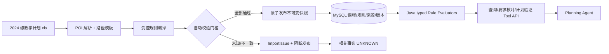

# Java 落地方案：自动导入、SQL 与确定性规则

> 2026-09-29 设计稿。当前只有原始 `.xls` 和插件源码；CoursePilot 尚未实现导入，也无法实测选课页。目标是**已知模板自动校验并发布，异常自动阻断**，不要求每次导入人工审批。

## 1. 三类数据的来源

| 信息 | 当前来源 | 首版边界 |
| --- | --- | --- |
| 培养要求、课程、学分、建议学期 | 用户提供的 2024 级 `.xls` | 选一条计算机路径，编译为带单元格来源的不可变快照 |
| 本学期教学班、教师、上课时间 | 当前没有可实测的真实快照；插件仅提供静态字段线索 | 标为 `SYNTHETIC` 的 fixture 只验证时间解析/冲突算法；真实开课回答 UNKNOWN |
| 课程/教师主观评价 | [选课小本本](https://course-rate.icu/) 的公开页面 | P0 只存外部链接；P1 可导入少量有权使用的评价摘要并记录来源/匹配状态。评论不当作培养规则或本学期班次事实 |

## 2. A 实现“教学计划编译器”，不是数据录入员

**路径与读取。** 首版显式选择一条计算机科学与技术培养路径，配置其三张 sheet 和左右列组。原文件有 24 张表，不能按相似名称混读。Java 21 + Apache POI `WorkbookFactory`/`DataFormatter` 保留课程号前导零，为每条结果记录 `rawText, sheetName, rowIndex, columnIndex`。分别处理表头、合并单元格、空行、小计和左右并列表。`sourceFileSha256 + cohortYear + majorCode + trackCode + importerVersion` 标识快照。

**受控编译。** 学分、课程号、建议学期以及已明确定义的文字格式可转换为 `CourseDraft`、`CurriculumCourseDraft`、`RequirementDraft`。`08305011~012`、`8+4`、三选一、全英语等写法只有在模板配置中定义精确含义、配黄金样例后才能编译成 typed rule。未知写法输出 `ImportIssue`；不能让 AI 猜测含义后自动写入 hard rule。

**自动发布门槛。** 必须同时通过：路径/sheet/表头指纹匹配；必需列和课程号有效；没有静默覆盖的重复代码；学分与可核对的小计/总计一致；每条 hard rule 有支持的 `ruleType` 和来源坐标；课程数相对基线的差异在明确配置内；黄金样例与导入回归测试通过。全部通过才在数据库事务中发布；任一失败则拒绝发布并给出带单元格坐标的异常报告，受影响事实返回 UNKNOWN。首个模板基线需与原件做**一次**独立核对；之后同模板日常重导无需人工逐条审核。模板变化、新规则或难以解析的备注，由开发者补映射、样例、测试与代码审查后才进入下一版。

**版本与接口。** 已发布快照不可就地改；相同 `fileHash + path + importerVersion` 重导幂等。解析器修正升版本，保留旧快照和差异报告。建议 `POST /api/v1/curriculum-imports` 返回 `PUBLISHED | REJECTED`、`snapshotId?`、`issues[]`、`diff`；`GET /api/v1/curriculum-snapshots/{id}` 返回来源。可先用 CLI 验证解析，再按第五周任务接通 Spring Boot API。人工点“批准”不能绕过自动门槛。

## 3. SQL 存事实与版本，Java 计算规则

建议 MySQL 8 + Flyway。最小表：`curriculum_snapshot(id,file_sha256,cohort_year,major_code,track_code,importer_version,status,published_at)`；`course(course_code,name)`；`curriculum_course(snapshot_id,course_code,category,credits,suggested_term,source_sheet,source_row,source_col)`；`requirement_rule(snapshot_id,rule_type,params_json,source_ref,compile_status)`；`import_issue(import_id,source_ref,issue_code,severity,raw_text)`；`completed_course(attempt_id,session_id,course_code,recognized_credits,evidence_status)`；`offering_snapshot(id,source_type,term_xnm,term_xqm,captured_at,adapter_version)`；`course_offering(snapshot_id,class_id,course_code,teacher_text,credits,capacity,parse_status)`；`meeting(offering_snapshot_id,class_id,seq,day,section_start,section_end,weeks_json,raw_text)`；`external_review_link(course_code,teacher_key,url,match_status)`；P1 `review_note(review_note_id,course_code,teacher_key,source_type,source_url,import_batch_id,text_excerpt,match_status)`。

课程代码用字符串；不同培养路径可给同一课程不同类别和计入方式；不同教师/教学班必须独立标识。`params_json` 只接收白名单字段，经 Java 类型校验，不执行任意 SQL/脚本/模型表达式。SQL 负责查事实、关联、来源与事务；纯 Java Service 负责计算，便于 JUnit 对照。

## 4. B 实现小型 typed evaluator

| 类型 | 参数 | 算法 | UNKNOWN 条件 |
| --- | --- | --- | --- |
| `REQUIRED_COURSE` | `courseCode` | 已认定有效的已修集合是否包含课程 | 已修清单不完整/代码认定不明 |
| `MIN_CATEGORY_CREDITS` | `category, minimumCredits` | 路径类别内有效学分求和并比较门槛 | 类别或学分未通过导入门槛；已修不完整 |
| `ONE_OF` | `courseCodes, minCount` | 集合命中数 | 组合编号无法按受控模板拆解 |
| `FULL_ENGLISH_MIN_COUNT`（可选） | `minCount` | 有来源的英语课程标记计数 | 标记或已修证据不足 |

`RuleEvaluator.evaluate(rule, transcript, snapshot) -> RuleResult` 返回 `SATISFIED | NOT_SATISFIED | UNKNOWN` 与 `required/actual/gap/sourceRefs/reasons`。只有已修清单明确完整、对应规则和学分通过导入门槛，才可判“不满足”；资料缺失不能当 0 学分。`PlanVerifier` 再检查重复修读、跨路径和硬偏好；软偏好指标另算。Agent 只解释 Java 结果，不自行计算或宣布硬事实。

## 5. 上课时间和浏览器插件

本机插件匹配 `https://jwxt.shu.edu.cn/jwglxt/xsxk/*`，`@grant none`，改写 `window.jQuery.post` 观察选课页响应。**只有用户能访问匹配页面、页面确实发出相应请求并返回数据时**，插件才可能读到教学班；现在未实测，不能把它称作稳定官方 API。原脚本还含 `initXz(); yd.click()`，不可原样当只读采集器。以后若得到合法样例，独立开发只读 Browser Adapter，由浏览器利用当前登录态导出最小 JSON；后端不模拟登录、不保存 Cookie/Token。详见[浏览器适配说明](09-browser-adapter.md)。

首版用明确标为 `SYNTHETIC` 的样例，例如 `星期三第3-4节{1-16周(单)}`，归一成 `Meeting(day, sections, weeks)`。两个教学班在星期、节次、周次三维同时相交才冲突。未知格式保留原文并返回 `UNKNOWN_TIME_FORMAT`，不能判“无冲突”。这验证算法，不证明当期开课。

## 6. 验收与排期入口

完整模块业务功能见[A 数据](trd/a-data.md)与[B Java](trd/b-verifier.md)，本页只维护导入与规则实施设计。课程周次以[第五至第八周安排](19-delivery-plan.md)为准。

导入须通过模板基线独立核对、异常阻断、重复导入和原子发布验收；学业核对与独立预期一致。模拟时间算法与真实培养规则分别统计，未知资料不能判通过，失败例和版本保留。真实选课页样例出现后单独核验来源与字段，不作为当前已实现能力。
