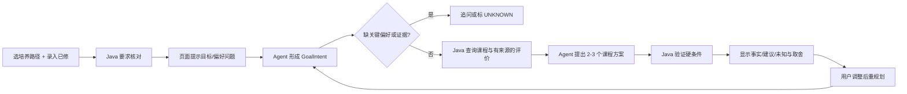

# 老师反馈后的产品主线：引导式规划、数据供给与 Harness 演化

> 2026-09-30 增量设计。下述功能均为五周开发目标或后续扩展，当前仓库仍只有文档和目录骨架。保持 [PRD](02-prd.md)、[总体 TRD](03-trd.md)、[共享契约](04-infrastructure-workflow.md) 的 System 1/2 边界；本文件把一次学生使用流程讲具体。

## 1. 一句话定位

学生不必先写一段完美的需求。页面用几个可选问题帮他表达目标；Agent 把回答整理成结构化约束，查询 Java 的课程与培养要求工具，给出可追溯的课程建议。**只有存在经过验证的当期教学班快照时**，才进一步选择教师、班次并核验真实时间冲突；否则停留在课程层面的规划与未知提示。

## 2. 一次完整的使用场景

以下是**虚构学生及演示输入**，不能当作原始教学计划或当期开课事实。

1. 学生打开 Vue Web，选择“2024 级计算机科学与技术”中已经导入并发布的一条培养路径，手动录入已修课程，并确认清单是否完整。五周首版采用本地匿名会话，不做学校账号登录，也不自动读取成绩。
2. 页面根据培养路径和学生声明的已修清单展示必修待完成项、各类别已计学分与缺口，卡片附培养快照与工作表来源。清单不完整时只说“按目前录入课程估算”，不宣称真实毕业缺口。用户看到“这个学期先补哪类课程”的引导入口。
3. 页面给出可点击的目标提示：“优先补必修”“多修学分”“探索感兴趣的专选”“想从事后端/数据/AI 哪类岗位”“少上早课”“周五尽量空出来”“签到希望少、管理严格还是无所谓”“我还没想好”。点选只是填入或提示一个目标，仍可自由输入。用户输入“必修优先，想以后做后端开发，也想了解系统方向；周五最好没课，签到特别频繁的课我不太想选”。
4. Agent 把输入整理为 `GoalIntent`：必修优先是排序目标，后端岗位和系统方向是学生声明的探索目标，周五空与签到频率是软偏好。岗位到课程的关联需依据人工维护且有来源的少量能力标签，不能由模型凭空断言“上这门课就能胜任岗位”；签到信息若只有评价，只能称主观线索，不能称官方考勤政策。若“周五必须空”或“高分”含义会改变决策，Agent 只问一两个关键澄清问题，例如“周五完全不能上课，还是尽量不排？”“高分指高学分，还是希望参考课程评价？”
5. Java 从该路径的课程与要求表中返回候选课程、必修优先级、学分和来源。页面可显示有来源的教师评价摘录或外部链接，但**历史评价不证明该教师本学期授课**，评价也不能当作“容易拿高分”的客观结论。没有匹配到当期班次时，界面不提供真实“选这个老师”按钮。
6. Agent 给出 2–3 个课程层面的方案并解释取舍；Java `plans/validate` 再检查课程存在、路径归属、重复修读、学分和已可验证的硬条件。若有**模拟班次演示模式**，可让学生体验时间冲突、单双周与换班次重规划，但结果必须显著标注 `SYNTHETIC`。只有以后导入经验证的当期班次，才能在真实模式中由 Java 检查时间冲突，再由 Agent 解释“换教学班、放宽周五偏好、减少一门课程”等备选。
7. 用户修改一个条件后继续追问。会话保存结构化偏好和上轮方案的 ID，重新向 Java 查询所需事实并核验；不会把整个数据库或所有历史聊天塞进模型。

## 3. 数据如何给 AI：按任务查询，不是“同步整个库”

| 数据 | 存储与来源 | Agent 获取方式 | 可用于什么 |
| --- | --- | --- | --- |
| 培养路径、课程、类别、学分、要求 | `.xls` 经过模板编译与自动门槛发布到 MySQL | Java `courses` / `requirements/audit` 返回少量结构化 JSON、`SourceRef` 和快照 ID | 硬事实；Agent 不自行重新计算 |
| 学生已修与偏好 | 学生输入的本地会话，演示用虚构或经授权数据 | `PlanningRequest` 和精简 `GoalIntent` | 个性化规划；缺完整已修清单时不能判学分缺口确定 |
| 岗位目标与课程能力标签 | 学生自报目标岗位；首版人工维护少量课程能力标签/岗位方向映射并标来源 | Java 查询候选课程标签，Agent 只解释可能的相关性 | 探索专选方向；不承诺岗位资格或就业结果 |
| 教师/课程评价 | 首版可手工导入少量有权使用的 CSV/JSON 评价摘要，或只保存外部页面链接；带来源、更新时间和匹配状态 | Java `reviews/search` 返回最多几条短摘录/链接；页面直接展示原来源 | 仅作主观参考，不能证明当期授课、客观高分或培养规则 |
| 教学班/时间 | 当前无法实测；首版仅 `SYNTHETIC` fixture，真实快照未来由只读浏览器 Adapter 提供 | Java `offerings` / `plans/validate`，每次附来源类型、学期和采集时间 | 模拟模式测算法；无真实快照时只能回答 UNKNOWN |

因此首版**不需要为课程表、学分和培养规则做向量 RAG**。它们是结构化关系事实，应该由 SQL 查询和 Java 规则计算。RAG 适合以后检索长篇、非结构化的课程说明或评价文档：文档切分、索引、检索小段原文，再把片段和来源交给模型解释。五周版先用少量评价摘要/外部链接及普通查询；若确有足量授权文本和明确检索评测，再考虑 MySQL 全文检索或向量检索。MySQL 本身支持 `FULLTEXT`；向量检索是额外的数据处理链路，不是本项目“有 AI”就必须引入的组件。[MySQL 全文检索文档](https://dev.mysql.com/doc/refman/8.0/en/fulltext-search.html)、[OpenAI Vector Store 文件检索参考](https://platform.openai.com/docs/api-reference/vector-stores-files)。

**评价导入的最小结构：**`reviewNoteId, courseCode, teacherKey?, sourceType, sourceUrl?, importBatchId, createdAt?, textExcerpt, tags[], matchStatus`。`sourceType=USER_IMPORT|EXTERNAL_LINK|SYNTHETIC`；没有可核验的课程/教师关联时 `matchStatus=UNVERIFIED`，不得合并到某个真实教学班。五周首版可先导入一小批经授权或虚构的演示摘要，不批量抓取第三方评论，不保存学生身份。

**模型上下文包：**`taskId, curriculumSnapshotId, offeringSnapshotId?, profileCompleteness, GoalIntent, 相关 Java Tool 返回的 facts/provenance/unknowns, 最多 K 条评价摘要, tokenBudget`。Python Runner 按 `context_policy` 截断与筛选；数据库更新后由 Java 的快照 ID 管理版本，Agent 下一次工具查询自然读取新快照，不维护一份过期的“AI 专用数据库副本”。

### 3.1 可编辑的学生画像

画像是学生明确提供、可随时改动的字段：`curriculumTrack, completedCourses[], transcriptComplete, interestTags[], careerTargets[], desiredCredits?, schedulePreferences[], attendancePreference?, workloadPreference?`。每个非课程字段有 `value, source=USER_DECLARED, updatedAt`；模型从聊天中提取的新目标先标为 `PROPOSED`，由学生确认后才进入稳定画像，不能悄悄变成硬约束。学分缺口由 Java 将已修清单与培养规则比对，结果带培养快照 ID 和 `transcriptComplete`；它不是由模型猜出的标签。

“以后想做后端开发”可触发系统方向课程探索，但岗位映射需有人工维护的少量 `CareerCourseTag(role, skill, courseCode, sourceRef)`；缺映射时先问兴趣或只展示课程类别。“希望少签到”“偏好课堂管理严格”“无所谓”是不同方向的软偏好，学生确认后才改变排序，不改变课程合法性。若没有教师大纲等可靠来源，只能引用评价里的签到感受并标为“历史主观信息”，不可生成确定的签到次数。五周首版只做 2–3 个岗位方向、少量可核对标签和四态签到偏好（希望少签到/偏好管理严格/无所谓/未填写），避免扩展为无法验证的全职业推荐系统。

## 4. Prompt 不是一个万能长提示词

页面提示问题用于**帮助学生表达意图**；运行 Harness 用可版本化的 `AGENTS.md`、Skills、Tool Policy、Context Policy 指定 Agent 如何做事。两者职责不同。五周首版将输入归一为 `GoalIntent`：`hardConstraints[]`、`softPreferences[]`、`interestTags[]`、`careerTargets[]`、`creditGoal?`、`attendancePreference?`、`teacherPreference?`、`questionToClarify?`。每条约束保留 `sourceText`、`confidence` 和类型；“最好”默认软偏好，“必须”通常是硬约束，但对“高分”“少课”等含糊词必须按影响程度澄清。

建议首批页面提示按任务组织，而不是随机展示：①先补毕业/必修要求；②想探索什么方向、将来倾向什么岗位；③更重视高学分、主观评价、签到负担还是时间安排；④哪几天/时段不能上课，哪些只是偏好。学生可以跳过；没有答案时系统不能偷偷补默认偏好。对“我不知道想学什么”，先给 2–3 个有来源的方向/课程类别让其选择，再做推荐；不把评价文本当作官方课程描述。

## 5. Harness 怎样真正自进化

**Target Agent** 是 C 维护的同一个生产/评测 Runner；**Evolver** 是 D 的独立流程。Harness 可变部分限定为运行时 `AGENTS.md`、`skills/`、`tool_policy.yaml`、`context_policy.yaml`。它不只是改一段 Prompt，还可改变“何时澄清、先查什么、带多少上下文、何时停止并返回 UNKNOWN”等可执行的工作策略。Java Tool API、数据快照、模型、预算、Benchmark 标签和评分器在同轮比较中冻结。

首个可演示的演化例子：v0 在两个不同案例里把“周五最好空”误判为硬条件，导致不必要的拒绝；Failure Miner 从两个 Trace 提出同一个假设；Evolver 只修改 `skills/preference-clarification.md` 或相应 `tool_policy`，要求先区分 hard/soft 再选择工具；候选 v1 运行 evolution 回归与隔离 held-out。若 held-out 规则正确性提高、无硬违规/幻觉退化，才晋级。下一轮再从 v1 的新 Trace 中发现“总把历史教师评价当作当期开课证据”，修正 `context_policy` 的评价来源展示规则，得到候选 v2；不通过则回滚，保留失败记录。另一个可量化的假设是消除重复查相同课程的工具调用，检查 Token/调用次数是否下降且质量不退化。

过程必须留 `hypothesis → 最小 patch → Harness Snapshot → Trace/Score/Token/Latency → held-out 决策 → parentVersion`。Evolver 只看 evolution cases 和脱敏 Trace，不得访问答案、held-out 题目或评分器；候选至少能走两轮 v0→v1→v2 的机制。若仅手工写好 Prompt、没有跨 Case 失败归因和隔离晋级/回滚，就不称已完成 Harness 自进化。正式门槛见 [Benchmark 协议](07-benchmark-protocol.md)。

## 6. 五周取舍

W1 冻结 `GoalIntent/PlanningRequest/ReviewNote/PlanResult` 与 Java Tool API，做好引导式页面假数据；W2 完成培养数据、要求核对和少量评价摘要导入/来源展示；W3 跑通一条学生引导→Agent→Java→重规划的链路；W4 建四组任务基线与失败 Trace；W5 跑两轮候选评测、回滚和演示。评价摘要的导入保持小规模，真实班次采集和向量 RAG 不作为五周完成条件。可交付的核心是**真实培养规则核验 + 引导式规划 + 可追溯建议 + 有隔离评测的 Harness 演化机制**；时间相关能力的边界必须如实呈现。
