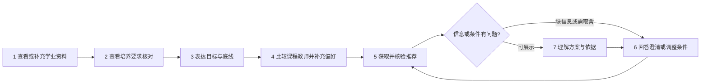
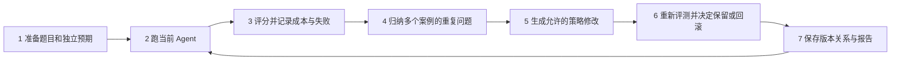
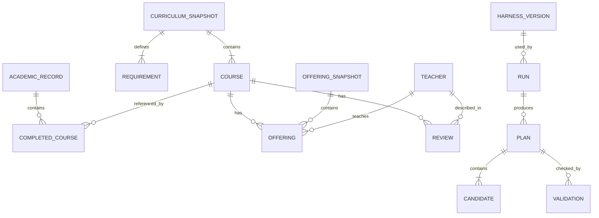
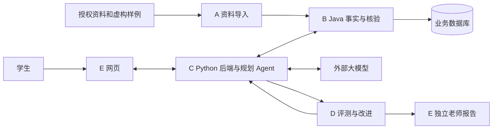

# 团队总览：产品流程、核心对象与模块分工

这是全组开工前的共同入口。先理解项目怎么使用、每个人负责什么，再读个人 TRD 的功能清单和技术实现，最后领取对应业务任务。当前仓库是设计、契约、检查工具和 HTML 原型，业务服务尚未实现。课程第五至第八周安排以[排期](19-delivery-plan.md)为准。

## 1. 项目最终要交什么

CoursePilot 帮学生核对学业进度、比较课程教师、表达目标、理解并调整课程推荐。另有一条评测与改进流程，验证 Agent 的错误、质量和成本，并决定策略修改是否保留。两条流程都是本次交付。

首版支持一个计算机培养路径、有限评价和少量有来源的发展方向。学生在官方系统自行选课。已找到 [SHUOSC 公开历史班次](09-browser-adapter.md)，可供输入适配与时间格式核对，尚未接入；当前学期仍无已验证班次，可以给课程层建议并保存教师意愿，时间保持未知。模拟班次用来验证冲突算法并显著标识。培养计划建议学期、当期开课和毕业硬要求必须分清。

参与者：学生使用规划页面；资料维护者导入受控数据；老师/开发者通过受限入口看实验报告。普通学生流程不展示运行策略、Token 或内部日志。

## 2. 业务地图：两条完整流程

### 学生规划

| 步骤 | 学生做什么、应看到什么 | 模块接力 |
| --- | --- | --- |
| 1 资料 | 已有本会话记录则读取，缺记录才补充；完整性明确 | A 定输入，E 提入口，C 传递，B 保存 |
| 2 核对 | 查看已满足、缺口、建议修读和无法判断的项 | B 计算，C 传递，E 展示，D 核对预期 |
| 3 目标 | 组合目标，说明必须/偏好及优先级，跳过无关问题 | E 引导，C 理解与校验 |
| 4 详情 | 查看课程教师反馈的年份和来源，表达明确意愿 | A 整理，B 查询，C 传递，E 展示 |
| 5 推荐 | 得到有依据且经过规则核验的候选 | C 取证/生成，B 核验，E 展示 |
| 6 澄清 | 缺关键信息时补答，硬条件冲突时选择取舍 | C 提问/修复，E 收答案，B 重新核验 |
| 7 调整 | 看懂依据、冲突、未知，改条件后得到新结果 | E 保留输入，C 重规划，B 新核验 |

例：学生已修部分必修，想选低工作量课程且必须保留某教师。系统先核对培养要求，再查对应评价并推荐；缺班次时说明时间待确认。学生修改教师偏好后重新推荐。学分计算、候选生成和页面呈现分别有明确所有者。

### 评测与改进

A/B/C 协助 D 核对案例预期；C 提供与学生使用相同的 Agent；D 运行、评分、归因并管理改进判决；C 加载策略版本；E 展示聚合报告。没有跨案例证据不能自动改策略，两轮可以被拒绝，必须保留实际结果。

## 3. 领域地图：我们共同处理什么

| 对象 | 人话解释与关系 | 写入/产生者 → 使用者 |
| --- | --- | --- |
| 培养计划版本 | 某路径的课程与毕业要求；一个版本包含多门课程和多项要求 | A 整理、B 发布 → B/C/D/E |
| 课程 | 按课程编号识别；同一课程可有多个学期/教师班次 | A 输入、B 保存 → C/E/D |
| 学业记录 | 当前学生/会话的多条已修课程，带完整性与修订版本 | A 定格式、E 收集、C 传递、B 保存 → B/C/E/D |
| 学业核对结果 | 某记录与某培养版本下的满足/缺口/建议/未知 | B 计算 → C/E/D |
| 班次 | 某学期某课程由某教师授课，可含多段周次/节次；班次归属快照 | A 提原文、B 保存/解析 → B/C/D/E |
| 评价 | 对应课程、教师及修读学期的有限主观反馈，带来源与匹配状态 | A 整理、B 保存 → C/E/D |
| 选课需求 | 目标、必须条件、偏好与优先级，可被学生修改 | E 收集、C 确认 → C/B/D |
| 推荐方案 | 一组候选课程/教师及解释，可引用之前方案以重新规划 | C 生成 → B 核验、E 展示、D 评分 |
| 核验结果 | 绑定方案输入、记录与快照版本的通过/违规/未知及原因 | B 产生 → C/E/D |
| 运行与策略版本 | 同一 Agent 在固定条件下的结果、用量与运行策略；候选有父版本 | C 记录运行、D 管判决/版本 → D/E |

下面是概念关系图，表中的中文解释与之一一对应；它不规定 SQL 表结构或新增接口字段。

课程不等于班次，历史评价不等于当期开课证据，推荐不等于核验通过。具体字段只在[公共契约](04-infrastructure-workflow.md)与 contracts 维护。

| 生命周期 | 允许的变化 | 谁负责 |
| --- | --- | --- |
| 培养资料 | 读取 → 检查 → 拒绝或发布；已发布内容有变更就产生新版本 | A 检查，B 事务发布 |
| 学业记录 | 创建/读取 → 修改形成新修订；核对绑定特定修订 | B 保存，C/E 处理引用 |
| 规划请求 | 接收 → 澄清或候选 → 核验 → 展示；改条件形成新请求，失败有终态 | C 编排，B 核验，E 展示 |
| 核验判决 | 已知违规为 INVALID；无违规但检查不全为 UNKNOWN；全部完成才 VALID | B；模拟通过仍标 SIMULATION |
| 策略候选 | 当前稳定版本 → 候选 → 评测 → 保留或拒绝；下一轮从稳定版本继续 | D 判决，C 加载 |

## 4. 系统地图：业务经过哪些模块

A/B 在同一 Java 工程衔接；网页调用 C，C 调 Java。大模型生成候选，Java 判定硬事实，网页消费服务结果。外部教务仅作为未来授权数据来源和学生实际选课的系统，不执行代登录或选课提交。调用步骤与技术时序见[总体 TRD](03-trd.md)。

## 5. 五个人最终各交什么

| 负责人 | 模块完整成果 | 完整功能与实现入口 |
| --- | --- | --- |
| JiangYiLin-Q121 | 让项目能使用正确、统一、有来源的培养计划、已修课程、评价和班次参考资料。队友应能知道每条数据来自哪里，哪些资料可以使用，哪些需要补充。 | [A 数据导入与资料整理](trd/a-data.md) |
| mira-xu | 让系统准确回答课程事实、学生已满足哪些要求，以及推荐方案哪些条件通过、违规或无法确认。每项判断要有数据和规则依据。 | [B Java 数据与规则核验](trd/b-verifier.md) |
| goat-yang | 把学生的目标变成有依据、可解释、可修改的课程推荐；信息不足时问清楚，条件无法同时满足时说明取舍。 | [C 需求理解与智能规划](trd/c-agent.md) |
| amorfatiii | 证明系统哪些能力可靠，找出重复失败，并用真实评测决定 Agent 策略修改是否应该保留。提供可复现结果和失败记录。 | [D 验收、评测与策略改进](trd/d-benchmark-rsi.md) |
| HelicasECoode42 | 让学生顺利完成提供资料、表达目标、理解推荐和修改方案的过程；让老师通过独立入口查看评测与策略改进结果。 | [E 学生网页与老师报告](trd/e-web-integration.md) |

模块文档前半讲完整业务功能与交接，后半讲实现。完整模块含后续期功能，首期任务只覆盖其中一部分；读某张卡片前应能知道它对应哪项功能。

## 6. 队长的贯穿职责

HelicasECoode42 同时负责 Web 和统筹：确认业务范围及接口样例、组织周中集成、协调字段变化、处理阻塞、核对验收证据、安排缺陷修复。模块作者拥有从实现、自查到联调交付的责任；相邻消费者负责实际调用复核。队长不替模块作者实现功能或逐行掌握所有代码。

联调至少覆盖普通推荐、缺资料、条件冲突/取舍和改条件四类场景。接口提供者与消费者先确认输入输出和失败预期；一个 Bug 指派一个主要修复人，关联模块复测。实际操作见[团队指南](18-team-progress-guide.md)。

## 7. 从模块功能到业务任务

阅读顺序：本总览 → [个人模块 TRD](05-team-and-sub-trds.md)的完整功能 → [本期业务任务](19-delivery-plan.md) → 卡片内的验收和实现参考。体验可对照 [HTML 原型](../demo/coursepilot-guided-demo.html)和[交接说明](../demo/README.md)。

看板标题写完成后用户/队友获得的能力。例如“告诉学生已满足和仍缺少的培养要求”，点开才看到需要计算哪些规则、调用什么接口及如何验收。数据库迁移、函数、组件、依赖安装等是卡片内的实施步骤或小 PR；独立造成业务失败的 Bug 可单独登记。

所有交付须有实现、消费者调用、正常/异常/未知证据与限制。模拟输入、受控模型测试、真实模型调用分别说明；CI 的未实现模块 SKIP 不算业务完成。整体完成还包括四组固定条件评测、受控策略改进和至少两轮候选判决；节省 Token 只能报告实测结果。

需求范围见[PRD](02-prd.md)，详细页面规则见[UX 规范](14-student-choice-research-and-ux.md)，评分和晋级标准见[评测协议](07-benchmark-protocol.md)。排期只在[第五至第八周安排](19-delivery-plan.md)与 Project 维护。
