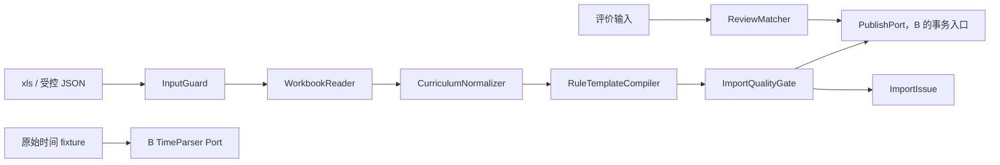
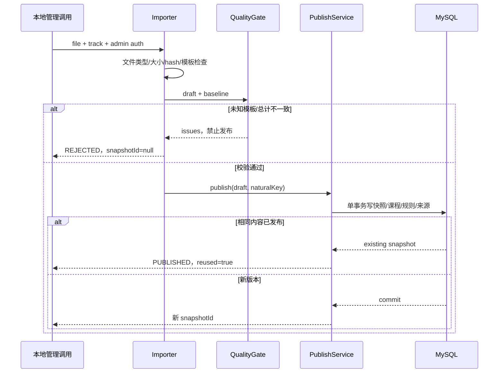
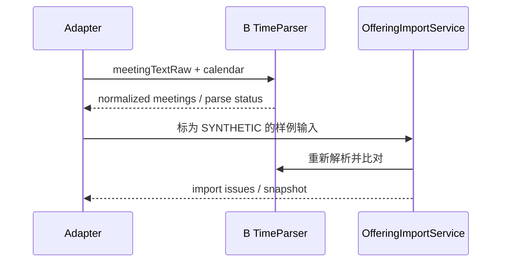

# 子 TRD A v1.0｜导入、规范化与来源

| 项 | 内容 |
| --- | --- |
| 责任 | A，待组内填写姓名；11 人日 |
| 技术 | Java 21、Apache POI、JSON Schema、JUnit 5 |
| 所有权 | java-environment/importer、输入模板、黄金样例、来源映射 |
| 输入 | 本地 xls、受控已修/评价输入、插件静态字段研究 |
| 输出 | Curriculum draft、ImportResult、ReviewImport、原始班次 fixture |
| 当前状态 | 无导入服务；原始文件不进入公开仓库 |

## 1. 需求与边界

A-01：一个选定培养路径可重复导入，课程号保留零、学分和规则可追原表。A-02：未知格式自动阻断。A-03：有限评价输入按课程教师学期匹配。A-04：给时间解析提供完整原文/对照样例。

A 不拥有学分审核、时间冲突、模型推理或生产页面。B 维护唯一 TimeParser，A 在规范化时使用该接口，不能重写一套 JS/AI 时间解析。原插件只做静态研究，不原样运行其点击/请求逻辑。

## 2. 组件结构

目录：importer/input（大小/格式）、excel（受控表型读取）、normalization（字段映射）、rules（模板编译）、quality（门槛）、port（发布接口）；黄金样例放模块 test/resources，公开 fixture 仅虚构数据。

## 3. 接口与输入约束

Java `POST /api/v1/curriculum-snapshots/import`，multipart fields= schemaVersion、trackId、file；Service Key+Admin Key。10 MiB 上限、仅 .xls、检查文件签名，不信任后缀。文件路径/输出目录由服务端生成，接口不能接受任意 sourcePath。

`WorkbookReader.read(stream, trackId) -> CurriculumSnapshotDraft`；`RuleTemplateCompiler.compile(rawRule, templateVersion) -> CompiledRule|ImportIssue`；`ImportQualityGate.check(draft, baseline) -> publishable + issues`；`PublishPort.publish(draft, inputHash, importerVersion) -> ImportResult`。

| 字段 | 规则 |
| --- | --- |
| courseCode | 字符串；保留前导零，不能同名合并 |
| credits | BigDecimal；最多两位小数，未知复合数值不硬拆 |
| suggestedTerm | 可空，仅建议，不构成本学期硬要求 |
| SourceRef | refId/kind/snapshotId/locator/capturedAt；locator 保留 sheet/row/column |
| compiled rule | 白名单受控表达式；备注不能 eval 成代码 |
| hash/version | 内容摘要+路径+importerVersion 构成自然幂等键 |

不执行 Excel 公式、宏或外链。受控格式中公式仅读取有依据的缓存值；不能获取的值标未知。左右并列表、实践表与组合编号在模板内明确，不靠 LLM 猜出缺失单元格。

## 4. 导入发布时序

首个模板做独立基线对照；之后同模板自动门槛发布。没有“人工批准忽略未知”的绕过接口。事务失败无 PUBLISHED，无半张快照。

## 5. 评价与班次适配

ReviewImport Schema 为唯一格式：notes≤200、excerpt≤1500 字；sourceUrl 仅 http/https，teacherKey/termId 未知为 null。course/teacher/term 不能可靠对齐则 UNVERIFIED，不用文本相似度自动确认为教师事实。原文定位或有限摘要按授权范围保留。

浏览器原始导出格式见旧 snapshot Schema，转换到 OfferingImport：termId、calendar、sourceKind、capturedAt、offerings。sourceKind 由输入说明来源，sourceValidation 由 B 的后台验证流程控制；上传者不能声明 VERIFIED。meetings/parseStatus 客户端值仅供对照，B 重新解析 raw。

## 6. 异常、调试与安全

| 场景 | 返回/处理 |
| --- | --- |
| 未知表型/备注 | UNKNOWN_RULE/IMPORT_REJECTED；不发布 |
| 重复课程冲突/总计错误 | 导入 issue，定位字段与 sheet/row |
| 重导 | 复用自然键，不插重复版本 |
| 超大/错误类型/路径试探 | 413/422，清理临时文件 |
| 存储失败 | ERROR/503，事务回滚 |

日志：requestId、input hash、模板版本、行计数、issue code，不记录完整表、成绩或上传路径。资料来自不可信文件时不能影响系统 Prompt、shell 或 SQL。私有原始输入在 gitignore 下，测试公开虚构 fixture。

## 7. 验收与批次

W1：一条路径模板、黄金输入/反例和 SourceRef；W2：重复导入/原子发布与未知阻断；W3：少量评价输入及时间 fixture。

必须覆盖：前导零、合并/并列表、重复冲突、学分总计、未知备注、公式无缓存、重导幂等、发布中失败、未匹配教师、缺学期、超限文件。不需要为每个 getter 写镜像测试，重点测会改变结论或发布状态的风险。

## 契约变更与完成标准

字段以 [contracts](../../contracts/README.md) 为真源，行为以 [公共契约](../04-infrastructure-workflow.md) 为准。提交提供者/消费者 DTO、正反例和受影响测试；Schema 破坏性变更升版本，不能边跑 Benchmark 边改。调试和提交要求见 [工程规范](../16-engineering-and-debugging.md)。

任务完成至少包含：实现目录、输入/输出、正常和失败证据、限制；fixture 不算真实接入，HTML 不算生产前端，手工改 Prompt 不算 RSI。每次 PR 使用仓库模板自查，接口 PR 由相邻模块复核。
