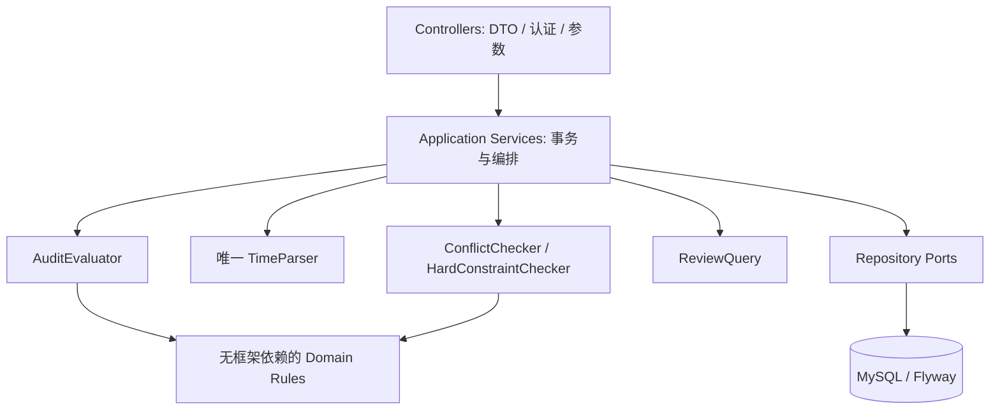
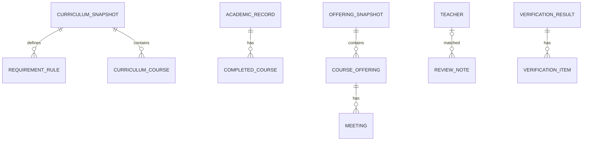
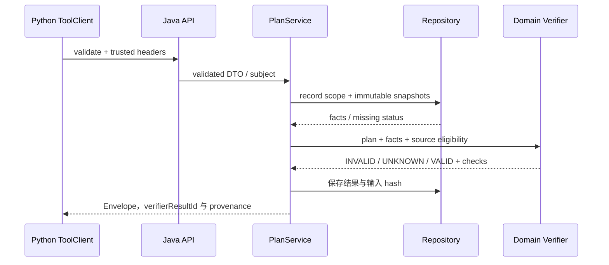
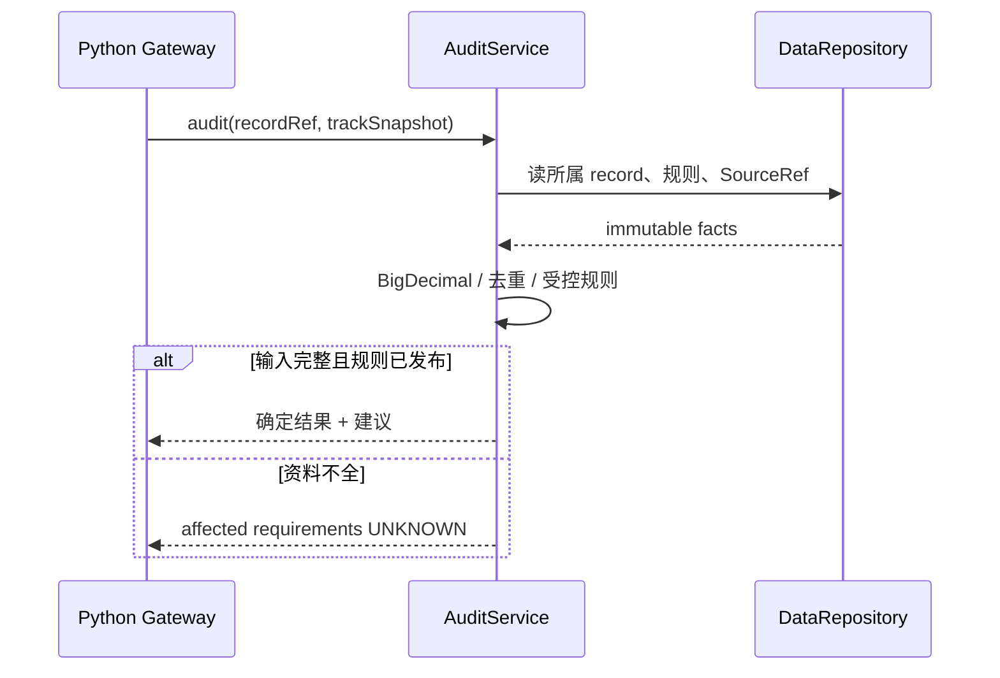

# B 模块：Java 数据与规则核验（业务说明与 TRD）

负责人：**mira-xu**。先读[团队总览](../15-team-baseline-and-batches.md)，再读本页业务功能，实施时查下半页接口与规则。当前是设计与合同，尚未实现；排期见[本期任务](../19-delivery-plan.md)。

## 先理解你要交出的完整模块

让系统准确回答课程事实、学生已满足哪些要求，以及推荐方案哪些条件通过、违规或无法确认。每项判断要有数据和规则依据。

举例：学生已经修过某门必修课两次，另一类学分资料不完整。你应按支持的重修规则计一次，并将无法确定的类别标为未知；推荐班次缺时间时不能宣布没有冲突。

## 完整业务功能清单

| 功能编号 | 功能 | 具体需要完成什么 | 本期任务或后续期 |
| --- | --- | --- | --- |
| B-F1 | 保存并查询业务资料 | 保存培养计划、课程、学业记录、教师评价和班次；保留版本/来源，正确处理重复发布与存储失败。 | B1 |
| B-F2 | 核对学业进度 | 计算选定完整路径的必修与类别学分满足情况；处理已修去重、支持的重修/替代，区分缺口、建议与未知。 | B2 |
| B-F3 | 提供课程教师资料 | 查询课程教师对应关系及评价证据，明确历史、当期和未知，不用旧评价证明当期开课。 | B1；第六周补边界 |
| B-F4 | 理解上课时间 | 唯一解析时间原文，保留周次和节次；不支持的格式给出原因。 | B3 |
| B-F5 | 核验推荐方案 | 核对候选课程、硬条件、时间冲突及可计算偏好；返回原因与核验版本，已知违规优先于未知。 | B3 |
| B-F6 | 保证资料隔离与一致性 | 只允许访问所属记录；拒绝错误快照/学期和过期核验引用；数据库操作失败时保持完整性。 | B1–B3；第七周回归 |

上表是整个模块范围。A1/E2 等是[排期草案](../19-delivery-plan.md)的业务任务编号，尚不等于 GitHub Issue 编号；后续期功能届时拆任务。本期未覆盖的功能仍属于模块完整交付。

## 谁交给你、你交给谁

JiangYiLin-Q121 提供规范化资料和核对基线；goat-yang 提供候选和待核验条件。你向 Agent 返回事实、学业核对和方案核验结果，由网页经 Agent 后端使用；与 amorfatiii 核对独立预期。

## 你的责任边界

你拥有持久化、权限/事务、规则计算和唯一时间解析器。XLS 读取归 JiangYiLin-Q121；推荐策略和解释归 goat-yang；页面归 HelicasECoode42。数据库与 Java 判定由你维护。

## 整个模块怎样算完成

完整路径学业核对与独立预期一致；班次算法覆盖正常/冲突/未知；方案不能绕过核验，其他人的记录与混版本输入被拒绝。 每项功能要有实现、实际消费者调用和正常/异常/未知的证据。权限、错误恢复等检查贯穿各功能，模拟与真实能力分别说明。

## 实现参考与技术约束

下面保留现有技术方案。业务功能是交付目标；组件、接口、函数与测试是实现这些功能的手段。字段以 contracts 为准，不在业务功能表里复制一套字段。

| 项 | 内容 |
| --- | --- |
| 责任 | mira-xu，模块 B |
| 技术 | Java 21、Spring Boot/Web/Validation、JPA、MySQL、Flyway、JUnit |
| 所有权 | domain/application/api/persistence、TimeParser/ConflictChecker、核验结果 |
| 输入 | A 的受控导入、可信主体与当前快照、C 的候选 |
| 输出 | AuditResult、只读事实、评价证据、PlanValidation |
| 状态 | 契约与设计；无可运行 Java 服务 |

### 1. 需求追溯与唯一写入

班次输入可参考 [SHUOSC 历史样本](../09-browser-adapter.md)。B1/B3 与 A 核对来源类型、标识关联、校历和容量策略后再接入；`teacherId` 不能直接作为本项目 `teacherKey`，时间原文中的备注与缺周次不能被忽略。历史格式测试与当期真实核验分开。

B-01 核对必修/类别学分；B-02 分开建议与硬要求；B-03 时间完整解析/冲突；B-04 评价身份和来源；B-05 UNKNOWN 不通过；B-06 对象级隔离与不可变版本。

B 写课程/快照/学业记录/评价与核验记录；A 只提交 draft，C 只通过 Tool API 读事实。Java 不调用模型解释自然语言，也不把社区评价认证为客观成绩。

### 2. 组件和表关系

Repository 只保存/查询，Domain 不依赖 Controller/JPA；transaction 由 application service 管。Flyway 唯一管理表变更，不用自动 ddl 覆盖历史数据库。

### 3. 接口合同

完整路径/字段见 [Java OpenAPI](../../contracts/java.openapi.json)。所有请求需 Service Key；X-Subject-Id 仅来自可信 Python。全局 import 另需 Admin Key。academic record 每次检查所属 scope，不能只查主键。

| 接口 | 输入 | 输出 / 行为 |
| --- | --- | --- |
| requirements/audit | recordId + curriculumSnapshotId | AuditResult，缺口/建议/未知分开 |
| courses | 发布快照 + query/limit/cursor | Course[]，SourceRef |
| teacher-course-options | course/query | historical/current/unknown，不能用旧评价证明当期 |
| reviews/search | courseCode、teacherKey?、term?、limit≤10 | 有维度与来源的 ReviewNote[] |
| offerings | 双快照、courseCode | 原文/Meeting/parseStatus；不跨学期 |
| plans/validate | items≤30、硬条件、记录、mode/双快照 | verdict/scope/violations/unknownChecks |
| preferences/score | verifierResultId + 偏好 | 可计算 metrics 和 unknownMetrics |

`AuditService.audit(recordRef, snapshotRef, subject)`；`TimeParser.parse(raw, calendar)`；`ConflictChecker.check(Meeting[], Meeting[])`；`PlanValidator.validate(plan, facts)`。Domain 返回结构化原因，不返回“AI觉得不错”。

### 4. 关键不变量

学分 BigDecimal；已修去重与重修/替代按受控规则。无完整记录、未知规则或重复认定不明确时相应要求 UNKNOWN，不把未知贡献算零以得出确定缺口。

源快照不可修改，新的内容产生新版本；核验绑定输入摘要、recordRevision 和两个快照。偏好评分不能用旧 result 给新 candidate 算分；校验 request digest 和所属 scope。

时间全部消费：未知余串/待定/未给周次不得默认每周。schema 上限不是学校实际上限，实际 calendar 限制更严格。weeks 需非空排序去重，sectionStart≤sectionEnd。

判决：已知 violation→INVALID；无 violation 但未完成 hard check→UNKNOWN；全部检查且无 violation→VALID。synthetic 可 VALID 但 scope=SIMULATION；REAL 只用 VERIFIED、同学期、未过期快照。今天没有这种真实快照。

### 5. 核验时序

### 6. 错误与故障

| code | HTTP/status | 行为 |
| --- | --- | --- |
| RECORD_NOT_FOUND | 404 NOT_FOUND | 不泄露其他 scope 记录 |
| SNAPSHOT_MISMATCH / TERM_MISMATCH | 409 CONFLICT | 拒绝混版本计算 |
| UNKNOWN_TIME_FORMAT / OFFERING_UNAVAILABLE | 200 UNKNOWN | 拦无冲突结论 |
| SOURCE_UNVERIFIED / SNAPSHOT_STALE | 200 UNKNOWN | 不用来源标签冒认真实 |
| COURSE_NOT_FOUND | 422 INVALID_INPUT 或 validation violation | 请求查询错误与候选错误区分 |
| TOOL_UNAVAILABLE | 503 ERROR | 不退化成已通过 |

### 7. 安全、观测与测试

参数化 SQL，排序/字段白名单，不执行用户或模型 SQL。只读查询有限分页；response 无原始成绩名单/堆栈。日志只记 requestId、耗时、核验原因。导入单事务，snapshot 发布后只读；并发重导用唯一键和事务处理重复，而非先查后插竞态。

测试：单双周不重叠、离散周交集、节次边界、未知余串、缺周次、错误学期、synthetic/REAL 混用、部分已知违规加未知、record 越权、重复导入、旧 verifier 复用。第五周完成培养事实/模拟时间与 C/E 联调。B/D 共同复核事实标签，不向 Evolver 开放答案。

### 契约变更与完成标准

字段以 [contracts](../../contracts/README.md) 为真源，行为以 [公共契约](../04-infrastructure-workflow.md) 为准。提交提供者/消费者 DTO、正反例和受影响测试；Schema 破坏性变更升版本，不能边跑 Benchmark 边改。调试和提交要求见 [工程规范](../16-engineering-and-debugging.md)。

任务完成至少包含：实现目录、输入/输出、正常和失败证据、限制；fixture 不算真实接入，HTML 不算生产前端，手工改 Prompt 不算 RSI。每次 PR 使用仓库模板自查，接口 PR 由相邻模块复核。
