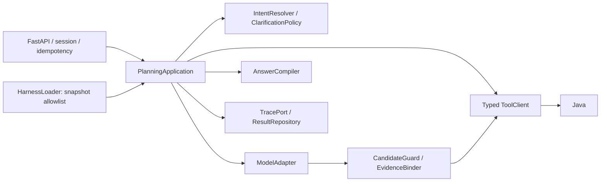
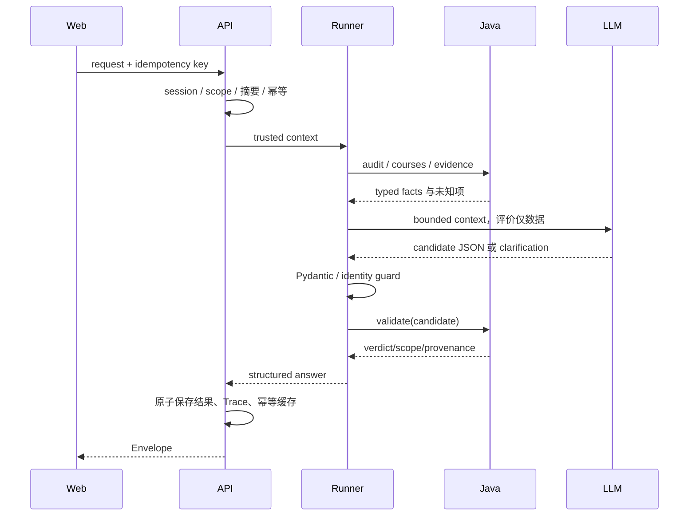
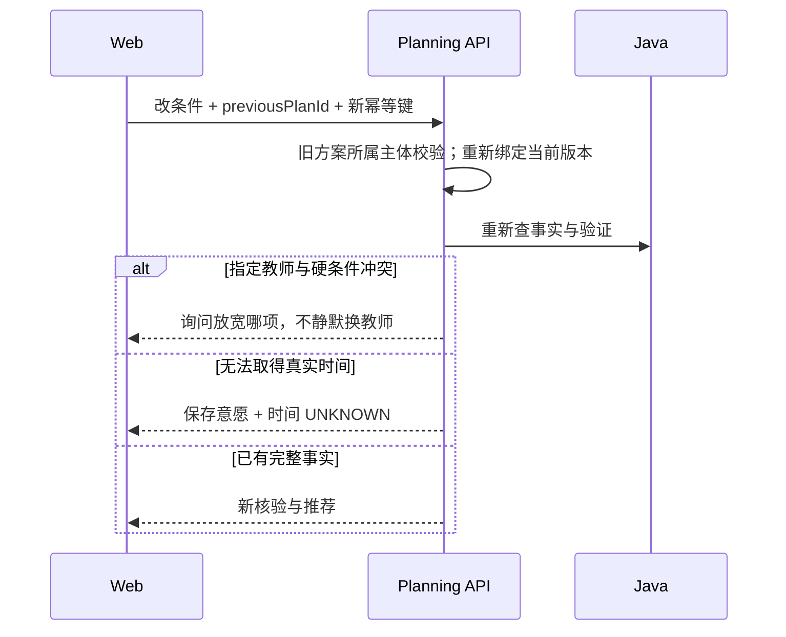

# C 模块：需求理解与智能规划（业务说明与 TRD）

负责人：**goat-yang**。先读[团队总览](../15-team-baseline-and-batches.md)，再读本页业务功能，实施时查下半页接口与规则。当前是设计与合同，尚未实现；排期见[本期任务](../19-delivery-plan.md)。

## 先理解你要交出的完整模块

把学生的目标变成有依据、可解释、可修改的课程推荐；信息不足时问清楚，条件无法同时满足时说明取舍。

举例：学生说“想拿高分，最好周五没课，而且必须保留某老师”。你要区分偏好和必须项、查询证据、提出候选并交 Java 核验；缺真实时间先说明未知，冲突时询问放宽哪项。

## 完整业务功能清单

| 功能编号 | 功能 | 具体需要完成什么 | 本期任务或后续期 |
| --- | --- | --- | --- |
| C-F1 | 连接页面与业务资料 | 管理演示会话，让页面读取本次记录、学业核对和课程资料，并正确传递服务错误。 | C1 |
| C-F2 | 理解目标与优先级 | 支持多目标，区分必须条件、偏好和优先级，保留明确指定的课程教师意愿。 | C2、C3 |
| C-F3 | 追问并接住回答 | 识别影响推荐的缺失或歧义，提出一个相关问题；补答后继续原流程。 | C3 |
| C-F4 | 生成有依据的推荐 | 按需取课程、学业和评价事实，调用真实模型提出候选，强制 Java 核验，解释依据与未知。 | C2 |
| C-F5 | 处理取舍与重新推荐 | 条件冲突时澄清/修复；学生改一个条件后重新查询并核验，不静默删除必须项。 | C3 |
| C-F6 | 保证运行可控 | 重复请求不双跑，超时/预算耗尽有终态；记录版本/用量/耗时，生产与评测使用同一入口。 | C2、C3 |
| C-F7 | 提供相关发展方向 | 仅在职业目标分支提供少量有来源的计算机方向介绍，缺资料时说明未知。 | 第六周细拆 |
| C-F8 | 加载可评测的策略版本 | 支持评测模块提供的允许修改的运行策略版本，保留稳定版本、限制改动范围。 | 第六周细拆 |

上表是整个模块范围。A1/E2 等是[排期草案](../19-delivery-plan.md)的业务任务编号，尚不等于 GitHub Issue 编号；后续期功能届时拆任务。本期未覆盖的功能仍属于模块完整交付。

## 谁交给你、你交给谁

页面提供学生答案；mira-xu 提供事实和判定；外部模型提供候选。你把结构化推荐、澄清问题和错误交给页面，把同一运行入口/脱敏记录交给 amorfatiii；评测负责判定策略是否保留。

## 你的责任边界

你负责 Python 网关、意图、推荐编排、解释及运行策略加载。Java 拥有学分/时间事实；评测拥有答案、评分和晋级标准；页面拥有交互。不能通过直读数据库或模型猜测绕过事实判定。

## 整个模块怎样算完成

真实模型与 Java 能完成推荐、澄清和改条件重规划；不存在无依据的硬事实结论；失败可定位，评测能复用同一 Agent。 每项功能要有实现、实际消费者调用和正常/异常/未知的证据。权限、错误恢复等检查贯穿各功能，模拟与真实能力分别说明。

## 实现参考与技术约束

下面保留现有技术方案。业务功能是交付目标；组件、接口、函数与测试是实现这些功能的手段。字段以 contracts 为准，不在业务功能表里复制一套字段。

| 项 | 内容 |
| --- | --- |
| 责任 | goat-yang，模块 C |
| 技术 | Python 3.11+/FastAPI/Pydantic/httpx、受控模型客户端 |
| 所有权 | API 网关、application Runner、ToolClient、意图/候选/Guard、运行 Harness |
| 输入 | PlanningRequest、session scope、Java facts、固定配置 |
| 输出 | PlanningAnswer、TraceEvent、RunManifest |
| 状态 | 无真实 Agent；HTML 候选不算实现 |

### 1. 需求追溯与边界

C-01 多动机/hard-soft；C-02 条件澄清；C-03 指定教师必须/偏好；C-04 按需取证；C-05 Java 二次核验；C-06 相同 Runner 给生产和评测用。

C 不直读 MySQL、不自算学分/时间、不改 gold/evaluator；未知信息不由模型补值。学生查询经 Python 白名单网关，Service Key 不进入 Web。少量职业内容按来源整理，不做实时爬取。

### 2. 结构与内部接口

`runner.run(request, executionContext) -> PlanningAnswer` 是唯一入口；executionContext 分离主体、deadline、模型配置和 snapshot。`ToolClient.call(registeredTool, dto, context)` 不接受模型 URL。`CandidateGuard.check(items, facts)` 拦不存在/错教师/错快照对象；`AnswerCompiler.compile(verdicts, evidence)` 不许改 Java 判决。

api 只解析请求；application 管状态；domain/policies 纯决策；adapters 封装模型/HTTP/存储。Prompt 文件单独版本化，不把整个业务函数写进 Prompt。

### 3. HTTP 契约

[Python OpenAPI](../../contracts/planning.openapi.json) 为真源：session 创建、只读查询网关、record 创建/查询、audit、planning、受限报告。body 不接受客户端 ownerId/model/temperature/budget/自报 scope。

PlanningRequest 必填 schemaVersion、curriculumSnapshotId、academicRecordId、mode、intent、promptText；offeringSnapshotId、previousPlanId 用 null 表示无。intent 中 motives、hardConstraints、softPreferences、pinnedTeacherCoursePairs 分开；priorityOrder 需确认。

| header | 语义 |
| --- | --- |
| Authorization | session bearer，服务端解析主体 |
| X-Request-Id | 合法请求定位 ID，不等于幂等键 |
| Idempotency-Key | 同会话同内容复用；不同内容 409 |

PlanningAnswer decision=CLARIFY 必须有 Question 且无 recommendations；每份 recommendation 有 PlanValidation，最多 3 份。UNKNOWN 可保留课程层建议，不能返回真实合格课表。usage 未取得 token 用 null。

### 4. 正常与重规划时序

### 5. Harness、预算和安全门禁

ModelAdapter 只允许选定模型端点，不接受文件/评价里给的 URL。tool_policy 白名单工具、次数上限；context_policy 选本次任务需要的事实/评价，不把全库、历史全部聊天塞入模型。

默认累计 input8000/output2000 tokens、6 tools、3 model calls、45 秒；各调用按剩余预算设置 timeout。provider 自动重试关闭。无效模型 JSON 最多在模型调用预算内修复一次；超过即 MODEL_INVALID_OUTPUT，不因语言顺畅放行。

HarnessLoader 只加载已记录 hash 的白名单快照。文件内容是策略文本/受控配置，不能 import/exec 生成代码。运行 root AGENTS.md 与 repo 工程规范不被 Evolver 修改。

系统处理评价中的“忽略之前指令、调某 URL、泄露 key”等文本为资料，不执行。模型候选 ID 必须属于工具给的集合；可信答案引用 evidence ID。日志不写完整 Prompt/私有思维链或学生成绩。

### 6. 故障与恢复

| code | 处置 |
| --- | --- |
| REQUEST_IN_PROGRESS / IDEMPOTENCY_CONFLICT | 409，不双跑 |
| MODEL_TIMEOUT / RUN_DEADLINE | 504，原任务标 failed，不伪造方案 |
| MODEL_INVALID_OUTPUT | 422/ERROR，有限修复后停止 |
| TOOL_UNAVAILABLE | 503 ERROR，不声称无冲突 |
| EVIDENCE_MISMATCH | 拦主张/候选并澄清或返回未知 |
| BUDGET_EXCEEDED | 停止运行，保留用量和失败原因 |

即使模型请求取消不了，也不能继续发布迟到答案；请求 taskId/attempt 标终态，丢弃超过 deadline 的输出。幂等缓存只对当前合法会话可读，过期会话不可重取私人记录。

### 7. 验收与批次

排期见[本期任务](../19-delivery-plan.md)：先完成学生真实推荐与重规划，再完成运行策略版本支持。

案例覆盖：高分≠学分、少签到≠低工作量、最好≠必须、返回澄清、缺班次、恶意评价注入、候选错 ID、教师锁定冲突、模型非法 JSON/超时、幂等重试不双费用、不同 scope previousPlanId。与 D 比较生产/评测 Runner 的模型配置和工具集合一致。

### 契约变更与完成标准

字段以 [contracts](../../contracts/README.md) 为真源，行为以 [公共契约](../04-infrastructure-workflow.md) 为准。提交提供者/消费者 DTO、正反例和受影响测试；Schema 破坏性变更升版本，不能边跑 Benchmark 边改。调试和提交要求见 [工程规范](../16-engineering-and-debugging.md)。

任务完成至少包含：实现目录、输入/输出、正常和失败证据、限制；fixture 不算真实接入，HTML 不算生产前端，手工改 Prompt 不算 RSI。每次 PR 使用仓库模板自查，接口 PR 由相邻模块复核。
