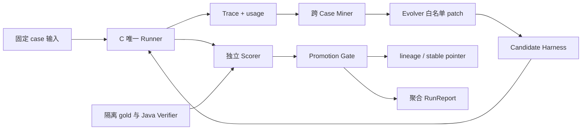
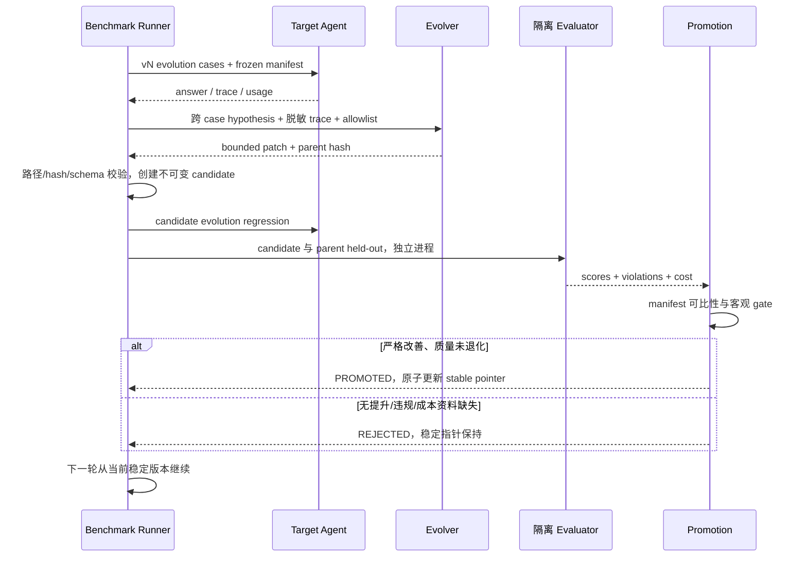

# D 模块：验收、评测与策略改进（业务说明与 TRD）

负责人：**amorfatiii**。先读[团队总览](../15-team-baseline-and-batches.md)，再读本页业务功能，实施时查下半页接口与规则。当前是设计与合同，尚未实现；排期见[本期任务](../19-delivery-plan.md)。

## 先理解你要交出的完整模块

证明系统哪些能力可靠，找出重复失败，并用真实评测决定 Agent 策略修改是否应该保留。提供可复现结果和失败记录。

举例：多个案例把“最好”当成“必须”。你要先确认预期和运行证据，再让改进程序提出有限策略修改；重新测已知与留出案例，质量下降就回滚。

## 完整业务功能清单

| 功能编号 | 功能 | 具体需要完成什么 | 本期任务或后续期 |
| --- | --- | --- | --- |
| D-F1 | 建立验收案例与依据 | 覆盖学业核对、硬软偏好、多目标/重规划、缺信息/拒编；与 A/B/C 独立核对正确判断，隔离答案与留出题。 | D1 |
| D-F2 | 测量当前推荐表现 | 跑相同 Agent，记录逐例正确性、违规、无依据主张、澄清、Token、调用和耗时，形成基线。 | D3 |
| D-F3 | 检查完整用户流程 | 组织接口与浏览器自动检查，让服务缺失、流程中断和异常返回能被 CI 发现；登记问题并复测。 | D2；第七周扩回归 |
| D-F4 | 归纳重复失败 | 从至少两个不同案例中找可解释的共同问题，记录证据、假设和允许修改的策略。 | D3 提供材料；第六周实现归因 |
| D-F5 | 生成受限改进候选 | 由改进程序修改允许的策略内容，保留父版本和差异；答案、预算、Java 和评分器保持隔离。 | 第六周细拆 |
| D-F6 | 决定保留或回滚 | 按固定条件重新评测候选，执行客观门槛和原子版本切换，至少跑两轮真实候选决策。 | 第六周细拆；第七周复跑 |
| D-F7 | 交付可信实验报告 | 汇总质量/成本/失败与版本关系，明确缺失指标、拒绝候选和样本限制，交给老师报告页。 | D3；第六周完整报告 |

上表是整个模块范围。A1/E2 等是[排期草案](../19-delivery-plan.md)的业务任务编号，尚不等于 GitHub Issue 编号；后续期功能届时拆任务。本期未覆盖的功能仍属于模块完整交付。

## 谁交给你、你交给谁

A/B 提供独立事实依据；C 提供同一 Agent 和脱敏运行记录；E 提供可操作页面。你把具体 Bug 交给代码所有者修复，把结果/版本关系交给 E 展示，把策略候选交 C 加载。

## 你的责任边界

你拥有题集、标签、评分、隔离、改进判决与集成检查。业务实现与业务 Bug 修复归对应模块；C 拥有 Agent；B 提供事实核验。必须用预先核对的答案判断结果。

## 整个模块怎样算完成

四组评测可复现，答案/留出隔离真实生效；有基线与两轮候选决策及失败分支；成本缺失如实报告，整条流程的故障可被发现并复测。 每项功能要有实现、实际消费者调用和正常/异常/未知的证据。权限、错误恢复等检查贯穿各功能，模拟与真实能力分别说明。

## 实现参考与技术约束

下面保留现有技术方案。业务功能是交付目标；组件、接口、函数与测试是实现这些功能的手段。字段以 contracts 为准，不在业务功能表里复制一套字段。

| 项 | 内容 |
| --- | --- |
| 责任 | amorfatiii，模块 D |
| 技术 | Python/pytest/JSONL、hashlib、独立进程/文件隔离 |
| 所有权 | benchmark、evo-harness、评分器与标签、snapshot/lineage/report |
| 输入 | C 唯一 Runner、A/B 真值依据、manifest |
| 输出 | 逐例质量/成本、跨 Case hypothesis、patch、两轮判决、聚合报告 |
| 状态 | 尚无运行分数，不预填省 token/成功晋级 |

### 1. 需求、数据和隔离

D-01 四组任务：学业核对、hard/soft、多目标规划/replan、澄清/拒编。每组目标 5 evolution+5 held-out，最低 3+3。fixture 标 REAL 培养事实 / SIMULATION 班次 / 无真实班次，不把 simulation 当真实排课能力。

D-02 固定 model/temperature/API/data/evaluator/budget；D-03 token/工具/时间；D-04 至少两个不同 case 的失败假设；D-05 白名单最小 patch；D-06 两轮候选判决、rejected 也保存。

答案与题面隔离、同环境不同 case。Evolver 只见 evolution 输入和脱敏 trace，没有 gold、held-out、evaluator、Java 源码；不通过 Prompt 自觉保证隔离。

### 2. 组件和文件结构

目录建议：benchmark/cases/evolution、独立受限 held-out/gold 根、scoring、fixtures；evo-harness/mining、patching、promotion、snapshots；private runs 存入 gitignore 的 data/private。公开仓库只放虚构合同样例；发布完整 held-out 题面就不能再声称 Evolver 永久不可见，验收题需运行时私下提供/隔离。

### 3. 内部接口与报告合同

`BenchmarkRunner.run(agentSnapshot, manifest, caseSet) -> RunResult`；`Scorer.score(answer, gold, JavaVerifier) -> CaseScore`；`FailureMiner.mine(evolutionTraces) -> Hypothesis[]`；`Evolver.patch(hypothesis, harnessSnapshot) -> PatchProposal`；`PromotionGate.decide(parentResult, candidateResult, thresholds) -> Decision`。

TraceEvent/RunManifest/RunReport 见公共 Schema。Hypothesis 必须含 hypothesisId、category、caseIds≥2、traceRefs、重复模式、允许修改的策略、预期影响。PatchProposal 含 parent hash、target paths、diff hash、hypothesisId；路径 canonicalize 后必须在 allowlist，禁止软链接逃逸。

CaseScore 最小：caseId、groupId、factScore、hardViolations、unsupportedClaims、clarificationScore、inputTokens/outputTokens nullable、toolCalls、latencyMs、verdict。aggregate 各 task group 等权，不让大组吞掉小组失败。

### 4. 候选评测时序

### 5. 指标和晋级

[Benchmark 协议](../07-benchmark-protocol.md) 为 gate 真源。平均 token 不能将 unavailable 算零，报告有效样本覆盖率。模型不改但仍可能随机波动，parent/candidate 同重复次数；如果无可比成本不宣称效率提升。

候选没有严格改善或 held-out 质量退化则回滚。省 token 与质量同时看；删掉证据/澄清导致退化不能晋级。两轮不是强行写出成功 v1/v2：候选1失败后第二轮仍从稳定 v0 出发，lineage 记录分支。

### 6. 安全与异常

case/模型输出视为不可信，不 exec；patch 只能改文本与受控配置，不改 Java、预算、答案、root AGENTS.md。sandbox 白名单目录不同于仅仅给 LLM 一个“不能看”的约束。隔离检查必须尝试读取/遍历受限路径，确认权限失败。

| 异常 | 处理 |
| --- | --- |
| MANIFEST_MISMATCH | 拒绝分数比较，重建基线 |
| PATCH_OUTSIDE_ALLOWLIST | 拒绝候选，保留事件 |
| TRACE_INCOMPLETE / TOKEN_UNAVAILABLE | 标缺失，不用零填补 |
| SCORER_FAILURE | 本轮失败，不更新 stable |
| LINEAGE_WRITE_FAILURE | 不晋级；稳定指针原子性优先 |
| 无跨 case 证据 | 不 patch，补案例或报告暂未发现 |

### 7. 验收与批次

排期见[本期任务](../19-delivery-plan.md)：案例/基线同步准备，随后实现两轮改进与回滚，第七周复跑。

必须测：恶意候选宣称无冲突会被拒、held-out不可读、答案不可读、路径穿越/软链接 patch、评分失败无晋级、manifest不同不可比、重复无双计数、回滚后稳定版本一致。手写 Skill 可以作 v0 起点，不算完成自进化。

### 契约变更与完成标准

字段以 [contracts](../../contracts/README.md) 为真源，行为以 [公共契约](../04-infrastructure-workflow.md) 为准。提交提供者/消费者 DTO、正反例和受影响测试；Schema 破坏性变更升版本，不能边跑 Benchmark 边改。调试和提交要求见 [工程规范](../16-engineering-and-debugging.md)。

任务完成至少包含：实现目录、输入/输出、正常和失败证据、限制；fixture 不算真实接入，HTML 不算生产前端，手工改 Prompt 不算 RSI。每次 PR 使用仓库模板自查，接口 PR 由相邻模块复核。
