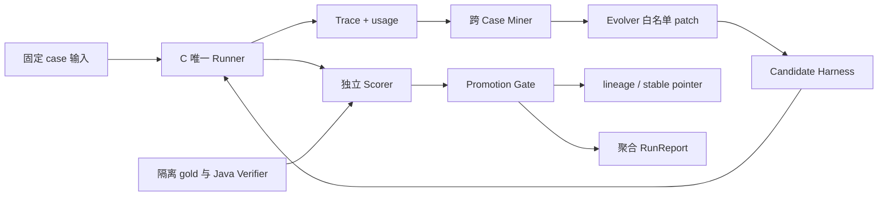
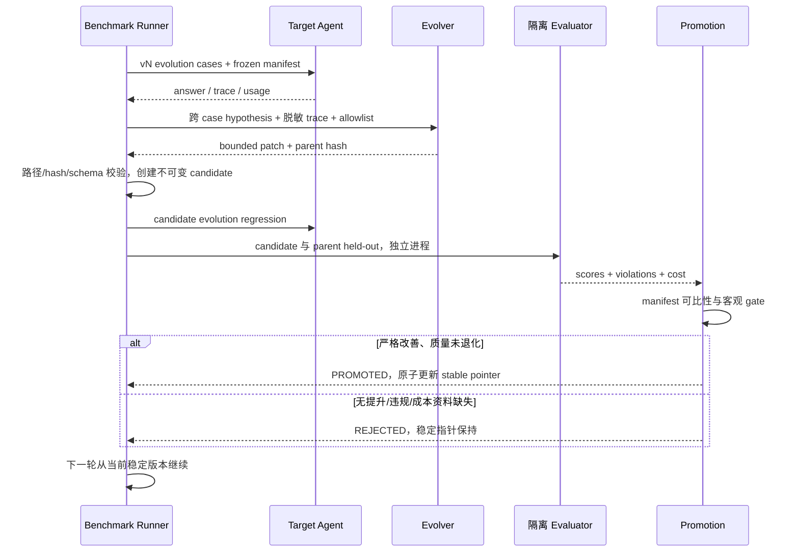

# 子 TRD D v1.0｜Benchmark、Trace 与多轮 RSI

| 项 | 内容 |
| --- | --- |
| 责任 | D，待填写；10 人日 |
| 技术 | Python/pytest/JSONL、hashlib、独立进程/文件隔离 |
| 所有权 | benchmark、evo-harness、评分器与标签、snapshot/lineage/report |
| 输入 | C 唯一 Runner、A/B 真值依据、manifest |
| 输出 | 逐例质量/成本、跨 Case hypothesis、patch、两轮判决、聚合报告 |
| 状态 | 尚无运行分数，不预填省 token/成功晋级 |

## 1. 需求、数据和隔离

D-01 四组任务：学业核对、hard/soft、多目标规划/replan、澄清/拒编。每组目标 5 evolution+5 held-out，最低 3+3。fixture 标 REAL 培养事实 / SIMULATION 班次 / 无真实班次，不把 simulation 当真实排课能力。

D-02 固定 model/temperature/API/data/evaluator/budget；D-03 token/工具/时间；D-04 至少两个不同 case 的失败假设；D-05 白名单最小 patch；D-06 两轮候选判决、rejected 也保存。

答案与题面隔离、同环境不同 case。Evolver 只见 evolution 输入和脱敏 trace，没有 gold、held-out、evaluator、Java 源码；不通过 Prompt 自觉保证隔离。

## 2. 组件和文件结构

目录建议：benchmark/cases/evolution、独立受限 held-out/gold 根、scoring、fixtures；evo-harness/mining、patching、promotion、snapshots；private runs 存入 gitignore 的 data/private。公开仓库只放虚构合同样例；发布完整 held-out 题面就不能再声称 Evolver 永久不可见，验收题需运行时私下提供/隔离。

## 3. 内部接口与报告合同

`BenchmarkRunner.run(agentSnapshot, manifest, caseSet) -> RunResult`；`Scorer.score(answer, gold, JavaVerifier) -> CaseScore`；`FailureMiner.mine(evolutionTraces) -> Hypothesis[]`；`Evolver.patch(hypothesis, harnessSnapshot) -> PatchProposal`；`PromotionGate.decide(parentResult, candidateResult, thresholds) -> Decision`。

TraceEvent/RunManifest/RunReport 见公共 Schema。Hypothesis 必须含 hypothesisId、category、caseIds≥2、traceRefs、重复模式、允许修改的策略、预期影响。PatchProposal 含 parent hash、target paths、diff hash、hypothesisId；路径 canonicalize 后必须在 allowlist，禁止软链接逃逸。

CaseScore 最小：caseId、groupId、factScore、hardViolations、unsupportedClaims、clarificationScore、inputTokens/outputTokens nullable、toolCalls、latencyMs、verdict。aggregate 各 task group 等权，不让大组吞掉小组失败。

## 4. 候选评测时序

## 5. 指标和晋级

[Benchmark 协议](../07-benchmark-protocol.md) 为 gate 真源。平均 token 不能将 unavailable 算零，报告有效样本覆盖率。模型不改但仍可能随机波动，parent/candidate 同重复次数；如果无可比成本不宣称效率提升。

候选没有严格改善或 held-out 质量退化则回滚。省 token 与质量同时看；删掉证据/澄清导致退化不能晋级。两轮不是强行写出成功 v1/v2：候选1失败后第二轮仍从稳定 v0 出发，lineage 记录分支。

## 6. 安全与异常

case/模型输出视为不可信，不 exec；patch 只能改文本与受控配置，不改 Java、预算、答案、root AGENTS.md。sandbox 白名单目录不同于仅仅给 LLM 一个“不能看”的约束。隔离检查必须尝试读取/遍历受限路径，确认权限失败。

| 异常 | 处理 |
| --- | --- |
| MANIFEST_MISMATCH | 拒绝分数比较，重建基线 |
| PATCH_OUTSIDE_ALLOWLIST | 拒绝候选，保留事件 |
| TRACE_INCOMPLETE / TOKEN_UNAVAILABLE | 标缺失，不用零填补 |
| SCORER_FAILURE | 本轮失败，不更新 stable |
| LINEAGE_WRITE_FAILURE | 不晋级；稳定指针原子性优先 |
| 无跨 case 证据 | 不 patch，补案例或报告暂未发现 |

## 7. 验收与批次

W1 各组种子 case；W2/W3 标注/Trace 联调；W4 v0/隔离/失败假设；W5 两轮决策。B 复核事实、C 共用 Runner，E 只显示聚合报告。

必须测：恶意候选宣称无冲突会被拒、held-out不可读、答案不可读、路径穿越/软链接 patch、评分失败无晋级、manifest不同不可比、重复无双计数、回滚后稳定版本一致。手写 Skill 可以作 v0 起点，不算完成自进化。

## 契约变更与完成标准

字段以 [contracts](../../contracts/README.md) 为真源，行为以 [公共契约](../04-infrastructure-workflow.md) 为准。提交提供者/消费者 DTO、正反例和受影响测试；Schema 破坏性变更升版本，不能边跑 Benchmark 边改。调试和提交要求见 [工程规范](../16-engineering-and-debugging.md)。

任务完成至少包含：实现目录、输入/输出、正常和失败证据、限制；fixture 不算真实接入，HTML 不算生产前端，手工改 Prompt 不算 RSI。每次 PR 使用仓库模板自查，接口 PR 由相邻模块复核。
