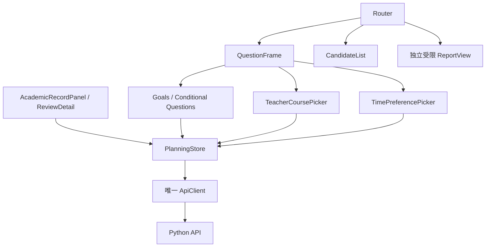
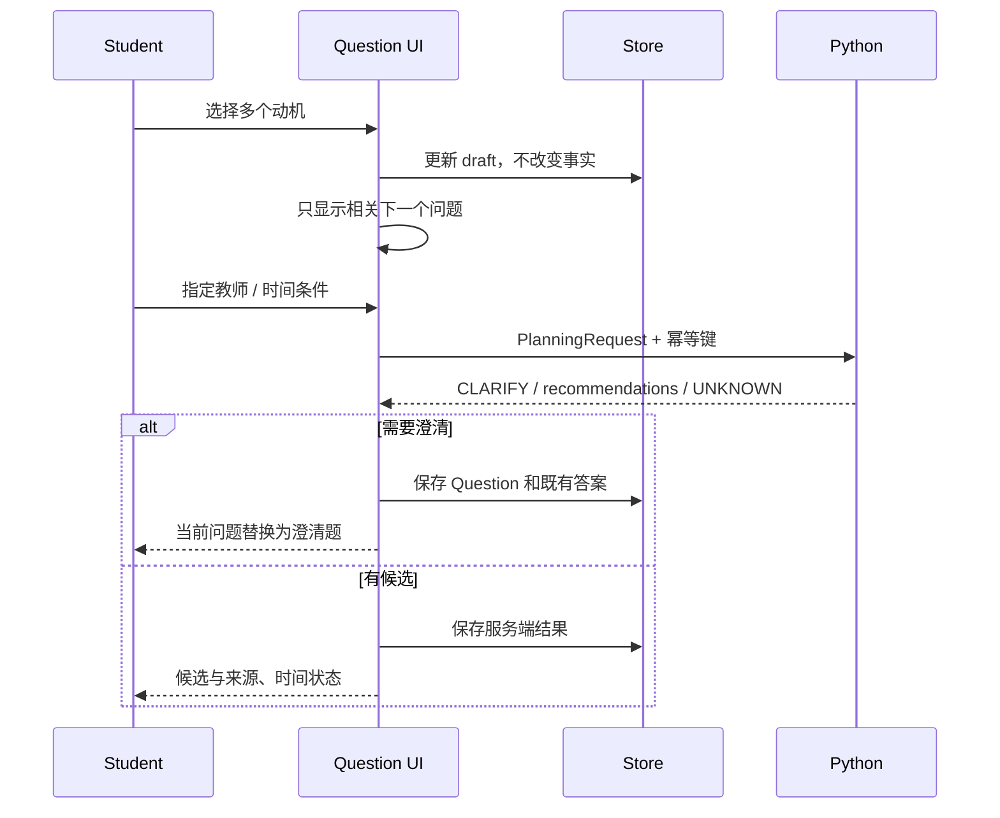
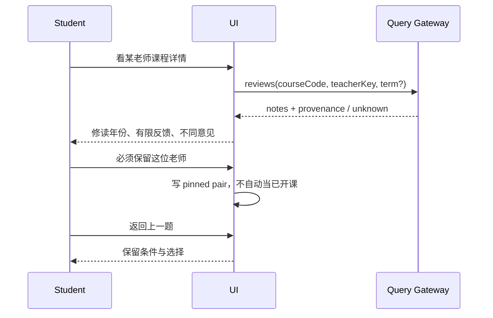

# 子 TRD E v1.0｜单问题 Web、详情与集成

| 项 | 内容 |
| --- | --- |
| 责任 | E，待填写；11 人日 |
| 技术 | Vue 3/Vite/Router、Pinia 或会话 store、TypeScript、Fetch |
| 所有权 | web 页面/状态/API adapters、学生与老师两个路由、集成测试 |
| 输入 | 公共 DTO、C PlanningAnswer、B 经 Python 网关的事实、D RunReport |
| 输出 | 学生决策 UI、接口调用、明确 UNKNOWN 和来源、独立报告 |
| 状态 | 独立 HTML 原型，不是已接入服务的 Vue 应用 |

## 1. 需求与边界

E-01 一次一问、条件分支、返回保留；E-02 已有关联记录不重复手填；E-03 多动机而非强迫职业；E-04 课程教师详情/必须与偏好；E-05 缺真实时间不称无冲突；E-06 工程报告不进学生主线。

HTML 与 [交接规范](../../demo/README.md) 为体验参考，固定示例候选不能复制成生产推荐逻辑。学生页面不展示 Java/System/Harness/Prompt/Trace 等工程文案。

## 2. 组件结构与状态

store 分 inputDraft、record/audit、planningResult、requestState；表单 state 不等同后端事实。session bearer 只在内存，不写 localStorage/URL；刷新后提示建立新演示会话，不假装复用旧私人记录。

路由：/plan/questions/{questionId}、/plan/result、/records、/reports/{runId}。只有当前问题挂载；详情可用 dialog/drawer，键盘焦点回原入口。URL 记录问题标识，不放成绩/Prompt/token；退回保留内存答案。

## 3. 输入和调用约束

使用 [Python OpenAPI](../../contracts/planning.openapi.json)。浏览器不调 8080，不拿 serviceKey。正常入口建立会话→读本会话记录→audit；缺记录时 POST academic-records，明确完整性。成绩导入首版用结构化授权/虚构记录，不偷偷读取学校账号。

| UI 动作 | 接口 / 状态 |
| --- | --- |
| 选路径/查课程 | curricula/courses，带 requestId，处理空与分页 |
| 查教师与评价 | teacher-course-options/reviews，current/historical/unknown 分开 |
| 看职业介绍 | career-directions，按 subjectTag，只展示有来源内容 |
| 发规划/改条件 | planning，bearer+新 Idempotency-Key，previousPlanId 可空 |
| 重试同一次网络丢答复 | 保持相同幂等键与内容，不能重复建新任务 |
| 看报告 | reports，只有有 admin 资格的独立路由 |

字段由共享 TS DTO/Schema 适配，不在每个组件定义同一接口的变体。未知 nullable 不转成 0、空字符串或“无冲突”。Backend status 与 requestState 分开。

## 4. 单问题路由时序

## 5. 状态和展示门禁

UI requestState=idle/loading/succeeded/failed；答复 decision 与 verification verdict/scope 是业务状态，不用一个 loading/error 字段包全部。

| 后端状态 | 文案与动作 |
| --- | --- |
| COURSE_ONLY / UNKNOWN | 课程建议，时间待确认，补资料入口 |
| SIMULATION + VALID | 模拟核验通过，不代表本学期课表 |
| REAL_TIMETABLE + VALID | 本次快照下核验结果，显示采集时间 |
| INVALID | 明确冲突/不满足项，调整条件 |
| ERROR/timeout | 重试同请求或重新修改，不伪造候选 |
| historical review | 往年主观反馈，本学期要求未确认 |

只有 scope REAL_TIMETABLE + verdict VALID + 对应来源资格才显示真实时间通过；不能自己从无 violations 数组推断通过。记录 completeness 影响学分文案。

## 6. 安全、易用性与调试

不使用 v-html 渲染评价/模型文本；如需 Markdown 用禁 HTML 的安全渲染器并限制 URL scheme。链接 rel=noopener noreferrer；搜索/字段受长度限制。不能将 token 放 query、下载文件或调试截图。

loading 期间禁重复执行按钮但允许阅读/返回；响应绑定 task/request revision，较旧响应不能覆盖新条件。AbortController 只取消前端等待，不宣称后端模型已停止；迟到响应丢弃。

可访问性：label、button、visible focus、dialog focus trap/Escape、aria-live 状态；桌面与窄屏检查，不靠禁止缩放修布局。系统问题给可操作文案，不对学生展示 JSON/stack。

## 7. 验收与批次

W1 HTML 拆 Vue 与共用 fixture；W2 record/audit/query；W3 Agent 与教师取舍；W4 独立 report；W5 集成演示。

测：非职业目标不问岗位、多目标不互相覆盖、返回保存、详情关回原焦点、未知评价无假星级、教师硬锁不消失、缺班次无绿色通过、401过期、404越权、503超时、重复点击与迟到响应、小屏溢出。PR 附桌面/手机截图和交互结果；不能仅 node 语法检查声称视觉通过。

## 契约变更与完成标准

字段以 [contracts](../../contracts/README.md) 为真源，行为以 [公共契约](../04-infrastructure-workflow.md) 为准。提交提供者/消费者 DTO、正反例和受影响测试；Schema 破坏性变更升版本，不能边跑 Benchmark 边改。调试和提交要求见 [工程规范](../16-engineering-and-debugging.md)。

任务完成至少包含：实现目录、输入/输出、正常和失败证据、限制；fixture 不算真实接入，HTML 不算生产前端，手工改 Prompt 不算 RSI。每次 PR 使用仓库模板自查，接口 PR 由相邻模块复核。
